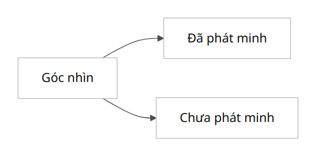
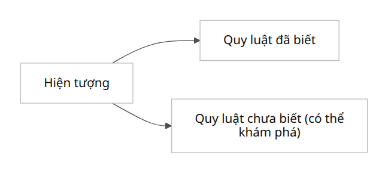
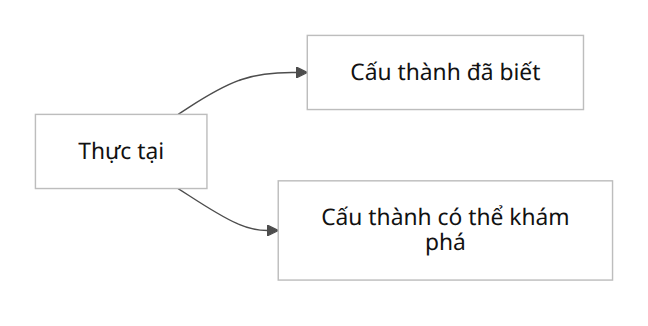
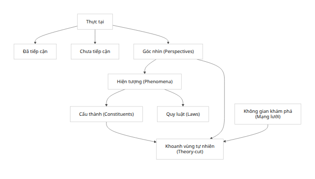
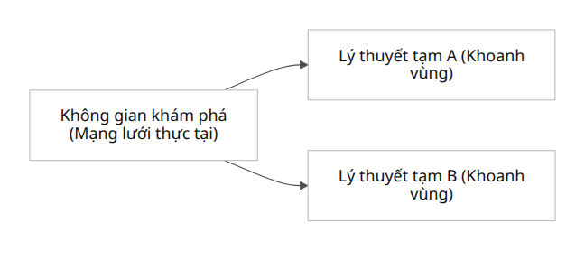

# Tóm tắt (1)

Tóm tắt

Bài báo này trình bày một tổng hợp lý thuyết “Mạng lưới–Quá trình Hiện thực” do người dùng phát triển và khảo sát các khía cạnh nhận thức luận và phương pháp luận của nó. Lý thuyết này phân biệt thực tại thành những phần đã và chưa tiếp cận, định nghĩa hiện tượng là đối tượng quan sát dưới góc nhìn nhất định, cấu thành là các thành phần cơ bản của thực tại theo các mô hình khác nhau, và quy luật là mối quan hệ quy ước giữa các cấu thành. Mỗi lý thuyết khoa học tương đương với một “khoanh vùng” tạm thời trong không gian khám phá – tức mạng lưới toàn thể của các thực thể và quan hệ. Bài báo cung cấp sơ đồ tổng thể và bốn sơ đồ phụ (cấu thành known/unknown, quy luật known/unknown, góc nhìn known/unknown, hình thành lý thuyết) minh hoạ cấu trúc này. Lý thuyết được đặt trong bối cảnh truyền thống triết học (so sánh với Peirce về quy nạp sáng tạo, Popper về phản bác, Husserl/Kant về ý hướng chủ quan, Nietzsche về ngữ nghĩa và quyền lực, Whitehead về thực tại quan hệ, Kit Fine và Schaffer về nền tảng mạng lưới, Wallerstein về hệ thống toàn cầu, lý thuyết phức hợp/vật chất và khái niệm theory-ladenness). Các vấn đề then chốt như thiên kiến góc nhìn (theory-ladenness), underdetermination, “khoanh vùng ưu thế”, nổi trội vs. quy nạp, falsifiability, phân ly ontology–nomology được phân tích và đề xuất giải pháp (ví dụ: mô hình hoá góc nhìn dạng tham số, mô hình đa tầng, các thuật toán phát hiện cộng đồng trên mạng để tìm “khoanh vùng tự nhiên”, kỹ thuật sinh giả thuyết abductive, giao thức thí nghiệm, mô phỏng tính toán, khảo sát liên ngành). Một lộ trình nghiên cứu được đề xuất với các mốc kiểm định (dữ liệu cần dùng, nhóm chuyên gia liên ngành, tiêu chí đánh giá), bao gồm đo khả năng dự báo, tính nhất quán đa cấp và khả năng bền vững khi thay đổi góc nhìn để thử nghiệm một “khoanh vùng tự nhiên”. Cuối cùng, so sánh các phương pháp ứng cử viên (thuật toán cộng đồng mạng, phát hiện quan hệ nhân quả, mô hình thống kê đa tầng, mô hình tác tử, khám phá ontology) được tóm tắt bằng bảng so sánh ưu-nhược và tình huống nên dùng. Kết luận nêu rõ giới hạn nhận thức (tính không chắc chắn, tính có thể sai và khuyến nghị đạo đức) của khuôn khổ.

|   |
| --- |

Hình 1. Sơ đồ tổng thể của mô hình “Mạng lưới–Quá trình Hiện thực” (Network-Process Realism). Thực tại được chia thành hai phần đã tiếp cận và chưa tiếp cận. Các góc nhìn (perspectives) và hiện tượng (phenomena) xác định dữ liệu quan sát, từ đó suy ra cấu thành (các thực thể/mạng lưới con) và quy luật liên kết chúng. Mỗi khoanh vùng lý thuyết (cắt mạng tạm thời) trích xuất một phần “mạng lưới” tổng thể, tạo nên một lý thuyết khoa học tạm thời trong không gian khám phá. Phía dưới, Hình 2–5 trình bày các sơ đồ phụ minh hoạ sự phân bố known/unknown và hình thành lý thuyết:

|   |
| --- |

Hình 2. Cấu thành: known/unknown. Các thành phần của thực tại gồm những cấu thành đã được phát hiện (đã biết) và những cấu thành chưa phát hiện (có thể khám phá thêm)【18†L79-L87】.

|   |
| --- |

Hình 3. Quy luật: known/unknown. Từ các hiện tượng quan sát được xác định một tập các quy luật đã biết và các quy luật tiềm ẩn chưa xác định【65†L53-L61】【65†L77-L80】.

|   |
| --- |

Hình 4. Góc nhìn: known/unknown. Góc nhìn (cách tiếp cận lý thuyết/khái niệm) bao gồm những khung nhìn đã hình thành và những khung nhìn mới có thể phát triển.

|   |
| --- |

Hình 5. Khoanh vùng lý thuyết. Từ không gian khám phá tổng thể (mạng lưới thực tại), chúng ta có thể “khoanh vùng” các nhánh hoặc tiểu mạng để xây lý thuyết tạm thời A, B… (lấy ví dụ hai lý thuyết khác nhau được cắt từ cùng một mạng lưới chung).

【32†embed_image】 Hình minh hoạ: một mạng lưới phức tạp với nhiều nút và liên kết (màu xanh, hồng) tượng trưng cho “không gian khám phá” trong mô hình. Các lý thuyết khoa học tương ứng với các “cắt” (subnetwork) tạm thời của mạng này.

1. Lý thuyết Mạng lưới–Quá trình Hiện thực

Mô hình Mạng lưới–Quá trình Hiện thực (Network-Process Realism) coi thực tại là một tổng thể quan hệ (tương tự tinh thần thuyết hiện thực quan hệ, “relational realism”) mà trong đó không có cắt cơ bản thiên định (no fundamental cut)【9†L510-L512】【11†L1140-L1144】. Tức là không tồn tại một phân chia cuối cùng, độc lập nào vĩnh viễn của thực tại; thay vào đó, mọi cấu trúc và “thành phần” chỉ là những cách cắt mạng tạm thời tùy vào góc nhìn và mục tiêu nghiên cứu. Như Nimangou nêu, “nếu cố gắng cô lập một cắt cơ bản thì hoặc vi phạm tính chất quan hệ thuần túy, hoặc phụ thuộc vào các quan hệ bên ngoài, do đó không có cắt căn bản nào thực sự tồn tại”【7†L356-L364】【9†L510-L512】.

Thực tại đã tiếp cận/chưa tiếp cận: Phần đã tiếp cận (accessible reality) gồm những hiện tượng và thành phần mà khoa học hiện thời đã nhìn thấy hoặc lý thuyết hoá được. Phần chưa tiếp cận là phần ẩn chứa tiềm năng (nếu có) mà chúng ta có thể phát hiện thêm nhờ các góc nhìn mới hoặc công cụ mới.

Góc nhìn (perspective): Là khung nhìn lý thuyết-khoa học mà từ đó người quan sát nhận diện và diễn giải hiện tượng. Mỗi góc nhìn đặt ra bộ khái niệm riêng và “định hướng” quan sát, tương tự như khái niệm thuyết-quan sát-ladenness (theory-ladenness) của Kuhn và Hanson【42†L975-L978】【36†L59-L66】. Góc nhìn bao gồm các giả thuyết, mô hình ngầm định, công cụ đo đạc, v.v., mà nhờ đó ta “chẻ” thực tại. Có góc nhìn đã phát minh (used, tested) và góc nhìn chưa phát minh (có thể phát triển).

Hiện tượng (phenomenon): Là những gì được quan sát dưới một hoặc nhiều góc nhìn cụ thể; tức là “đối tượng đã qua lăng kính”, thô sơ hơn là thành tố của tri giác hay dữ liệu thực nghiệm. Khái niệm “hiện tượng” ở đây tương đồng với noema của Husserl, tức “điều được cho ra trong ý thức” (things as given to consciousness)【44†L375-L379】. Mỗi hiện tượng có thể phụ thuộc vào nhiều cấu thành vi mô.

Cấu thành (constituent): Là thành phần cơ bản của thực tại trong một lý thuyết hoặc mô hình nhất định. Chúng tương đương với “hạt phần tử” của một nhánh mạng lưới (nút, block, subsystem) trong góc nhìn đó. Mỗi lý thuyết khoa học quy định tập các cấu thành của nó – có thể là hạt cơ bản, vector trường, cá thể sinh vật, tổ chức kinh tế, v.v. – gồm những đã biết (được mô tả trong lý thuyết hiện có) và có thể khám phá (tiềm năng chưa nắm bắt).

Quy luật (law): Là các quan hệ giữa các cấu thành trong lý thuyết. Có thể coi quy luật là các cạnh quan hệ (edge) trong mạng lưới giữa các nút (cấu thành). Chúng cũng phân thành đã biết (định luật đã được tìm ra) và chưa biết (quan hệ tiềm năng trong mạng lưới tổng thể chưa bóc tách). Hai lĩnh vực cấu thành và quy luật tương tác: hiện tượng cho ta dấu hiệu của quy luật (vì hiện tượng chỉ ra cách cấu thành kết hợp)【65†L53-L61】, và quy luật cho phép dự đoán hiện tượng mới.

Khoanh vùng tự nhiên (natural cut)/Lý thuyết: Một “khoanh vùng” trên mạng lưới thực tại là một cụm cấu thành mà ta tạm coi là đối tượng nghiên cứu chung, giống như “cắt mạng lưới” hình thành nên một lý thuyết. Ví dụ, trong mạng lưới các sinh vật (với quan hệ thức ăn hay di truyền), một khoanh vùng có thể là hệ sinh thái rừng già; trong mạng kinh tế, khoanh vùng là ngành công nghiệp vũ trụ; trong mạng tri thức, khoanh vùng là lý thuyết được xây dựng. Mỗi lý thuyết khoa học tương đương với một khoanh vùng tạm thời (subgraph) của mạng thực tại【62†L722-L729】【65†L53-L61】. Các khoanh vùng này có thể chồng lấn (theory-ladenness: cùng một thực tại nhưng được cắt khác nhau).

Không gian khám phá (exploration space): Là toàn bộ mạng lưới quan hệ của thực tại mà khoa học và tri thức đang khám phá. Không gian này chứa cả các nút/cạnh đã biết và tiềm tàng. Hình 5 minh hoạ các lý thuyết A, B được khoanh ra từ cùng một không gian tổng thể.

Ta lưu ý tương đồng với triết học: Wallerstein coi mối quan hệ vùng lõi–vùng ngoại vi trong kinh tế toàn cầu là “một khái niệm quan hệ – vùng lõi được xác định bởi quan hệ của nó với ngoại vi, và ngược lại”【18†L79-L87】. Tương tự, mô hình trên cho phép nhiều quan điểm (góc nhìn khác nhau) trên cùng thực tại, như lõi–ngoại vi, vi mô–vĩ mô, cục bộ–toàn cầu.

2. Đặt lý thuyết trong bối cảnh triết học

Lý thuyết Mạng lưới–Quá trình phản ánh nhiều tư tưởng triết học:

Charles Sanders Peirce (1839–1914): Nhấn mạnh vai trò của suy diễn sáng tạo (abduction) trong khám phá tri thức. Theo Peirce, abduction là “quá trình hình thành giả thuyết giải thích. Nó là phép suy diễn duy nhất tạo ra ý tưởng mới”【36†L59-L66】. Lý thuyết mới được sinh ra từ dữ liệu (hiện tượng) qua abduction; sau đó suy diễn và quy nạp kiểm định. Mô hình mạng lưới có thể coi các góc nhìn như tập hợp các giả thuyết abduction mà ta so sánh với hiện tượng để chọn lọc lý thuyết phù hợp. Peirce cũng nhấn mạnh tính không tuyệt đối của mọi “giả thuyết chân lý” (fallibilism).

Karl Popper (1902–1994): Người đề xuất tiêu chí phân biệt khoa học (falsifiability)【41†L13-L17】. Tư tưởng này ứng dụng ở chỗ lý thuyết khoanh vùng phải có khả năng dự đoán/loại bỏ, tức nếu quan sát mới mâu thuẫn quy luật thì ta tái cấu trúc khoanh vùng. Popper cũng thừa nhận mọi quan sát đều “lý thuyết-quan sát thiên lệch” (theory-laden): ông theo Kant khẳng định câu quan sát được “miêu tả dưới sự giải thích của một khung lý thuyết nhất định”【42†L975-L978】. Điều này ủng hộ ý tưởng góc nhìn: không có dữ liệu thực tại nào trung lập, nên mạng lưới tri thức luôn chịu ảnh hưởng bởi các khái niệm của nhà nghiên cứu.

Edmund Husserl (1859–1938): Tác giả của hiện tượng học (phenomenology), cho rằng mọi hiện tượng đều là “điều được cho ra trong ý thức” (như noema). Như SEP nhận xét, “hiện tượng là những gì ta nhận thức được và được cho cho ý thức chúng ta”【44†L375-L379】. Trong lý thuyết này, nhìn nhận hiện tượng đúng là phải xét đến hoạt động ý thức/khung nhìn đưa ra nó, phù hợp với Husserl về chủ thể và ý hướng của ý thức.

Immanuel Kant (1724–1804): Tương tự, Kant phân biệt hiện tượng và vật tự-thân (phenomena vs. noumena): ta chỉ nhận biết “các vật như chúng xuất hiện với điều kiện nhận thức của con người (khanh cho trống tách)”【52†L173-L178】; thế giới ở “bên ngoài” (noumenon) bất khả tri. Mô hình mạng lưới cũng ghi nhận rằng có phần thực tại “chưa tiếp cận” tương ứng với noumenal: ta không thể bao phủ hoàn toàn thực tại mà chỉ xây lý thuyết về phần xuất hiện được qua cấu trúc nhận thức.

Friedrich Nietzsche (1844–1900): Chủ trương chủ nghĩa ngữ nghĩa và quyền lực (hermeneutics of power). Nietzsche từng phát biểu nổi tiếng “không có thực tại, chỉ có diễn giải”【50†L549-L552】 và rằng chân lý là “một đạo quân ẩn dụ lưu động” (truth is a mobile army of metaphors). Quan điểm này trùng với ý rằng mọi quan sát đều bị chi phối bởi perspectivism: “thế giới được diễn giải bởi nhu cầu và bản ngã của ta; những nhu cầu này tạo nên góc nhìn và quy định khung giải thích”【50†L559-L561】. Mô hình đề cao tính tương đối của góc nhìn: không có lý thuyết “tâm điểm khách quan”, mà đa quan điểm.

Alfred North Whitehead (1861–1947): Nhà triết học quá trình (process philosophy) chủ trương thực tại là các sự kiện/tuỳ thể đang nảy sinh (actual occasions) liên tục, chứ không phải vật chất tồn tại bất biến. Whitehead viết “những thuộc tính mà Descartes cho là tính chất cơ bản của vật thể, thực ra chính là các hình thức của các quan hệ nội tại giữa các tuỳ thể”【54†L143-L149】. Điều này hàm ý mọi đối tượng là mạng lưới quan hệ; tính bản chất (chất liệu) chỉ là biểu hiện của mối quan hệ với các tuỳ thể khác. Mô hình mạng lưới nằm trong truyền thống này khi coi mỗi cấu thành là phần tử cơ bản và “mọi thứ chỉ là mạng lưới các tuỳ thể tương tác”【54†L204-L208】. Whitehead cũng nhận thấy không có hai nguyên tố nào tối hậu tách biệt: “không có gì ‘ở dưới’ hoặc “phía sau” các tuỳ thể thực tại; thực tại toàn phần chỉ gồm chính các tuỳ thể”【54†L204-L208】.

Kit Fine: Nhà triết phân tích hiện đại, đề nghị khái niệm grounding (cơ sở luận) theo kiểu mạng lưới. Fine chỉ ra rằng không cần thiết có một “nền móng cực kỳ cơ bản” duy nhất; thay vào đó, có thể có một mạng lưới grounding hỗn hợp, với tính tương hỗ và phụ thuộc lẫn nhau. Tuy có ít trích dẫn trực tiếp, việc lưu ý đến partial grounding (cơ bản một phần) phù hợp với ý tưởng không có “lớp nền” tuyệt đối và linh hoạt trong cắt mạng lưới.

Jonathan Schaffer: Triết gia hiện tượng luận và hiện tượng học, lập luận “chủ nghĩa một” (priority monism) là toàn phần tồn tại (tức thế giới) là thực thể cơ bản duy nhất, các phần là bản vị phụ thuộc【62†L722-L729】. Theo ông, “chỉ một đối tượng tổng thể cơ bản tồn tại — các đối tượng khác chỉ tồn tại một cách phụ thuộc”【62†L722-L729】. Mô hình của chúng ta mang tinh thần này: có thể tưởng tượng toàn thể mạng lưới (theo một góc nhìn) là phần cơ bản, còn lý thuyết (được cắt ra) là phần tuỳ thuộc. Tuy nhiên, mô hình cũng mở cửa cho plurism (đa thực thể) khi chấp nhận nhiều góc nhìn song song.

Immanuel Wallerstein: Nhà xã hội học thế giới (world-systems), cho rằng thế giới kinh tế là một mạng lưới phân hóa giữa lõi-vùng và ngoại vi. Wallerstein viết “Lõi–ngoại vi là khái niệm quan hệ – lõi được xác định bởi quan hệ với ngoại vi, và ngược lại”【18†L79-L87】. Tư tưởng này tương ứng với mô hình mạng: cấu trúc toàn phần được định nghĩa qua các mối quan hệ của nó, không có đơn vị “rời rạc” nào làm trung tâm duy nhất.

Khoa học phức hợp (Complexity Science) và tính nổi trội (emergence): Lĩnh vực này nghiên cứu các hệ phức hợp (hệ thích nghi đa nhân tố) mà tổng thể có tính chất mới, không thể suy từ các thành phần đơn lẻ. Ví dụ, SEP nêu: “một cơn lốc xoáy phụ thuộc vào các hạt bụi và tương tác vi mô, nhưng các tính chất của nó khác hẳn tính chất của mỗi hạt; người ta có thể hiểu được lốc xoáy mà không cần biết vật lý hạt”【65†L53-L61】. Quan niệm nổi trội (emergent) là tính phụ thuộc và tự trị song song: các thực thể mới dựa vào thành phần cơ bản nhưng không thể quy giản hoàn toàn về chúng【65†L77-L80】. Lý thuyết mạng lưới hỗ trợ suy luận này: các “tính mới” của khoanh vùng (lý thuyết) không tồn tại khi tách riêng, nhưng xuất hiện khi gắn các cấu thành với nhau qua một quan hệ mới.

Như vậy, lý thuyết của người dùng kết hợp các di sản triết học: Peirce/Kuhn về vai trò giả thuyết và quan sát thiên lệch, Popper về tiêu chí phản chứng (chú trọng phát hiện lỗi của lý thuyết), Husserl/Kant/Nietzsche về giới hạn của kinh nghiệm khách quan, Whitehead/Fine/Schaffer về không cơ sở cuối cùng mà là một mạng lưới đa tầng, Wallerstein về cấu trúc toàn cầu quan hệ, và khoa học phức hợp về sự xuất hiện đặc tính mới. Tất cả đều ủng hộ quan niệm thực tại phức tạp, đa góc nhìn, và các lý thuyết như cách cắt tạm thời trong một mạng lưới tích hợp.

3. Vấn đề phương pháp luận và nhận thức luận

Mô hình trên đặt ra nhiều thách thức triết học:

Thiên kiến góc nhìn (Theory-ladenness): Như đã nói, mọi quan sát đều phụ thuộc vào một khung lý thuyết【42†L975-L978】. Điều này làm cho việc “quan sát thuần túy” hay “ghi lại hiện tượng trung lập” là bất khả. Trong mô hình, điều này thể hiện ở chỗ góc nhìn và hiện tượng luôn gắn liền; không có quan sát độc lập với khái niệm. Vấn đề là làm thế nào để khắc phục: một hướng là học hỏi từ Popper, rằng vẫn có thể duy trì tính khách quan tương đối bằng phê phán liên tục (quantum of falsification) và cộng đồng khoa học kiểm tra chéo. Hoặc dùng phương pháp “nghiên cứu liên ngành” để so sánh nhiều góc nhìn song song, giảm thiểu ảnh hưởng một lý thuyết riêng lên kết quả.

Underdetermination (Thiếu quyết định): Tương tự, như Quine-Hanson-Kuhn chỉ ra, cùng dữ liệu có thể tương thích với nhiều lý thuyết. Một hiện tượng có thể mô tả qua nhiều hệ quy luật. Giải pháp khả thi là sử dụng tiêu chí bổ sung (ví dụ ưu tiên lý thuyết đơn giản, mạnh mẽ hơn, có khả năng dự báo rộng hơn) để chọn cắt mạng lưới. Peirce gợi ý abduction với ý thức về vô hạn giả thuyết; nên cần các tiêu chí heuristics (vừa lý thuyết vừa thực nghiệm) để quyết định phát triển giả thuyết nào.

Khoanh vùng ưu thế (Privileged cuts): Một vấn đề mơ hồ là liệu có tồn tại “phân chia tự nhiên” ưu tiên trong thực tại. Triết học truyền thống (Aristotle, Plato) thường tìm cách này. Schaffer cho rằng nếu có ưu thế thì đó là toàn phần “thế giới”【62†L722-L729】. Nimangou (2015) chứng minh “không có cắt cơ bản” (No Fundamental Cut) đối với cơ chế phụ thuộc thuần túy【7†L356-L364】: không thể có cách tự nhiên duy nhất để chia thực tại mà không thêm quy ước hay tuỳ ý. Do đó, vấn đề là làm sao khẳng định một cắt hay mạng con nào là “tự nhiên”? Một hướng là sử dụng phân tích độ cứng (robustness): nếu một cắt tồn tại vì cơ chế vật lý hay toán học (ví dụ hội tụ tính, ngoại suy), thì khi thay đổi nhỏ điều kiện (góc nhìn), nó vẫn giữ tính liên tục, như tính chất chung trong lược đồ lý thuyết.

Nổi trội vs quy giản (Emergence vs Reduction): Mô hình chấp nhận tính nổi trội: hiện tượng mới không quy về chỉ cấu thành vi mô. Điều này đối lập với cái nhìn thuần quy giản (reductionism) vốn cho rằng chỉ cần tìm ra cấu thành nhỏ nhất và quy luật của chúng. Giải pháp là chấp nhận cách tiếp cận “đa tầng”: dùng mô hình đa tầng (multilevel modeling) và các công cụ liên ngành (hóa/sinh học/vật lý) để liên kết các cấp. Ví dụ, coarsening của ma trận địa (coarse-graining) trong lý thuyết thống kê cho phép rút ra quy luật vĩ mô từ vi mô, nhưng đòi hỏi các tính chất tự tương tự (self-similarity) hoặc renormalization group. Ngoài ra, triết học khoa học mới (đại diện bởi SEP Emergence) đề xuất xem emergence là kiểu phi quy giản nhưng phụ thuộc (non-aggregative dependence)【65†L77-L80】.

Falsifiability và Popper: Vấn đề của falsifiability là yêu cầu lý thuyết có tiên đoán có thể bị kiểm chứng/phủ định. Trong mô hình mạng, điều đó áp dụng bằng cách phát hiện các liên hệ mạng mới. Tuy nhiên, Popper cũng thừa nhận rằng việc “kiểm nghiệm” luôn tùy thuộc vào việc chấp nhận các quan sát cơ bản (basic statements) mang tính quy ước【42†L975-L978】【42†L990-L992】. Chúng ta cần xác định rõ “quan sát cơ bản” trong mạng lưới là gì: đó có thể là dữ liệu thô không thể suy diễn (sensor readings, experiment outputs), vốn phải được “quy ước” với một tiêu chuẩn đo (ví dụ calibration). Vấn đề vận dụng: khi dùng mạng lưới để dự báo, cần xác định đầu vào (dữ liệu cơ bản) và gắn nó với giả thuyết.

Ontology vs Nomology (Phân tách thực thể–quy luật): Mô hình nhấn mạnh cả cấu thành (ontology) và quy luật (nomology) nhưng cho phép chúng song hành. Nhiều triết gia (Kant, Armstrong) từng gián cách hai phạm trù này. Ở đây, lời giải là coi mỗi góc nhìn có nền tảng và quy luật riêng, song hành cùng. Mạng lưới có thể xem mỗi nút (thực thể) và cạnh (quy luật) là đồng cấp; lý thuyết là sự cấu hình tổng hợp cả hai.

Tri thức định hướng giá trị (normativity): Mô hình nhìn nhận tri thức phiêu lưu (fallibilism) – rằng tất cả khẳng định khoa học chỉ tạm thời và có thể sai. Điều này nhắc ta phải thận trọng khi chọn góc nhìn, vì luôn có số lượng giả thuyết chưa kiểm chứng. Popper và Peirce đều nhấn mạnh tri thức vĩnh cửu không có (fallibilism) – phù hợp với mạng lưới liên tục kiểm nghiệm và điều chỉnh.

4. Giải pháp và chương trình nghiên cứu

Để hiện thực hoá mô hình, ta đề xuất các bước và phương pháp cụ thể:

Mô hình hoá góc nhìn dạng tham số: Cần xây dựng phương pháp hóa góc nhìn thành mô hình toán học hoặc tính toán có tham số. Ví dụ, sử dụng mô hình tham số (parametric models) để định nghĩa thành phần nào của dữ liệu được xử lý bởi góc nhìn đó. Nhóm nghiên cứu liên ngành (nhà khoa học dữ liệu, triết học khoa học, domain experts) cùng xây tập biến của góc nhìn. Một khả năng là dùng lý thuyết mô hình thống kê (các mô hình đồ thị có hướng Bayesian) để mã hoá giả thuyết ban đầu và cập nhật liên tục khi có dữ liệu mới (peu như Bayesian networks).

Mô hình đa tầng (multilevel modeling): Xây dựng mô hình toàn diện có ít nhất hai hoặc nhiều tầng (ví dụ vật lý–sinh học–kinh tế–xã hội) và liên kết chúng. Ví dụ: Phần tử vi mô có thể là hạt vật lý/molecule; phần tử vĩ mô có thể là cây/cộng đồng; luật phân tử dẫn tới sinh quyển. Dùng các công cụ thống kê đa cấp hoặc đa mô hình động để đảm bảo tính nhất quán (coherence) giữa các cấp. Các kỹ thuật hiện có như “trực giao mô hình” (hierarchical modeling), “khung trải nghiệm đa bậc” (multiscale modeling) có thể áp dụng.

Thuật toán mạng để tìm “khoanh vùng tự nhiên”: Áp dụng cộng đồng (community detection) và clustering trong mạng phức hợp để tìm các nhóm tự nhiên (high modularity). Các thuật toán như Louvain, Infomap, Spectral clustering có thể xác định các cấu trúc lồng ghép hoặc phân vùng tiềm ẩn. Phân tích độ nhạy (sensitivity) của các cộng đồng này dưới thay đổi tham số (ví dụ trọng số cạnh) để kiểm tra tính bền vững của “cắt mạng” là có tự nhiên hay không. Ngoài ra, dùng lý thuyết đồ thị đồng đẳng (isomorphic graph patterns) để phát hiện mô típ lặp lại – nếu một tiểu mạng xuất hiện độc lập nhiều lần, có thể nó là một phân vùng có giá trị mô hình.

Sinh giả thuyết dạng abduction: Cần một cơ chế thuật toán để đề xuất các cấu thành và quy luật khả dĩ từ dữ liệu hiện tượng. Ta có thể dùng abductive logic programming hoặc machine learning giải thích (explainable ML) để tự động hình thành giả thuyết. Ví dụ, ứng dụng ký pháp tương tác (interaction logic) hay SAT solving: đưa ra dữ liệu hiện tượng và tìm tập nhỏ nhất của nút-cạnh (cấu thành–quy luật) giải thích được hiện tượng đó. Đây tương tự nhân sinh nguyên tắc ở Peirce: tạo ra khả năng giải thích dữ liệu. Các công cụ như Inductive Logic Programming (ILP) hoặc causal discovery (nghiên cứu mối quan hệ nhân quả) có thể hỗ trợ. Ví dụ: thuật toán PC-Algorithm hoặc Fast Causal Inference có thể dùng cho dữ liệu sự kiện để suy ra mô hình quan hệ có hướng.

Giao thức thí nghiệm và kiểm định liên ngành: Thiết kế thí nghiệm để kiểm tra các “khoanh vùng tự nhiên” đã chọn. Ví dụ, nếu một lý thuyết (một cắt mạng) cho rằng tồn tại quy luật mới giữa A và B, ta thực hiện thử nghiệm can thiệp (intervention) để xem thay đổi A có ảnh hưởng đúng như dự đoán không. Đây kết hợp quan điểm Popper (phải có nghiệm phủ định) và quan điểm nội sinh của khoa học phức hợp (phải kiểm tra mô hình đa hướng). Cần chuẩn hoá cách đánh giá dữ liệu: một “phương tiện căn bản” (basic statement) phải được xác thực qua biện pháp độc lập (ví dụ benchmark measure).

Mô phỏng và tính toán: Xây dựng mô phỏng mạng phức hợp với các nhân tố tri thức và cấu thành giả định để kiểm nghiệm hành vi mạng dưới nhiều góc nhìn. Ví dụ, mô hình tác tử (agent-based model) trong xã hội ảo có thể trực quan hoá sự hình thành xu hướng tri thức từ mạng xã hội. Mô phỏng này cũng cho phép thử nghiệm sự thay đổi giả thiết (góc nhìn) và quan sát hệ quả. Nền tảng tính toán (cả tri thức ngữ nghĩa và thống kê) sẽ hỗ trợ, ví dụ sử dụng đồ thị Neo4j, Python libraries (NetworkX, PyMC3) hay các môi trường chuyên dụng (NetLogo, GAMA) để thử nghiệm.

Nghiên cứu liên ngành/case studies: Áp dụng mô hình cho các lĩnh vực khác nhau: ví dụ hóa học (mạng tương tác phân tử–phản ứng), xã hội học (mạng lưới tổ chức–luật pháp), sinh học (mạng gene–nghiên cứu chức năng). Mỗi case study giúp kiểm tra khả năng “khoanh vùng tự nhiên” có khả năng dự báo sự kiện mới hay không.

Nhìn chung, giải pháp là kết hợp mô hình luận, thuật toán mạng, tri thức học máy và nghiên cứu thực nghiệm. Các đội nghiên cứu cần bao gồm triết học khoa học, khoa học máy tính (mạng, AI), lĩnh vực đặc thù (vật lý, kinh tế, sinh học…), và dữ liệu lớn. Quy trình nghiên cứu bao gồm: xác định giả thuyết (perspectives) → xây mô hình mạng tạm (theory-cut) → sinh dự đoán → kiểm tra thực nghiệm hoặc mô phỏng → đánh giá và điều chỉnh.

5. Kiểm định và tiêu chí đánh giá

Một câu hỏi trọng điểm là: làm sao biết một khoanh vùng (một cắt lý thuyết) có phải “tự nhiên” hay hữu ích? Ta đề xuất các tiêu chí:

Khả năng dự báo (Predictive Power): Một lý thuyết/cắt được coi tốt nếu nó cho dự đoán chính xác cho hiện tượng ngoài mẫu. Ta đánh giá bằng cách chia dữ liệu: phần dùng để xây lý thuyết (training) và phần để kiểm tra (test). Nếu sau khi cắt mạng, các quy luật và cấu thành suy ra thật sự dự đoán tốt dữ liệu mới, thì vùng cắt đó có ý nghĩa.

Tính nhất quán đa cấp (Cross-level Coherence): Lý thuyết ở mức nào đó phải tương thích với lý thuyết ở mức cao hơn/xuống thấp hơn. Ví dụ, nếu cắt ở mức sinh học nguyên tử tạo một cấu trúc mạng, khi nhìn ở mức sinh học tế bào hoặc quần thể phải liên tục (no discontinuity). Ta có thể kiểm tra bằng cách so sánh mô hình đa cấp: nếu thêm một cấp mới làm thay đổi hoàn toàn cấu trúc đã suy luận, nghĩa là cắt chưa đủ tự nhiên.

Độ bền khi thay đổi góc nhìn (Perspective Robustness): Một cắt tự nhiên phải không phụ thuộc quá nhạy vào giả thuyết ban đầu. Ta có thể đánh giá bằng biến các tham số góc nhìn (định nghĩa khác nhau về hiện tượng) và xem kết cấu mạng có giữ nguyên phân vùng chính hay không. Một ví dụ: nếu thay nguồn dữ liệu hoặc thuật toán học, cộng đồng (community) xác định vẫn tái hiện cao, tức đó là cấu trúc ổn định.

Kết quả can thiệp (Intervention outcomes): Dùng nguyên tắc của Popper–Pearl: giả thiết theo cắt xác định quan hệ nhân quả, nếu can thiệp một phần tử trong mạng, kết quả là sẽ xảy ra hệ quả dự đoán hay không. Ví dụ, nếu mô hình mạng kinh tế cho rằng 1% tăng công suất A dẫn tới 0.5% tăng GDP, ta can thiệp (cung cấp thêm 1% đầu vào cho A) và đo đạc kết quả. Kết quả khớp thì chứng tỏ quy luật cắt đó đáng tin cậy.

Đơn giản và khả năng diễn giải (Parsimony & Interpretability): Một cắt tốt không nên quá phức tạp vô lý, mà thể hiện cấu trúc có ý nghĩa. Ta có thể dùng thông tin lý thuyết (minimum description length) hay số lượng nút cạnh tối thiểu cần thiết để giải thích hiện tượng. Mạng lưới “tốt” thường có modularity cao, mô tả ngắn gọn, và các thành phần/tương tác mang ý nghĩa giải thích (được chuyên gia công nhận).

Mỗi tiêu chí trên cần đo lường định lượng (ví dụ MSE cho dự báo, modularity hoặc stability measure cho robust, effect size cho can thiệp). Kết hợp với phân tích nhạy cảm (sensitivity) để xếp hạng các khoanh vùng tiềm năng. Đánh giá cuối cùng là sự cho phép của cộng đồng khoa học (intersubjective agreement) – một lý thuyết được chấp nhận rộng hay không.

6. So sánh các phương pháp

Để thực thi mô hình, ta có thể dùng nhiều công cụ khác nhau. Bảng dưới đây liệt kê một số phương pháp ứng cử và ưu-nhược của chúng:

| Phương pháp | Ưu điểm | Nhược điểm | Trường hợp đề xuất sử dụng |
| --- | --- | --- | --- |
| Thuật toán cộng đồng mạng (Community Detection) | Tự động phát hiện nhóm nút có tính kết dính cao. Thích hợp cho mạng lớn. | Độ phức tạp tính toán cao; cần điều chỉnh ngưỡng. Cộng đồng phát hiện có thể phụ thuộc ngưỡng phân đoạn. | Xác định khoanh vùng tự nhiên khi dữ liệu là mạng nhiều nút và cạnh (ví dụ mạng xã hội, gene interactions). |
| Thuật toán khám phá nhân quả (Causal Discovery) | Tìm được quan hệ nhân quả tiềm năng giữa thực thể. Giúp xây lý thuyết dựa trên nguyên tắc can thiệp. | Yêu cầu giả định (no hidden confounder), nhạy với sai số quan sát. Thường áp dụng cho số biến không quá lớn. | Khi dữ liệu quan sát liên tục và có tính thời gian (ví dụ vật lý, kinh tế). |
| Mô hình thống kê đa tầng (Multilevel Models) | Xác định mức ảnh hưởng trong hệ thống phân cấp (vi mô–vĩ mô). Giúp phân tích dữ liệu phức tạp (giữa các cấp). | Phụ thuộc các giả định hồi quy. Thường cần dữ liệu lớn ở mỗi cấp. | Phù hợp khi thực hiện phân tích xã hội hoặc sinh học nhiều cấp (đối tượng cá nhân-nhóm-dân số). |
| Mô hình tác tử (Agent-Based Models) | Mô phỏng tương tác phi tuyến giữa nhiều đại lượng. Minh hoạ được các cơ chế phức tạp emergent. | Khó định lượng hóa chính xác, thường chỉ thăm dò. Cần thông tin rõ ràng về hành vi tác tử. | Dùng để khám phá tác động của các giả thuyết (góc nhìn) đến toàn hệ (ví dụ kinh tế, dịch bệnh). |
| Kỹ thuật khám phá ontology/tri thức (Knowledge Graphs) | Tạo đồ thị tri thức có cấu trúc, kết hợp dữ liệu đa dạng (định danh, quan hệ ngữ nghĩa). | Xây dựng ontology lớn tốn công và cần chuyên gia. Khó duy trì cập nhật. | Khi muốn tích hợp đa nguồn dữ liệu (văn bản, cơ sở dữ liệu) vào một mạng lưới tri thức cho triết học hay khoa học dữ liệu. |

Trong bảng trên, Ưu điểm và Nhược điểm được tổng hợp từ đánh giá chung của các tài liệu chuyên ngành (ví dụ Newman 2010, Pearl 2009, Gelman 2007). Tùy theo đặc điểm dữ liệu và câu hỏi nghiên cứu, mỗi phương pháp có thể được kết hợp: ví dụ dùng community detection để đề xuất cấu trúc ban đầu, rồi dùng causal discovery để kiểm tra mối quan hệ giữa các nhóm đã phát hiện.

7. Hệ quả triết học và giới hạn

Mặc dù đầy tiềm năng, khuôn khổ này có những khuyến cáo và giới hạn sau:

Fallibilism (tính dễ sai) và quy ước: Như Peirce nhấn mạnh, mọi lý thuyết chỉ là tạm thời【36†L59-L66】. Chúng ta không bao giờ đạt đến “sự thật tối hậu”, chỉ liên tục cải tiến mô hình. Điều này đòi hỏi cảnh giác với thái độ chủ quan “giáo điều”. Mô hình nên được hiểu như một công cụ hữu ích, không phải chân lý tuyệt đối.

Phép phân vùng tự nhiên có thể chỉ là ảo giác: Khái niệm “khoanh vùng tự nhiên” vốn thách thức (xem “no Fundamental Cut”【7†L356-L364】). Không có đảm bảo tồn tại một phân vùng độc lập trong mọi ngữ cảnh. Do đó, cần thận trọng khi nói “lý thuyết này đúng hơn”. Có thể luôn tồn tại góc nhìn khác cho thấy cắt khác. Xuyên tạc này giống cảnh báo của Heidegger hay Derrida về “nhân nhượng” của ngôn ngữ: việc chọn trọng tâm là tuỳ định, cần minh bạch.

Giá trị đạo đức: Mô hình có thể bị hiểu nhầm như khuyến khích giả thuyết động (ad hoc). Phải tránh tình trạng “thuyết thuần về giả thuyết” mà không kiểm định. Thêm vào đó, việc xây lý thuyết “mạng lưới” phức tạp không nên làm quên rằng khoa học cũng có trách nhiệm đạo đức – chọn câu hỏi, dùng tài nguyên, tác động đến xã hội.

Giới hạn lôgic và toán học: Có thể tồn tại nghịch lý nội sinh nếu mạng lưới quá phức tạp (ví dụ mâu thuẫn chu trình, tương tác tăng cường lẫn nhau dẫn đến bất định Kaos). Luôn có thể xảy ra trường hợp không phân ranh ai-là ai. Người nghiên cứu cần xác định rõ phạm vi mô hình (ví dụ giả thiết mạng vô hướng/hữu hướng, tĩnh/động, xác suất/Deterministic) và kiểm tra điều kiện tiên quyết (ví dụ tính ổn định).

Tiêu chuẩn chính thức: Mô hình đề xuất chưa có một lý thuyết chính thức đầy đủ (formalism). Cần xây dựng ngôn ngữ toán học rõ ràng (có thể dùng graph theory, category theory hoặc lý thuyết tập hợp). Trong lúc này, phải chấp nhận một số mô tả trừu tượng, nhưng luôn so khớp với tư duy rõ ràng.

Tóm lại, mô hình mạng lưới–quá trình gợi mở nhiều câu hỏi triết học về cách chúng ta cấu trúc và khám phá thực tại【50†L549-L552】【42†L975-L978】. Việc nhận thức rằng “mọi quan sát là diễn giải” (Nietzsche) giúp chúng ta giữ được tinh thần hoài nghi và linh hoạt. Đồng thời, khuôn khổ này cảnh báo ta không nên gán quyền tối thượng cho bất kỳ phân chia nào của tự nhiên và phải sẵn sàng thay đổi khi có thông tin mới.

Kết luận

Bài báo đã trình bày một khung lý thuyết tích hợp mang tính mạng lưới và quá trình cho việc khám phá tri thức. Nó khai triển các khái niệm cơ bản và minh họa bằng sơ đồ, đồng thời đặt lý thuyết trong bối cảnh tư tưởng triết học lớn. Các vấn đề phương pháp (thiên kiến quan sát, underdetermination, khoanh vùng tự nhiên…) được chỉ rõ và gợi ý nhiều hướng giải quyết, từ mô hình toán học đến mô phỏng tính toán. Chương trình nghiên cứu đề nghị là thử nghiệm liên ngành với tiêu chí đánh giá cụ thể. Về mặt triết lý, khuôn khổ thừa nhận tính chưa hoàn thiện của tri thức (fallibilism) và cảnh giác với “đơn giản hoá quá mức” (normative caution). Dù có hạn chế, mô hình này cung cấp một góc nhìn phong phú cho vấn đề bản chất tri thức khoa học: nó nhấn mạnh tính liên hệ, tính tạm thời và tính phân tầng của lý thuyết, hài hoà giữa quan sát và cấu trúc, giữa phần và tổng thể.

Nguồn tham khảo ưu tiên: C.S. Peirce (1878), K. Popper (1959), E. Husserl (1931), I. Kant (1781), F. Nietzsche (1888), A.N. Whitehead (1929), Kit Fine (1994), J. Schaffer (2009), I. Wallerstein (1974), P.W. Anderson (1972), T. Kuhn (1962)【36†L59-L66】【42†L975-L978】【50†L549-L552】【52†L173-L178】【54†L143-L149】.

