# Tư duy cấu trúc trong toán học - Nhập môn Category Theory qua Conceptual Mathematics

Session 1 – Galileo và Phép nhân các Đối tượng: Cánh cửa vào Vũ trụ Toán học của các Ánh xạ

Từ những dòng mở đầu, Lawvere khẳng định mục tiêu của sách không giới thiệu thêm một ngành toán học mới, mà giới thiệu cách nhìn mới về chính toán học. Trong suốt nhiều thế kỷ, các nhà toán học đã vô thức sử dụng cùng một kiểu tư duy cấu trúc khi nghiên cứu những lĩnh vực rất khác nhau. Chỉ đến năm 1945, khi Samuel Eilenberg và Saunders Mac Lane đưa ra định nghĩa chính xác của category (phạm trù), người ta mới có được một ngôn ngữ thống nhất để diễn tả kiểu tư duy đó. Vì vậy, cuốn sách sẽ không bắt đầu bằng các tiên đề hay định nghĩa hình thức như những giáo trình truyền thống, mà bắt đầu bằng trực giác. Ba khái niệm sẽ xuyên suốt toàn bộ cuốn sách là objects (đối tượng), maps (ánh xạ) và composition of maps (hợp thành ánh xạ). Lawvere gọi mỗi category là một "mathematical universe" (vũ trụ toán học). Cách gọi này cho thấy ông không xem category như một cấu trúc kỹ thuật của đại số, mà như một môi trường trong đó các đối tượng và các quan hệ giữa chúng được nghiên cứu một cách thống nhất.

Lawvere bắt đầu bằng một ví dụ lịch sử từ Galileo. Khi quan sát một con chim đang bay, trực giác thông thường sẽ nghĩ đến một đường cong mà con chim để lại trong không gian. Galileo lại nhìn khác. Điều quan trọng không phải là hình dạng của đường bay, mà là mối liên hệ giữa mỗi thời điểm và vị trí tương ứng của con chim. Vì vậy, chuyển động được mô tả như một map từ Time (thời gian) đến Space (không gian). Đây là thay đổi trực giác đầu tiên mà Lawvere muốn người đọc tiếp nhận: thay vì xem toán học chủ yếu nghiên cứu các đối tượng cô lập, hãy bắt đầu xem các quan hệ giữa các đối tượng, được biểu diễn bằng các map, mới là điều cơ bản. Chính trực giác này sẽ trở thành nền tảng cho toàn bộ category theory.

Với bài toán mô tả chuyển động trong không gian ba chiều, Galileo không tìm cách giải quyết trực tiếp toàn bộ bài toán. Ông phân tích nó thành hai phần đơn giản hơn bằng cách sử dụng hai projection maps (ánh xạ chiếu). Ông tưởng tượng ánh sáng mặt trời chiếu thẳng từ trên xuống, khiến mỗi điểm trong không gian tạo ra một cái bóng trên mặt phẳng ngang. Điều này xác định một map gọi là shadow từ Space xuống Plane. Đồng thời dựng một cột thẳng đứng và với mỗi điểm trong không gian lấy điểm có cùng độ cao trên cột đó, tạo thành một map khác gọi là level từ Space xuống Line.

          Space
         /     \
   shadow       level
      /           \
 Plane             Line

Nhờ 2 projection này, bài toán ba chiều được thay bằng hai bài toán đơn giản hơn nhiều: chuyển động của cái bóng trên mặt phẳng và chuyển động theo phương thẳng đứng. Nếu chuyển động ban đầu được mô tả bởi một map

Time
  |
flight
  |
Space

thì khi hợp thành với hai projection, ta thu được hai map mới:

Time ──► Space ──► Plane

Time ──► Space ──► Line

mô tả riêng chuyển động trên mặt phẳng và chuyển động theo độ cao. Điều quan trọng không nằm ở cơ học hay chuyển động của con chim, mà ở mẫu hình khái niệm phía sau: một object phức tạp có thể được hiểu thông qua các map tự nhiên từ nó đến những object đơn giản hơn. Đây chính là ý tưởng mà category theory sẽ khái quát hóa.

Từ trực giác đó, Lawvere viết: SPACE = PLANE × LINE

Tuy nhiên, dấu × ở đây không mang nghĩa phép nhân số học. Ông cũng không nói rằng không gian được "ghép" hay "cấu tạo" từ mặt phẳng và đường thẳng như các mảnh vật chất. Điều ông muốn gợi ý là: có một loại quan hệ đặc biệt giữa Space, Plane và Line, trong đó Space có hai projection maps tự nhiên

Space ──► Plane

Space ──► Line

và chính kiểu quan hệ này sẽ được khái quát thành khái niệm categorical product (tích phạm trù) ở các session sau. Session 1 chưa đưa ra định nghĩa chính thức; nó chỉ xây dựng trực giác để người đọc dần nhận ra rằng rất nhiều hiện tượng khác nhau thực ra đều có cùng một cấu trúc.

Trong category theory, product không phải là phép nhân, mà là một object mới được tạo ra từ hai object ban đầu theo một quy tắc cấu trúc nhất định. Điều cốt lõi không phải là "nhân" hay "ghép" theo nghĩa vật lý, mà là object mới này phải đồng thời bảo toàn thông tin của cả hai object gốc thông qua hai projection maps tự nhiên. Vì vậy, phép nhân số học chỉ là một trường hợp đặc biệt của một ý tưởng tổng quát hơn nhiều.

Để dễ hình dung, Lawvere đưa ra ví dụ về thực đơn nhà hàng. Giả sử có một danh sách món khai vị gồm soup, pasta, salad và một danh sách món chính gồm steak, veal, chicken, fish. Một Meal (bữa ăn) không phải là một món khai vị, cũng không phải một món chính, mà là một object mới chứa đồng thời một lựa chọn từ danh sách thứ nhất và một lựa chọn từ danh sách thứ hai, ví dụ

(soup, chicken)

Điều quan trọng là object Meal không "lai" giữa soup và chicken; nó là một kiểu object mới có hai thành phần thông tin. Từ mỗi Meal luôn có hai projection maps tự nhiên:

        Meal
       /    \
1st course  2nd course
    |            |
First Course  Second Course

projection thứ nhất lấy lại món khai vị, còn projection thứ hai lấy lại món chính. Cấu trúc này hoàn toàn giống cấu trúc

        Space
       /     \
   Plane     Line

trong ví dụ của Galileo.

Ví dụ hình học cũng mang cùng một mẫu hình. Nếu lấy một Segment (đoạn thẳng) và một Disk (đĩa tròn đặc), product của chúng không phải là một con số mà là một Cylinder (hình trụ). Một điểm trên hình trụ đồng thời xác định một vị trí trên đáy và một độ cao. Vì vậy luôn tồn tại hai projection maps tự nhiên:

        Cylinder
       /        \
   height      base
      |           |
   Segment       Disk

projection thứ nhất lấy độ cao của điểm trên hình trụ, projection thứ hai lấy vị trí của điểm trên đáy. Một lần nữa, điều quan trọng không phải hình trụ được "ghép" từ đoạn thẳng và hình tròn theo nghĩa vật lý, mà là mọi điểm của object mới đều đồng thời mang thông tin của cả hai object ban đầu và luôn có thể được chiếu ngược về từng object gốc.

Từ đây Lawvere nhấn mạnh: Galileo, thực đơn nhà hàng và hình trụ không phải là ba ví dụ khác nhau, mà là ba hiện thân của cùng một cấu trúc trừu tượng. Category theory không quan tâm vật liệu tạo nên các object ấy mà là vai trò cấu trúc của chúng trong mạng lưới các map. Chính cách nhìn này sẽ được phát triển dần qua các session tiếp theo và đến phần về universal property, người đọc mới có được định nghĩa đầy đủ và chính xác của product. Theo tinh thần đó, Session 1 không nhằm dạy định nghĩa của product, mà nhằm thay đổi trực giác: điều quan trọng trong toán học không phải đối tượng được làm từ gì, mà là đối tượng ấy liên hệ với các đối tượng khác như thế nào thông qua các map.

Ví dụ 3 × 2 = 6 dưới góc nhìn của Category Theory

Ta quay trở lại phép nhân quen thuộc 3 × 2 = 6. Phép nhân của các số tự nhiên thực chất chỉ là một hiện tượng phát sinh từ một cấu trúc tổng quát hơn rất nhiều là product (tích). Với category theory, product mới là khái niệm cơ bản, còn phép nhân chỉ là kết quả của việc đếm số phần tử trong một trường hợp đặc biệt.

Điều đầu tiên cần hiểu là khi viết: 3 = {1,2,3}

Lawvere không hề nói rằng số 3 được cấu tạo từ các số 1, 2 và 3, hay số 3 chính là tập hợp {1,2,3} theo nghĩa triết học. Trong category Set, số 3 chỉ được biểu diễn bởi một object có đúng ba phần tử. Để tiện diễn đạt, người ta gắn nhãn ba phần tử đó là 1, 2, 3, nhưng hoàn toàn có thể thay bằng

{a,b,c}

{🐱,🐶,🐭}

{●₁,●₂,●₃}

mà không làm thay đổi bản chất của object. Các ký hiệu 1, 2, 3 lúc này không còn mang ý nghĩa số học, mà chỉ đóng vai trò nhãn (labels) để phân biệt ba phần tử khác nhau của cùng một object. Tương tự, số 2 cũng chỉ được biểu diễn bằng một object có đúng hai phần tử, ví dụ {1,2} hay {x,y}.

Khi tạo product của hai object này, điều xảy ra không phải là đặt hai tập cạnh nhau (đó mới là phép cộng hay hợp của các tập), cũng không phải là trộn hai phần tử lại để tạo thành một vật lai nào đó. Đây là chỗ rất dễ gây hiểu lầm nếu chỉ nhìn ký hiệu (a,b). Trong product, mỗi cặp

(a,b)

không phải là hai phần tử đứng cạnh nhau, mà là một phần tử hoàn toàn mới của một object hoàn toàn mới. Nó không còn thuộc kiểu (type) của object thứ nhất, cũng không thuộc kiểu của object thứ hai, mà thuộc về một type mới là

A × B.

Điều này rất gần với tư duy của Type Theory. Nếu object thứ nhất có kiểu Dog và object thứ hai có kiểu Cat thì product của chúng không tạo ra một sinh vật vừa là chó vừa là mèo. Nó tạo ra một kiểu dữ liệu mới

Dog × Cat (tức theo type theory object có kiểu dữ liệu là Dog × Cat) 

mà mỗi phần tử của kiểu này chỉ đơn giản là một bản ghi gồm hai trường:(dog, cat)

Ví dụ:(Lucky, Mimi)

không phải là một con vật lai giữa Lucky và Mimi, cũng không phải Lucky hay Mimi, mà là một object mới chứa đồng thời hai thông tin:

trường thứ nhất lưu một giá trị kiểu Dog; 

trường thứ hai lưu một giá trị kiểu Cat. 

Nếu nhìn theo lập trình, đây giống hệt một lớp dữ liệu:

class Pair{
    Dog dog;
    Cat cat;
}

Một object của Pair không phải là Dog, cũng không phải là Cat; nó là một kiểu dữ liệu mới được tạo ra để lưu đồng thời hai giá trị. Đây chính là bản chất của product.

Quay trở lại ví dụ của Lawvere. Giả sử object thứ nhất có ba phần tử được gắn nhãn là

{1,2,3}

và object thứ hai có hai phần tử

{1,2}.

Khi tạo product, ta không cộng hai object này lại, mà tạo ra mọi object mới có thể, trong đó mỗi object mới chứa đồng thời một lựa chọn từ object thứ nhất và một lựa chọn từ object thứ hai. Do đó, toàn bộ các phần tử của product là

(1,1)   (1,2)

(2,1)   (2,2)

(3,1)   (3,2)

Mỗi cặp trên là một phần tử duy nhất của object mới. Ví dụ

(2,1)

không phải số 2 đứng cạnh số 1, mà là một object mới ghi nhận rằng thành phần thứ nhất được lấy từ phần tử thứ hai của object đầu tiên, còn thành phần thứ hai được lấy từ phần tử thứ nhất của object thứ hai. Nó giống hệt một tọa độ

(hàng, cột)

trong một bảng. Chẳng hạn

(2,1)

chính là ô nằm ở hàng thứ hai và cột thứ nhất.

          Cột 1      Cột 2

Hàng 1    (1,1)      (1,2)

Hàng 2    (2,1)      (2,2)

Hàng 3    (3,1)      (3,2)

Điểm quan trọng là mỗi ô của bảng là một thực thể mới, chứ không phải hai ô cũ được dán lại với nhau. Chính vì object thứ nhất có ba lựa chọn và object thứ hai có hai lựa chọn, nên số lượng mọi cặp có thể tạo thành là

3 × 2 = 6.

Đây cũng là lý do xuất hiện ký hiệu "×". Nó không có nghĩa là phép nhân số học được áp dụng lên các phần tử, mà biểu thị việc kết hợp đồng thời hai hệ lựa chọn độc lập. Nếu là phép cộng (hay hợp), ta chỉ có

a b c x y

nghĩa là chọn một phần tử từ object này hoặc object kia. Còn product yêu cầu chọn đồng thời một phần tử từ object thứ nhất và một phần tử từ object thứ hai, nên mỗi phần tử mới luôn mang hai thành phần. Theo ngôn ngữ logic, sum (coproduct) gần với phép OR, còn product gần với phép AND.

Điều Lawvere muốn người đọc nhìn thấy không phải là con số 6, mà là cấu trúc của object mới. Mỗi phần tử của product luôn có thể được "chiếu" ngược về hai object ban đầu thông qua hai projection maps tự nhiên:

π₁ : A × B → A

π₂ : A × B → B

Ví dụ

π₁((2,1)) = 2

π₂((2,1)) = 1

hay

π₁((3,2)) = 3

π₂((3,2)) = 2.

Chính khả năng khôi phục lại từng thành phần này mới là bản chất của product trong category theory. Toàn bộ object mới được tạo ra để hai projection ấy tồn tại một cách tự nhiên. Vì vậy, phép nhân số học

3 × 2 = 6

chỉ là trường hợp đặc biệt xảy ra khi ta đếm số phần tử của product giữa hai object hữu hạn. Theo cách nhìn của Lawvere, không phải product được xây dựng từ phép nhân; ngược lại, phép nhân số học chỉ là cái bóng (shadow) xuất hiện khi ta đếm số phần tử của một product trong category Set. Đây chính là sự đảo ngược tư duy quan trọng mà ông muốn người đọc nhận ra ngay từ Session đầu tiên: product là khái niệm cấu trúc có trước, còn phép nhân chỉ là một hệ quả số học của cấu trúc ấy.

Mối liên hệ với type theory

Nếu chỉ nhìn dưới góc độ của Set Theory, người đọc rất dễ hiểu product như "tập hợp các cặp có thứ tự". Cách nhìn này hoàn toàn đúng về mặt toán học, nhưng lại dễ dẫn đến một hiểu lầm quan trọng: người học có xu hướng nghĩ rằng một cặp như (Dog, Cat) là hai object bị đặt cạnh nhau hoặc ghép lại thành một vật thể lai. Thực ra, product không làm điều đó. Để có một trực giác tự nhiên hơn, có thể chuyển sang cách nhìn của Type Theory. Trong Type Theory, điều quan trọng không còn là object được tạo thành từ những phần tử nào, mà là object đó thuộc về kiểu (type) nào. Mỗi type mô tả một lớp giá trị cùng bản chất và quy định những thao tác hợp lệ có thể thực hiện trên chúng. Chẳng hạn, Dog là một type, Cat là một type, còn Dog × Cat là một type hoàn toàn mới. Một phần tử của type này có dạng (dog, cat), nghĩa là một object đồng thời chứa một giá trị thuộc type Dog và một giá trị thuộc type Cat. Nó không phải là một con chó, cũng không phải là một con mèo, càng không phải một sinh vật lai giữa hai loài; nó đơn giản là một object của một kiểu dữ liệu mới.

Nếu viết bằng ngôn ngữ lập trình hướng đối tượng, ta có thể định nghĩa:

class Pair {

    Dog dog;

    Cat cat;

}

Một object của lớp Pair không phải là Dog, cũng không phải là Cat; nó là một object của một type mới, trong đó trường thứ nhất lưu một giá trị kiểu Dog và trường thứ hai lưu một giá trị kiểu Cat. Điều này cũng đúng với mọi kiểu dữ liệu ghép khác trong lập trình như Point(x,y), Employee(name,id) hay Account(username,password). Mỗi object không còn được hiểu như sự "pha trộn" giữa các thành phần, mà như một record (bản ghi) đồng thời lưu giữ nhiều loại thông tin khác nhau. Chính vì vậy, Type Theory thường được xem là lý thuyết mô tả các kiểu dữ liệu (data types) và các chương trình (programs). Một chương trình được hiểu như một phép biến đổi giữa các type, còn dữ liệu là các phần tử của những type đó. Mục tiêu của Type Theory là xác định dữ liệu nào thuộc về kiểu nào, những phép biến đổi nào là hợp lệ và làm thế nào để xây dựng các kiểu dữ liệu mới từ các kiểu cũ.

Tuy nhiên Category Theory còn đi xa hơn Type Theory. Type Theory chủ yếu trả lời câu hỏi: "Object này thuộc type nào?". Category Theory lại đặt câu hỏi: "Type này đóng vai trò gì trong toàn bộ mạng lưới các object và các map?". Nói cách khác, Type Theory tập trung vào bản thân các kiểu dữ liệu và cách xây dựng chúng, còn Category Theory quan tâm đến cấu trúc mà các kiểu dữ liệu đó tham gia. Chẳng hạn, khi Type Theory tạo ra type Dog × Cat, Category Theory không hỏi object ấy chứa gì, mà hỏi: "Object mới này có những ánh xạ tự nhiên nào tới các object ban đầu?". Câu trả lời chính là 2 projection maps:

Dog × Cat

   /    \

 π₁      π₂

 /        \

Dog       Cat

Projection thứ nhất luôn lấy lại thành phần kiểu Dog, còn projection thứ hai luôn lấy lại thành phần kiểu Cat. Chính 2 projection này mới là điều khiến object đó trở thành một product trong category theory. Điều Category Theory quan tâm không phải là "pair" hay "record" theo nghĩa lập trình, mà là vai trò cấu trúc của object mới trong toàn bộ hệ thống các ánh xạ.

Điều thú vị là hai lý thuyết này không hề cạnh tranh với nhau mà bổ sung cho nhau một cách rất sâu sắc. Có thể xem Type Theory là ngôn ngữ mô tả "một object là kiểu dữ liệu gì", còn Category Theory là ngôn ngữ mô tả "kiểu dữ liệu đó tham gia vào cấu trúc tổng thể như thế nào". Chính vì thế, rất nhiều khái niệm cơ bản của Type Theory đều có đối tượng tương ứng trong Category Theory. Product type A × B tương ứng với product; function type A → B tương ứng với exponential object; unit type tương ứng với terminal object; empty type tương ứng với initial object; còn sum type tương ứng với coproduct. Đây không phải là sự giống nhau tình cờ mà là kết quả của một mối liên hệ toán học rất sâu, được nghiên cứu trong Categorical Logic và Categorical Semantics of Type Theory.

Từ góc nhìn này, ví dụ của Lawvere ở Session 1 trở nên tự nhiên hơn nhiều. Một Cylinder thực chất cũng có thể được xem như một product type. Mỗi điểm trên hình trụ đồng thời chứa hai thành phần thông tin: một vị trí trên đáy (Disk) và một độ cao (Segment). Nói cách khác, một điểm trên hình trụ có thể được hiểu như một object thuộc type:

DiskPoint × Height

Hình học chỉ đơn giản đặt tên riêng cho product type này là Cylinder. Trong khi đó, Dog × Cat không có một cái tên quen thuộc trong đời sống nên ta chỉ gọi nó bằng chính ký hiệu Dog × Cat. Sự khác biệt hoàn toàn nằm ở tên gọi, chứ không nằm ở bản chất cấu trúc. Cả hai đều là những object mới mà mỗi phần tử đồng thời mang hai thành phần thông tin độc lập và luôn có thể được khôi phục thông qua hai projection maps.

Nhìn theo cách này, Session 1 không còn đơn thuần là bài học về một phép toán mới, mà là bước đầu tiên để chuyển từ tư duy dựa trên thành phần sang tư duy dựa trên kiểu, rồi từ tư duy dựa trên kiểu sang tư duy dựa trên cấu trúc. Set Theory chủ yếu hỏi object được tạo nên từ những phần tử nào; Type Theory hỏi object thuộc về kiểu dữ liệu nào; còn Category Theory hỏi object đó đóng vai trò gì trong mạng lưới các ánh xạ. Ba cách nhìn này không phủ định nhau mà bổ sung cho nhau ở ba tầng khái quát ngày càng cao. Đối với nhiều người học hiện đại, trực giác của Type Theory thường là cây cầu tự nhiên giúp hiểu product trước khi tiếp cận định nghĩa thuần túy bằng universal property trong Category Theory.

Phân biệt type và value (hay instance – thể hiện cụ thể)

Để hiểu đúng Product Type, cần phân biệt rõ type (kiểu) với value (giá trị) hay instance (thể hiện cụ thể) của một type. Trong Type Theory, một type không phải là một object cụ thể, mà là một lớp các object có cùng bản chất và cùng cách sử dụng. Có thể hình dung type như một bản thiết kế hay một khuôn mẫu, còn value là những object cụ thể được tạo ra theo khuôn mẫu đó. Chẳng hạn, Dog là một type, còn Lucky hay Max là các value thuộc type Dog; tương tự, Cat là một type, còn Mimi và Kitty là các value thuộc type Cat. Điều này thường được ký hiệu bằng dấu hai chấm:

Dog : Type

Cat : Type

Lucky : Dog

Max   : Dog

Mimi  : Cat

Kitty : Cat

Nghĩa là Dog và Cat đều là các type, còn Lucky, Max, Mimi, Kitty là những object cụ thể thuộc các type đó. Khi xây dựng Product Type, điều được tạo ra không phải là một pair cụ thể, mà là một type hoàn toàn mới:

Dog × Cat : Type

Type mới này mô tả tất cả các object đồng thời chứa một giá trị kiểu Dog và một giá trị kiểu Cat. Chỉ sau khi type này được tạo ra, ta mới có thể tạo ra các value cụ thể của nó, chẳng hạn:

(Lucky, Mimi) : Dog × Cat

(Max, Kitty)  : Dog × Cat

Ở đây, (Lucky, Mimi) không phải là Product Type, mà chỉ là một pair, tức là một value (hay một instance) của Product Type Dog × Cat. Điều này hoàn toàn tương tự trong lập trình hướng đối tượng. Khi định nghĩa:

class Pair {

    Dog dog;

    Cat cat;

}

thì Pair là một kiểu dữ liệu (type), còn:

new Pair(Lucky, Mimi)

là một object cụ thể (instance) của kiểu dữ liệu đó. Nói cách khác, Product Type trả lời câu hỏi "đây là kiểu object gì?", còn Pair trả lời câu hỏi "đây là object cụ thể nào thuộc kiểu đó?". Hai khái niệm này không được nhầm lẫn với nhau.

Sự phân biệt này cũng giúp làm sáng tỏ mối liên hệ với Category Theory. Category Theory chủ yếu quan tâm đến Product Object, tức là object ở cấp độ cấu trúc, cùng với các projection maps của nó, chứ không quan tâm trực tiếp đến từng pair cụ thể. Ngược lại, Type Theory quan tâm đồng thời đến cả hai tầng: Product Type là kiểu dữ liệu được tạo ra, còn các pair là những giá trị cụ thể sống trong kiểu dữ liệu ấy. Chính vì vậy, Type Theory bổ sung cho trực giác của Category Theory: nó cho ta thấy product tạo ra một kiểu object mới, còn Category Theory giải thích vì sao kiểu object đó lại có vai trò đặc biệt trong mạng lưới các ánh xạ. Hai cách nhìn này không mâu thuẫn mà bổ sung cho nhau: Type Theory nhấn mạnh kiểu của object, còn Category Theory nhấn mạnh cấu trúc và các quan hệ mà object đó tham gia. Đây cũng là lý do Product Type trong Type Theory và Product Object trong Category Theory được xem là hai cách diễn đạt khác nhau của cùng một ý tưởng toán học sâu sắc.

Tóm gọn quan trọng

Điều quan trọng mà Session 1 muốn người đọc thay đổi không phải là cách tính phép nhân, mà là cách nhìn về bản chất của một cấu trúc toán học. Trong toán học phổ thông, ta thường hiểu phép nhân như một phép lặp: 3×2 nghĩa là lấy hai ba lần hoặc ba hai lần. Tuy nhiên, dưới góc nhìn của category theory, phép nhân không còn được xem như một phép tính trên các con số, mà như một cấu trúc thống nhất mô tả một lớp hiện tượng rộng hơn rất nhiều. Điều cốt lõi không còn là con số 6, mà là nhận ra rằng tồn tại một object mới, trong đó mỗi phần tử đều đồng thời mang hai thành phần thông tin độc lập và luôn có thể được phân tách trở lại thành đúng hai thành phần ấy thông qua các projection maps. Trong category Set, object này được biểu diễn bằng tập các cặp có thứ tự; trong hình học, nó có thể là hình trụ; trong ví dụ về thực đơn, nó là tập hợp các bữa ăn; còn trong không gian ba chiều của Galileo, nó là Space được nhìn thông qua Plane và Line. Những ví dụ này hoàn toàn khác nhau về nội dung, nhưng đều hiện thân cho cùng một mẫu hình cấu trúc.

Product là một cấu trúc tạo ra một object mới mang đồng thời hai thành phần thông tin độc lập; còn phép nhân số học chỉ là kết quả của việc đếm số phần tử của product trong trường hợp các object là những tập hữu hạn. Product là khái niệm cấu trúc, còn phép nhân chỉ là cái bóng số học của cấu trúc ấy.

Theo cách nhìn này, điều đáng quan tâm trước tiên không phải là hỏi "vì sao object này lại tồn tại?", mà là "có tồn tại một cấu trúc tổng quát hơn có thể thống nhất tất cả những hiện tượng tưởng như khác nhau này hay không?". Khi phát hiện rằng hình trụ, bữa ăn, không gian và tích Descartes đều có cùng một hình dạng khái niệm, ta không chỉ có thêm một ví dụ mới, mà đã khám phá ra một nguyên lý có sức khái quát lớn hơn rất nhiều. Đây chính là tinh thần của Lawvere: ưu tiên tìm kiếm cấu trúc thống nhất mạnh nhất có thể, bởi chính sự thống nhất ấy mới làm cho nhiều hiện tượng riêng lẻ trở nên dễ hiểu như những trường hợp đặc biệt của cùng một ý tưởng.

Mục tiêu của Category Theory không phải nghiên cứu riêng các tập hợp, các hàm số, hình học hay logic, mà tìm ra những cấu trúc và quy luật chung đang lặp lại trong mọi lĩnh vực của toán học. Những khái niệm tưởng như rất khác nhau như phép hợp thành trong hình học, sự thực thi liên tiếp của các chương trình, tam đoạn luận trong logic, phép biến đổi trong đại số hay các quy luật giữa những kiểu dữ liệu trong khoa học máy tính đều có thể được mô tả bằng cùng một khuôn mẫu: các object được nối với nhau bằng các morphism, và các morphism này có thể được hợp thành để tạo ra những morphism mới. Thay vì nghiên cứu từng ngành toán học một cách riêng lẻ, Category Theory lùi lên một mức trừu tượng cao hơn để nghiên cứu chính cấu trúc chung của các ngành đó. Vì vậy, vai trò của Category Theory không phải là thay thế đại số, hình học, logic hay khoa học máy tính, mà là cung cấp một ngôn ngữ thống nhất giúp nhận ra rằng nhiều khái niệm vốn được phát minh độc lập thực chất chỉ là những biểu hiện khác nhau của cùng một cấu trúc. Chính vì thế, Category Theory thường được xem là "toán học của các cấu trúc và các quan hệ" hay "ngôn ngữ chung của toán học hiện đại".

Từ đó Category Theory luôn ưu tiên tìm cấu trúc thống nhất trước khi đi tìm bản chất nền tảng của từng đối tượng riêng lẻ. Thay vì hỏi "đối tượng này được tạo nên từ cái gì?", Category Theory hỏi "đối tượng này đóng vai trò gì trong toàn bộ mạng lưới các quan hệ?". Chính sự chuyển dịch trọng tâm từ bản chất nội tại (internal constitution) sang vai trò cấu trúc (structural role) đã giúp Category Theory phát hiện những mẫu hình chung xuất hiện đồng thời trong logic, hình học, đại số, topology, Type Theory và khoa học máy tính. Theo tinh thần của Lawvere, khi hai hiện tượng ở những lĩnh vực hoàn toàn khác nhau có cùng một cấu trúc các morphism và cùng các quy luật hợp thành, thì điều quan trọng không còn là chúng được làm từ "chất liệu" gì, mà là chúng thực hiện cùng một vai trò toán học. Đây chính là lý do Category Theory trở thành một công cụ thống nhất mạnh mẽ: nó không cố gắng quy mọi thứ về một nền tảng vật chất hay logic duy nhất, mà nhận diện và mô tả cấu trúc chung sâu hơn mà tất cả những hiện tượng đó cùng chia sẻ. Đây cũng là điểm khác biệt lớn giữa Category Theory và nhiều hướng tiếp cận nền tảng khác: Category Theory thống nhất bằng cấu trúc và quan hệ, chứ không thống nhất bằng cách quy tất cả về một loại đối tượng cơ bản.

Article I – Tập hợp, Ánh xạ và Phép hợp thành

Trước khi đưa ra một định nghĩa chính xác về "category" (phạm trù), ta nên làm quen với một ví dụ cụ thể, đó là category của các tập hợp hữu hạn và các ánh xạ giữa chúng.

Một object (đối tượng) trong category này là một tập hợp hữu hạn (finite set) hoặc một bộ sưu tập hữu hạn (finite collection). Sau đây là một vài ví dụ:

(Tập hợp tất cả các sinh viên trong lớp) là một object. 

(Tập hợp tất cả các bàn học trong lớp) là một object khác. 

(Tập hợp gồm tất cả hai mươi sáu chữ cái trong bảng chữ cái của chúng ta) là một object khác nữa. 

Có lẽ bạn đã quen với một số ký hiệu dùng cho các tập hợp hữu hạn: {John, Mary, Sam}

là tên của tập hợp gồm ba phần tử, dĩ nhiên là John, Mary và Sam. (Bạn cũng đã biết những tập hợp vô hạn, chẳng hạn tập hợp tất cả các số tự nhiên: {0,1,2,3,…})

Thông thường, vì thứ tự liệt kê các phần tử không có ý nghĩa, nên sẽ hữu ích hơn nếu hình dung chúng như những điểm được rải rác trong một vùng, thay vì viết thành một danh sách.

Trong cách biểu diễn này, mỗi dấu chấm đại diện cho một phần tử của tập hợp. Sau đó, nếu vì một lý do nào đó mà tên của các phần tử tạm thời không còn quan trọng đối với cuộc thảo luận, ta hoàn toàn có thể bỏ các nhãn đi và chỉ biểu diễn tập hợp như một tập các điểm.

Một map (ánh xạ) f trong category này bao gồm ba thành phần:

một tập hợp A, được gọi là domain (miền xác định) của ánh xạ; 

một tập hợp B, được gọi là codomain (miền đích) của ánh xạ; 

một quy tắc (rule) gán cho mỗi phần tử a trong domain một phần tử b trong codomain. 

Giá trị này được ký hiệu là: f(a) (đôi khi cũng viết là f a), đọc là: "f của a" (f of a).

(Các từ khác cũng thường được dùng để chỉ map là function (hàm), transformation (phép biến đổi), operator (toán tử) và morphism (cấu xạ).)

Một ví dụ có lẽ sẽ giúp làm rõ hơn. Giả sử:

A={John, Mary, Sam} và B={eggs, oatmeal, toast, coffee} và ánh xạ f gán cho mỗi người món ăn sáng yêu thích của họ. Dưới đây là hình minh họa của tình huống này, được gọi là internal diagram (sơ đồ nội tại) của ánh xạ:

Hình này cho biết rằng món ăn sáng yêu thích của John là trứng, được viết là: f(John)=eggs

trong khi Mary và Sam đều thích cà phê.

Hãy chú ý đến một số đặc điểm của tình huống này, bởi vì đây chính là những đặc điểm chung của mọi internal diagram của một map.

(a) Từ mỗi dấu chấm trong domain (ở đây là {John, Mary, Sam}) luôn luôn có đúng một mũi tên đi ra.

(b) Đến một dấu chấm trong codomain (ở đây là {eggs, oatmeal, toast, coffee}) có thể có bất kỳ số lượng mũi tên nào đi vào:

không có mũi tên nào, 

đúng một mũi tên, 

hoặc nhiều hơn một mũi tên. 

Điều quan trọng nhất là: Đối với mỗi dấu chấm trong domain, luôn luôn có đúng một mũi tên đi ra, và mũi tên đó kết thúc tại một dấu chấm nào đó trong codomain. Không có điều gì trong phần thảo luận trên nhằm loại trừ khả năng domain và codomain của một map thực ra lại chính là cùng một tập hợp.                                                                                    Sau đây là internal diagram của một ánh xạ như vậy: g: A→A với quy tắc "favorite person" (người mà mỗi người yêu thích nhất).

tại sao mỗi phần tử của domain lại chỉ được phép có đúng một mũi tên đi ra.

Ngay từ ví dụ đầu tiên, Lawvere ký hiệu một ánh xạ dưới dạng

f: A→B 

trong đó A là domain (miền xác định), B là codomain (miền đích), còn f không phải là một mũi tên hay một công thức, mà là một quy luật (rule) mô tả cách mỗi object trong A được liên hệ với một object trong B. Chẳng hạn, nếu A là tập hợp tất cả học sinh và B là tập hợp các món ăn sáng, thì f có thể là quy luật favorite breakfast (món ăn sáng yêu thích nhất). Khi đó, với mỗi người trong tập A, quy luật này sẽ trả về đúng một món ăn sáng trong tập B. Tương tự, trong ví dụ của Galileo, flight : Time → Space mô tả vị trí của con chim tại mỗi thời điểm, còn birthplace : Person → City mô tả thành phố nơi mỗi người sinh ra. Điều quan trọng là bản chất của một map không nằm ở ký hiệu mũi tên, mà nằm ở một quy luật xác định cách các object của domain tương ứng với các object của codomain. Vì vậy, có thể xem một map như một quan hệ có quy luật (rule-governed relationship) giữa hai object.

Tuy nhiên, không phải mọi quan hệ đều là map. Trong toán học, một relation (quan hệ) chỉ đơn giản diễn tả rằng hai object có liên hệ với nhau. Ví dụ, quan hệ "thích" giữa người và món ăn cho phép một người thích nhiều món khác nhau; quan hệ "đã từng đến" giữa người và thành phố cũng cho phép một người từng đến nhiều nơi. Những quan hệ này chỉ mô tả sự liên hệ, chứ không tạo thành một quy luật xác định. Function thực chất là một trường hợp đặc biệt của relation, trong đó mỗi phần tử của domain luôn được liên hệ với đúng một phần tử của codomain. Chính vì vậy, Lawvere cố tình dùng quy luật favorite breakfast thay vì breakfasts that a person likes. Nếu John thích nhất món trứng thì ta có

John ─────► Eggs

Mỗi người chỉ có một mũi tên đi ra. Nhưng nếu thay bằng quan hệ "thích", hoàn toàn có thể xảy ra

        Eggs

       ▲

      /

John

      \

       ▼

     Coffee

John vừa thích trứng vừa thích cà phê. Khi đó, từ một phần tử của domain xuất hiện nhiều mũi tên đi ra và quy luật này không còn là một function nữa mà chỉ còn là một relation.

Đến đây sẽ có câu hỏi như: tại sao một function lại buộc mỗi phần tử của domain chỉ được phép có đúng một mũi tên đi ra? Có phải bản thân tập hợp (set) đã mang sẵn quy luật này hay không? Câu trả lời là không. Không có một quy luật tự nhiên nào bắt buộc các tập hợp chỉ được phép liên hệ với nhau bằng function. Bản thân một tập hợp chỉ là một collection các object; còn việc giữa hai tập hợp sẽ sử dụng loại quan hệ nào là một quyết định hoàn toàn độc lập. Nếu lấy các tập hợp làm object và chọn function làm morphism thì ta thu được category Set. Nhưng nếu vẫn giữ nguyên các tập hợp làm object mà thay function bằng relation, ta sẽ thu được một category khác gọi là Rel. Vì vậy, điều kiện "mỗi phần tử của domain có đúng một đầu ra" không phải là bản chất của tập hợp, cũng không phải là tiên đề chung của Category Theory; nó chỉ là đặc điểm của category Set.

Vậy tại sao category Set lại lựa chọn function thay vì relation? Câu trả lời nằm ở mục tiêu mà category này muốn mô tả. Một function biểu diễn một quy luật xác định: khi đưa vào một đầu vào, ta luôn thu được đúng một đầu ra. Chẳng hạn, quy luật "nơi sinh", "ngày sinh", "mã số sinh viên", "vị trí của con chim tại một thời điểm" hay "món ăn yêu thích nhất" đều có đặc điểm này. Nếu biết đầu vào là John thì quy luật birthplace luôn trả về đúng một thành phố; nếu biết thời điểm ttt thì quy luật flight luôn trả về đúng một vị trí của con chim. Ngược lại, relation chỉ nói rằng giữa hai object tồn tại một mối liên hệ nào đó. Khi một người vừa thích trứng vừa thích cà phê, relation không còn biểu diễn một quy luật xác định nữa mà chỉ cho biết nhiều khả năng (a set of possibilities). Morphism lúc này không còn giống một phép biến đổi từ object này sang object khác mà giống một tập hợp các khả năng có thể xảy ra.

Sự khác biệt này trở nên quan trọng khi ta xét đến composition. Giả sử sau quy luật

Person ─────► Breakfast

ta có thêm quy luật

Breakfast ─────► Calories

mô tả lượng calo của mỗi món ăn. Vì mỗi người chỉ có đúng một món ăn sáng yêu thích nên hai quy luật này luôn hợp thành thành một function mới

Person ─────► Calories

từ đó mỗi người lại được gán đúng một giá trị calo. Tuy nhiên, nếu thay favorite breakfast bằng quan hệ "likes breakfast", John có thể đồng thời thích cả trứng và cà phê. Sau khi hợp thành với quy luật tính calo, John sẽ đồng thời liên hệ với nhiều giá trị calo khác nhau. Phép hợp thành vẫn hoàn toàn thực hiện được, nhưng kết quả không còn là một function nữa mà trở thành một relation. Nói cách khác, category Set lựa chọn function vì sau mỗi lần composition, ta vẫn luôn thu được một function mới. Toàn bộ hệ thống morphism của category nhờ đó được giữ ổn định và khép kín.

Cần lưu ý rằng không phải relation là "sai" hay "kém hơn" function. Chúng chỉ phục vụ hai mục đích khác nhau. Phần lớn toán học cổ điển nghiên cứu các phép biến đổi (transformations) chứ không nghiên cứu các quan hệ nói chung. Chẳng hạn, phép quay, phép tịnh tiến, phép phản xạ trong hình học, phép lấy đạo hàm, phép lấy tích phân, phép nhân ma trận hay ánh xạ tuyến tính đều được hiểu như những quy luật xác định: mỗi đầu vào luôn sinh đúng một đầu ra. Chính vì vậy, function trở thành ngôn ngữ tự nhiên để mô tả các phép biến đổi này. Nếu morphism cho phép một đầu vào sinh nhiều đầu ra, ta không còn có một phép biến đổi xác định nữa mà chỉ còn một quan hệ giữa nhiều khả năng.

Không phải mọi hiện tượng đều mang tính xác định. Trong nhiều lĩnh vực như cơ học lượng tử, các hệ chuyển trạng thái (transition systems), logic, cơ sở dữ liệu hay ngữ nghĩa của ngôn ngữ lập trình (programming semantics), việc một trạng thái có thể dẫn tới nhiều trạng thái khác nhau lại là điều hoàn toàn tự nhiên. Trong những trường hợp như vậy, relation thường phù hợp hơn function để mô tả bản chất của đối tượng đang nghiên cứu. Chính vì thế, bên cạnh category Set còn xuất hiện nhiều category khác như Rel, Span, Profunctor và nhiều cấu trúc tổng quát hơn, trong đó morphism không còn là function nữa mà là những loại quan hệ khác phù hợp với từng bài toán.

Điều này cũng cho thấy một trong những ý tưởng quan trọng nhất của Category Theory: cùng một loại object có thể tạo thành nhiều category khác nhau chỉ bằng cách thay đổi morphism. Với các tập hợp, nếu morphism là function ta thu được category Set; nếu morphism là relation ta thu được category Rel. Sau này còn nhiều category khác như Top, trong đó morphism là các ánh xạ liên tục; Grp, trong đó morphism là các đồng cấu nhóm; hay Vect, trong đó morphism là các ánh xạ tuyến tính. Vì vậy, điều quyết định bản chất của một category không chỉ là object mà còn là loại morphism mà category đó lựa chọn.

Đó cũng là lý do Lawvere bắt đầu cuốn sách bằng category Set. Không phải vì function là loại morphism duy nhất hay "đúng" nhất, mà vì function mô tả những quy luật xác định quen thuộc nhất trong toán học và tạo nên môi trường đơn giản nhất để người đọc xây dựng trực giác về object, map và đặc biệt là composition. Sau khi trực giác này đã vững, Category Theory sẽ mở rộng sang nhiều "vũ trụ toán học" khác, nơi morphism có thể là đồng cấu nhóm, ánh xạ liên tục, relation hay nhiều loại cấu trúc khác. Nói cách khác, Set không phải là category "chuẩn" của Category Theory; nó chỉ là điểm khởi đầu thuận tiện nhất để học ngôn ngữ chung của các morphism.

Giải thích composition (phép hợp thành)

Để hiểu trực giác của composition (phép hợp thành), có thể xem mỗi map như một bước liên hệ giữa 2 object để tạo quy luật mới. Một map nhận thông tin từ một object, xử lý theo một quy luật nào đó rồi tạo ra thông tin ở một object khác. Khi đó, composition đơn giản là nối nhiều bước biến đổi liên tiếp thành một bước biến đổi mới. Chẳng hạn, giả sử ta có hai quy luật: quy luật thứ nhất gán cho mỗi người thành phố nơi sinh, còn quy luật thứ hai gán cho mỗi thành phố quốc gia mà thành phố đó thuộc về. Ta có hai map:

birthplace : Person → City

country    : City → Country

Khi hợp thành hai map này, ta thu được ngay một map mới:

birth country : Person → Country

Map mới này trả lời trực tiếp câu hỏi "người này sinh ở quốc gia nào?" mà không cần quan tâm đến bước trung gian là thành phố. Hai quy luật riêng biệt đã được ghép lại thành một quy luật lớn hơn. Điều tương tự cũng xuất hiện trong ví dụ của Galileo. Ta có một map mô tả vị trí của con chim theo thời gian:

flight : Time → Space

và một map khác mô tả phép chiếu từ không gian xuống mặt phẳng:

shadow : Space → Plane

Khi hợp thành chúng, ta thu được một map mới:

shadow ∘ flight : Time → Plane

Map này không còn mô tả chuyển động của con chim trong không gian ba chiều nữa, mà mô tả chuyển động của cái bóng trên mặt đất theo thời gian. Một lần nữa, toàn bộ bước trung gian qua không gian ba chiều đã được "ẩn đi", chỉ còn lại quy luật mới nối trực tiếp từ Time đến Plane.

Điều quan trọng cần nhận ra là composition không tạo ra một object mới. Các object như Person, City, Country hay Time, Space, Plane vẫn giữ nguyên. Thứ được tạo ra là một map mới, tức là một quy luật mới, bằng cách ghép các quy luật cũ thành một chuỗi liên tiếp. Vì vậy, nếu một map có thể được hiểu là một bước biến đổi thông tin, thì composition chính là cơ chế nối các bước biến đổi đó thành một bước biến đổi lớn hơn. Đây cũng là lý do composition trở thành trung tâm của Category Theory: thay vì chỉ nghiên cứu các quy luật riêng lẻ, Category Theory nghiên cứu cách các quy luật có thể kết nối, phối hợp và sinh ra những quy luật mới, từ đó hình thành toàn bộ cấu trúc của một "vũ trụ toán học".

Lưu ý:

"Biến đổi" (transformation), "tiến hóa" (evolution), "hàm số" (function), "quan hệ nhân quả", "chiếu" (projection), "quan sát" (observation), "đo lường" (measurement)... đều chỉ là những trường hợp riêng của morphism trong các category khác nhau. Biến đổi hay tiến hóa không phải là bản chất của morphism, mà chỉ là một cách diễn giải morphism trong một số category cụ thể. Bản chất của morphism là một quy luật có cấu trúc liên hệ giữa hai object và có thể hợp thành với các morphism khác để tạo thành một quy luật mới. Chính khả năng hợp thành này mới là đặc điểm cốt lõi khiến một quan hệ trở thành morphism trong Category Theory. 

Morphism không đồng nhất với object, nhưng mỗi morphism luôn gắn với hai object: domain và codomain. Composition không tác động lên các object, mà tác động lên các morphism; các object chỉ đóng vai trò xác định xem hai morphism có ghép được với nhau hay không. Chính vì composition là phép toán trên morphism nên phần tử đơn vị của nó cũng phải là một morphism, chứ không thể là object. Do đó, Category Theory không thay thế domain và codomain bằng identity morphism; domain và codomain vẫn là các object. Identity chỉ được đưa vào như một morphism trung hòa gắn với mỗi object, để mọi quy luật của composition đều được phát biểu hoàn toàn bằng ngôn ngữ của morphism mà không cần tạo ra bất kỳ trường hợp đặc biệt nào. Nhờ mỗi object luôn có một identity morphism tương ứng, ta có thể nhận biết điểm xuất phát và điểm kết thúc của một morphism thông qua các identity morphism gắn với hai object đó, chứ không phải vì identity morphism thay thế chính các object.

Article I – Phần 2.1: Endomap, Identity Map và Hai Cách Nhìn Một Ánh Xạ

Sau object và map, Lawvere bắt đầu tinh giản trực giác của người đọc. Ông không bổ sung thêm một loại object mới hay một loại map mới phức tạp hơn, mà chỉ tập trung vào một trường hợp đặc biệt của map đã học: map mà domain và codomain là cùng một object. Trường hợp này được gọi là endomap. Tiền tố "endo-" trong tiếng Hy Lạp có nghĩa là "bên trong", vì vậy một endomap đơn giản là một ánh xạ bắt đầu từ một object rồi lại quay trở về chính object đó.

Nếu trước đây ta có một map như:

Person ─────► Breakfast

thì đây không phải là endomap vì domain và codomain khác nhau. Ngược lại, nếu ta có:

Person ─────► Person

chẳng hạn quy luật "người mà mỗi người yêu thích nhất" chính là một endomap, bởi cả điểm xuất phát và điểm kết thúc đều nằm trong cùng một object. Trong ví dụ của Lawvere, John yêu thích Mary, Mary yêu thích John và Sam yêu thích Mary. Vì tất cả các mũi tên đều nằm trong cùng một tập hợp người, ta không còn cần vẽ hai tập hợp tách biệt nữa mà có thể biểu diễn toàn bộ các mũi tên ngay bên trong một hình duy nhất. Đây là lý do xuất hiện một kiểu hình vẽ mới: internal diagram của endomap. 

                                                      

Thay vì nhìn các mũi tên đi từ một tập hợp sang một tập hợp khác, ta chỉ cần nhìn các mũi tên nối trực tiếp các phần tử bên trong cùng một object. Cách biểu diễn này làm lộ rõ cấu trúc của quy luật hơn nhiều: người đọc có thể nhìn ngay thấy các chu trình (cycles), các điểm cố định (fixed points) hay các hướng liên kết giữa các phần tử mà không cần quan sát hai tập hợp song song.

Từ trường hợp đặc biệt này, Lawvere giới thiệu một trong những khái niệm quan trọng nhất của toàn bộ Category Theory: identity map. Nếu endomap là mọi quy luật đưa một object trở về chính nó, thì identity map là endomap đơn giản nhất có thể tưởng tượng được. Với mỗi object A, luôn tồn tại một map đặc biệt:

A ─────► A

được ký hiệu là: id_A (hay trong sách là I_A)

Điểm đặc biệt của map này là nó không thay đổi bất kỳ thông tin nào. Mỗi phần tử được gửi trở lại chính nó:

                

Không có phần tử nào bị đổi vị trí, không có thông tin nào bị biến đổi. Toàn bộ object được giữ nguyên tuyệt đối. Nếu nhìn bằng internal diagram, mỗi phần tử chỉ có một vòng lặp nhỏ quay trở lại chính mình:

                                                         

Đây chính là cách trực quan nhất để hiểu identity map: mỗi object tự ánh xạ về chính nó mà không làm thay đổi bất cứ điều gì.

Thoạt nhìn, identity map có vẻ quá đơn giản đến mức vô dụng. Nếu không có gì thay đổi thì tại sao Category Theory lại coi nó là một trong hai tiên đề nền tảng? Câu trả lời nằm ở vai trò của nó trong composition. Nếu composition được hiểu là nối nhiều quy luật liên tiếp thành một quy luật lớn hơn, thì identity map chính là quy luật "không làm gì cả". Nó đóng vai trò giống như số 1 trong phép nhân hay số 0 trong phép cộng. Khi nhân một số với 1, giá trị của số đó không thay đổi; khi cộng một số với 0, kết quả cũng giữ nguyên. Tương tự, nếu một map được hợp thành với identity map ở phía trước hoặc phía sau, map ban đầu phải hoàn toàn không bị thay đổi. Identity map vì thế trở thành phần tử trung hòa của phép hợp thành.

Có thể hình dung điều này qua một ví dụ đời thường. Giả sử một hệ thống có quy luật:

Person ─────► Birthplace

xác định nơi sinh của mỗi người. Nếu trước khi áp dụng quy luật này ta thực hiện thêm một bước "giữ nguyên người đó", kết quả hiển nhiên vẫn là nơi sinh ban đầu. Nếu sau khi đã xác định nơi sinh ta lại áp dụng một bước "giữ nguyên nơi sinh", kết quả cũng không thay đổi. Hai bước "không làm gì" này chính là identity map. Nó không sinh ra tri thức mới, nhưng bảo đảm rằng mọi phép hợp thành đều có một điểm trung hòa để hoạt động nhất quán.

Từ đây Lawvere chuyển sang một cách biểu diễn mới gọi là external diagram. Trong các ví dụ trước, người đọc luôn nhìn vào bên trong object để thấy từng phần tử và từng mũi tên cụ thể. Đó là internal diagram. Tuy nhiên, khi số lượng object và map ngày càng nhiều, những chi tiết bên trong trở nên rườm rà và đôi khi hoàn toàn không cần thiết. Điều mà Category Theory quan tâm dần dần không còn là John, Mary hay Sam nữa, mà là cấu trúc của các object và các map giữa chúng. Vì vậy, Lawvere bắt đầu bỏ đi toàn bộ phần tử bên trong object và chỉ giữ lại tên object cùng các mũi tên giữa chúng:

A ─────f────► B

A ─────g────► A

A ───id_A──► A

Đây chính là external diagram. Nó không mô tả cách từng phần tử được gửi đi đâu, mà chỉ ghi nhận object nào được nối với object nào bởi map nào. Nếu internal diagram giống như việc nhìn vào mã nguồn của một chương trình để xem từng dòng lệnh đang xử lý dữ liệu ra sao, thì external diagram giống như sơ đồ kiến trúc của toàn bộ hệ thống: ta không còn quan tâm chi tiết bên trong từng module, mà chỉ quan tâm các module liên kết với nhau như thế nào. Chính vì vậy, external diagram đặc biệt hữu ích khi nghiên cứu Category Theory, bởi từ thời điểm này trở đi, bản chất của một category sẽ không còn phụ thuộc vào các phần tử bên trong object nữa, mà phụ thuộc vào mạng lưới các morphism giữa các object.

Điều này cũng đánh dấu một bước chuyển tư duy rất quan trọng. Trong Set Theory, ta thường bắt đầu bằng câu hỏi: "Trong tập hợp này có những phần tử nào?". Còn trong Category Theory, câu hỏi dần trở thành: "Object này có thể được kết nối với những object nào, bằng những morphism nào?". Các phần tử bên trong object chỉ còn đóng vai trò minh họa trực giác trong giai đoạn đầu. Khi đã hiểu bản chất của object và map, chúng có thể được bỏ đi hoàn toàn mà không làm mất đi cấu trúc toán học. Chính vì vậy, external diagram không chỉ là một cách vẽ ngắn gọn hơn, mà còn phản ánh đúng triết lý của Category Theory: điều quan trọng không phải object được cấu tạo từ cái gì, mà là object tham gia vào mạng lưới các quan hệ như thế nào.

Có thể thấy Lawvere đang chuẩn bị cho hai tiên đề cơ bản của category. Endomap giúp người đọc quen với ý tưởng một map có thể quay trở về chính object của mình. Identity map giới thiệu một quy luật đặc biệt đóng vai trò "không làm gì cả" nhưng là phần tử trung hòa của mọi phép hợp thành. External diagram chuyển người đọc từ cách nhìn dựa trên các phần tử sang cách nhìn dựa trên cấu trúc của các morphism. Ba ý tưởng này tuy rất đơn giản, nhưng chính là nền móng để ngay sau đó Lawvere phát biểu hai định luật quan trọng nhất của Category Theory: identity laws và associative law, từ đó hoàn chỉnh định nghĩa của một category.

Lưu ý: Trong ký hiệu f : A → B, f là tên của morphism, còn A và B cho biết nó đi từ đâu đến đâu. Tuy nhiên, một morphism không được xác định chỉ bằng tên gọi. Trong category Set, một morphism gồm đủ ba thành phần: domain, codomain và quy luật. Hai map có cùng quy luật nhưng khác domain hoặc khác codomain là hai map khác nhau.

Identity Map – Vì sao Category Theory cần một phép biến đổi "không làm gì cả"?

Khi mới học Category Theory, rất nhiều người cảm thấy identity map là một khái niệm khá gượng ép. Nếu mỗi object đã tồn tại sẵn, tại sao còn phải thêm một morphism từ object đó đến chính nó?

A ───idA──► A

Thoạt nhìn, identity dường như chỉ nói một điều hiển nhiên: "A vẫn là A."

Nó không tạo thêm thông tin mới, không giúp phân biệt object này với object khác, cũng không biểu diễn một quy luật thú vị nào. Nếu sau này Category Theory còn cho rằng object được hiểu thông qua mạng lưới các morphism của nó, thì identity lại càng có vẻ vô nghĩa: một morphism chỉ gửi object trở về chính nó thì dường như chẳng giúp nhận diện được điều gì. Chính vì vậy, rất nhiều người lần đầu học Category Theory đều có cảm giác rằng identity chỉ là một quy ước hình thức được thêm vào cho đủ.

Trực giác này hoàn toàn hợp lý nếu ta vẫn đang nghĩ theo cách của Set Theory hoặc trực giác đời thường. Trong Set Theory, object là trung tâm: tập hợp đã tồn tại thì thế là đủ, còn các hàm chỉ là những cấu trúc được xây dựng thêm trên các tập hợp đó. Nhưng Category Theory đảo ngược góc nhìn này. Nó không bắt đầu từ câu hỏi "object gồm những gì", mà bắt đầu từ câu hỏi "các morphism liên hệ với nhau như thế nào". Chính vì thế, trung tâm của Category Theory không phải là object, mà là composition – phép hợp thành giữa các morphism.

Ví dụ, nếu có hai morphism

Person ──birthplace──► City ──country──► Country

thì ta có thể hợp thành chúng để thu được một morphism mới

Person ─────────────► Country

đi trực tiếp từ người đến quốc gia nơi sinh. Đây chính là phép toán quan trọng nhất của Category Theory: ghép nhiều phép biến đổi liên tiếp thành một phép biến đổi mới.

Nếu composition là phép toán trung tâm của toàn bộ lý thuyết, thì giống như mọi phép toán đại số khác, nó cũng cần có một phần tử đơn vị (identity element). Đây là điểm rất quan trọng và cũng là chỗ dễ hiểu nhầm nhất.

Nhiều người mới học thường nghĩ identity giống như một "đơn vị đo" của morphism, giống như 0,1°C là đơn vị để đo nhiệt độ. Thực ra hoàn toàn không phải vậy. Identity không phải đơn vị đo, mà là phần tử trung hòa của một phép toán. Nó giống với số 0 trong phép cộng hay số 1 trong phép nhân.

Ta có:

a + 0 = a

a × 1 = a

Số 0 không giúp mô tả số 5, số 7 hay số 10; số 1 cũng không giúp nhận diện số 8. Vai trò duy nhất của chúng là làm cho phép cộng và phép nhân có một phần tử trung hòa. Identity map cũng giữ đúng vai trò đó đối với composition.

Với mỗi object A, Category Theory yêu cầu tồn tại một morphism đặc biệt

idA : A → A

đưa mọi phần tử trở về chính nó:

John → John

Mary → Mary

Sam → Sam

Morphisim này gần như không mang thêm thông tin ngữ nghĩa nào về object. Nếu mục tiêu là nhận diện object thì identity hầu như vô dụng. Nó không được sinh ra để mô tả object, mà được sinh ra để hoàn thiện phép toán composition.

Điều quan trọng cần nhận ra là identity không phải là "đơn vị của một morphism". Đây là một nhầm lẫn rất tự nhiên. Giả sử ta có

f : A → B

thì không có chuyện morphism f có "hai đơn vị" hay "một đơn vị riêng". Identity không thuộc về morphism, mà thuộc về object. Mỗi object luôn mang theo một identity của riêng mình:

idA : A → A

idB : B → B

Hai identity này đóng vai trò đơn vị trái và đơn vị phải của morphism f:

f ∘ idA = f

idB ∘ f = f

Điều này hoàn toàn tương tự như số 1 trong phép nhân. Số 1 không phải là "một phần của số 8", mà là phần tử đơn vị của phép nhân. Identity map cũng không phải là "một phần của morphism f", mà là phần tử đơn vị của phép hợp thành.

Một câu hỏi rất tự nhiên tiếp theo là: nếu f vốn đã là một morphism hoàn chỉnh, tại sao còn cần identity? Thực ra, không cần nếu chỉ nhìn riêng morphism đó. Một morphism

f : A → B

đã hoàn toàn có nghĩa. Identity không được thêm vào để làm cho f có ý nghĩa hơn. Nó chỉ xuất hiện khi ta nhìn toàn bộ hệ thống các morphism như một cấu trúc đại số thống nhất.

Có thể hình dung điều này qua một dây chuyền sản xuất. Mỗi morphism giống như một công đoạn:

Nguyên liệu -> Gia công -> Lắp ráp -> Thành phẩm

Nếu mọi công đoạn đều là các phép biến đổi, thì đôi khi ta cũng cần một công đoạn đặc biệt mang ý nghĩa: "Không thực hiện bất kỳ biến đổi nào."

Công đoạn này không tạo ra sản phẩm mới, không thay đổi dữ liệu, nhưng vẫn là một công đoạn hợp lệ trong dây chuyền. Nhờ vậy, toàn bộ dây chuyền luôn có cùng một cấu trúc và không cần tạo ra một trường hợp đặc biệt mang tên "không có công đoạn". Identity map chính là công đoạn "không làm gì cả" đó.

Điểm tinh tế nằm ở chỗ Category Theory không muốn coi "không làm gì" là một ngoại lệ nằm ngoài hệ thống. Thay vào đó, nó biến "không làm gì" thành một morphism chính thức. Điều này phản ánh một triết lý rất phổ biến trong toán học hiện đại: nếu một khái niệm xuất hiện lặp đi lặp lại trong cấu trúc, hãy đưa nó vào chính lý thuyết thay vì để nó tồn tại như một trường hợp đặc biệt.

Một hiểu lầm khác là nghĩ rằng vì sau này Bổ đề Yoneda nói object được đặc trưng bởi các morphism nên identity cũng phải góp phần nhận diện object. Điều này không đúng. Identity gần như không mang thêm thông tin nhận diện nào cả. Nếu muốn biết object là gì, điều quan trọng là toàn bộ mạng lưới các morphism không tầm thường đi vào và đi ra object đó. Identity chỉ là morphism đặc biệt được thêm vào để làm cho đại số của composition trở nên hoàn chỉnh. Vai trò của nó thuộc về cấu trúc đại số, chứ không phải ngữ nghĩa.

Điều này cũng giúp giải thích vì sao object không phải là morphism. Object và morphism thuộc hai tầng hoàn toàn khác nhau của Category Theory. Object là nơi morphism bắt đầu hoặc kết thúc; morphism mới là các phép biến đổi. Vì composition chỉ hoạt động trên morphism nên nếu muốn có một phần tử đơn vị của composition thì phần tử đó cũng bắt buộc phải là một morphism, chứ không thể là object. Chính vì thế, identity không được thêm vào để làm cho object có ý nghĩa hơn; nó được thêm vào để làm cho phép hợp thành giữa các morphism trở thành một phép toán có đơn vị.

Có thể tóm tắt toàn bộ vai trò của identity bằng một câu:

Identity không được thêm vào để mô tả object, cũng không để nhận diện object. Object vốn đã tồn tại và identity gần như không bổ sung thêm bất kỳ thông tin ngữ nghĩa nào về object. Identity xuất hiện hoàn toàn vì composition. Composition là phép toán trung tâm của Category Theory và chỉ được định nghĩa trên các morphism. Vì vậy, nếu ở một đầu của phép hợp thành không có morphism nào khác để ghép, Category Theory không dùng object để thay thế, mà luôn cung cấp một identity morphism gắn với object đó. Identity không phải là "phép biến đổi không làm gì", mà là "morphism trung hòa biểu diễn việc không có quan hệ bổ sung nào cần thực hiện trong phép hợp thành". Nhờ vậy, mọi quy luật của composition đều được phát biểu hoàn toàn bằng ngôn ngữ của morphism, không cần tạo ra bất kỳ trường hợp đặc biệt nào nằm ngoài hệ thống.

Đây chính là lý do identity trở thành một tiên đề của Category Theory. Category Theory không cần identity vì object, mà vì composition. Một morphism riêng lẻ không cần identity để có ý nghĩa; nhưng nếu muốn toàn bộ hệ thống các morphism tạo thành một cấu trúc thống nhất, không có ngoại lệ và có thể phát triển thành các khái niệm sâu hơn như functor, natural transformation, Yoneda lemma, adjunction hay monad, thì composition bắt buộc phải có một phần tử đơn vị. Identity map chính là phần tử đơn vị đó.

Composition của hai Map: Ghép các Quan hệ để Sinh ra một Quan hệ Mới

Sau ba thành phần cơ bản của một category là objects, maps (morphisms) và identity maps, Lawvere chuyển sang thành phần cuối cùng – cũng là thành phần quan trọng nhất của toàn bộ Category Theory: composition of maps (phép hợp thành các ánh xạ). Chính Lawvere nhấn mạnh rằng đây là "thành phần cuối cùng nhưng là thành phần mang lại toàn bộ tính động cho khái niệm category". Điều này có nghĩa rằng chỉ có một tập hợp các object và các morphism riêng lẻ thì vẫn chưa đủ để tạo thành một category. Một category chỉ thật sự xuất hiện khi các morphism có thể được ghép với nhau theo một quy luật thống nhất, để từ những quan hệ đã có ta có thể xây dựng nên những quan hệ mới.

Từ "động" ở đây rất dễ khiến người đọc hiểu rằng Category Theory nghiên cứu sự biến đổi hay sự tiến hóa của các object. Tuy nhiên đây chỉ là một trực giác ban đầu. Trong rất nhiều ví dụ của Lawvere, morphism hoàn toàn không biểu diễn một sự biến đổi. Chẳng hạn, map

Person ──birthplace──► City

không có nghĩa một người "biến thành" thành phố nơi sinh của mình. Tương tự,

Person ──favorite breakfast──► Breakfast

không có nghĩa John biến thành trứng hay cà phê. Những map này chỉ biểu diễn một quy luật liên hệ có cấu trúc giữa hai object. Vì vậy, "biến đổi" chỉ là một trường hợp đặc biệt của morphism. Bản chất của morphism rộng hơn nhiều: nó là bất kỳ quy luật có cấu trúc nào liên hệ hai object và có thể hợp thành với các morphism khác. Điều Category Theory thật sự nghiên cứu không phải là sự biến đổi của object, mà là cấu trúc của các quan hệ và quy luật kết hợp giữa các quan hệ đó.

Để minh họa cho composition, Lawvere tiếp tục sử dụng ví dụ quen thuộc về favorite person (người yêu thích nhất) và favorite breakfast (món ăn sáng yêu thích nhất).

Ta có object: A = {John, Mary, Sam} và một endomap: g : A → A

trong đó g(x) trả về người mà x yêu thích nhất. Đồng thời, ta có object:

B = {eggs, toast, oatmeal, coffee}

cùng một map

f : A → B

trong đó f(x) trả về món ăn sáng yêu thích của người x.

External diagram được viết rất ngắn gọn: A ──g──► A ──f──► B

Thoạt nhìn, đây chỉ là hai quy luật độc lập. Nhưng nếu codomain của morphism thứ nhất trùng với domain của morphism thứ hai thì hai quy luật này có thể được ghép thành một quy luật mới.

Trong ví dụ này, để hiểu trực giác của composition, Lawvere đặt ra một câu hỏi rất cụ thể: "John nên phục vụ món ăn gì cho người mà John yêu thích nhất?" Câu hỏi này chính là ngữ cảnh của phép hợp thành. Ta thực hiện từng bước.

Trước hết, áp dụng map g: John ─────► Mary (John yêu thích Mary)

Sau đó áp dụng map f: Mary ─────► Coffee (Mary thích uống cà phê)

Ghép hai bước lại, ta thu được ngay một quy luật mới: John ─────► Coffee

Lúc này ta không còn cần nhắc tới Mary nữa. Không phải vì Mary biến mất khỏi lý thuyết, mà vì toàn bộ ảnh hưởng của Mary đã được "hấp thụ" vào quy luật mới.

Tương tự, Sam thích Mary. Mary thích Coffee. Do đó: Sam ─────► Coffee

Toàn bộ object A giờ đây được liên hệ trực tiếp với object B thông qua một quy luật mới. Lawvere ký hiệu quy luật này là

f ∘ g

đọc là "f following g" hoặc "f after g", nghĩa là "thực hiện g trước, sau đó thực hiện f." Ký hiệu f ∘ g được đọc từ phải sang trái. Ta luôn thực hiện: A ──g──► A ──f──► B. nghĩa là áp dụng g trước, rồi mới áp dụng f.

Với John: g(John)=Mary tiếp theo f(Mary)=Coffee nên(f∘g)(John)=Coffee.              Lawvere diễn đạt điều này bằng câu tiếng Anh rất tự nhiên: "The favorite breakfast of the favorite person of John is coffee." tức là: "Món ăn sáng yêu thích của người mà John yêu thích nhất là cà phê.". Đây chính là ý nghĩa trực tiếp của

(f∘g)(John)=Coffee.

Tuy nhiên, ở đây nảy sinh một câu hỏi rất tự nhiên: tại sao ví dụ này lại có ý nghĩa? Nếu chỉ nhìn vào sơ đồ: A ──g──► A ──f──► B

thì hoàn toàn không ai biết A, B, f hay g là gì, chỉ thấy hai object và hai morphism. Chỉ khi Lawvere đặt câu hỏi: "John nên phục vụ món ăn gì cho người mà John yêu thích nhất?" thì phép hợp thành mới trở nên trực quan và có nội dung. Điều này dẫn đến một nhận xét rất quan trọng: Ngữ cảnh này không được biểu diễn trong chính category.

Category Theory chỉ mô tả cấu trúc hình thức của các object và morphism. Nó biết rằng có hai object A và B, có các morphism g và f, và biết rằng codomain của g trùng với domain của f nên hai morphism có thể hợp thành. Nhưng Category Theory hoàn toàn không biết John là người, Coffee là đồ uống hay "favorite person" nghĩa là gì. Những ý nghĩa đó đến từ cách ta diễn giải (interpretation) category, chứ không nằm trong bản thân category.

Điều này rất giống vật lý. Công thức: F = ma

tự nó không nói gì về thế giới. Chỉ khi ta diễn giải F là lực, m là khối lượng và a là gia tốc thì công thức mới mang ý nghĩa vật lý. Category Theory cũng vậy. Nó chỉ giữ lại hình thức của các quan hệ, còn nội dung được cung cấp bởi mô hình hay cách diễn giải của người sử dụng.

Vì thế, composition không phụ thuộc vào ý nghĩa cụ thể của favorite person hay favorite breakfast. Trong bất kỳ category nào, miễn là codomain của morphism thứ nhất trùng với domain của morphism thứ hai, ta đều có thể tạo ra một morphism mới bằng phép hợp thành. Điều Category Theory quan tâm không phải là ý nghĩa của các quan hệ, mà là quy luật kết hợp giữa các quan hệ.

Đây cũng là lý do composition không tạo ra object mới, không thay đổi object và cũng không sửa đổi các morphism ban đầu. Điều duy nhất composition làm là: Từ hai morphism có thể thực hiện liên tiếp, sinh ra một morphism mới mô tả trực tiếp quan hệ giữa object đầu tiên và object cuối cùng.

Nếu A ──g──► B là một quan hệ, và B ──f──► C là một quan hệ khác thì composition sinh ra ngay:  A ──f∘g──► C là một quan hệ mới.

Object trung gian B không bị loại bỏ khỏi lý thuyết; nó chỉ không còn cần xuất hiện trong quan hệ mới vì toàn bộ vai trò của nó đã được hấp thụ vào morphism tổng hợp. Đây chính là bản chất sâu nhất của composition. Nó không đơn thuần là ghép hai mũi tên lại với nhau, mà khẳng định một nguyên lý rất tổng quát: Các quan hệ có cấu trúc cũng có thể được kết hợp với nhau để tạo thành một quan hệ có cấu trúc mới.

Nếu Set Theory tập trung vào câu hỏi: "Object này gồm những phần tử nào?" thì Category Theory lại đặt câu hỏi: "Các object được liên hệ với nhau như thế nào, và các quan hệ đó kết hợp với nhau theo quy luật gì?"

Category Theory không nghiên cứu từng quan hệ riêng lẻ mà nghiên cứu mạng lưới các quan hệ cùng quy luật hợp thành của chúng. Đó là lý do Lawvere gọi composition là thành phần "mang lại toàn bộ tính động" cho category. Nếu chỉ có object và morphism, ta mới chỉ có một tập hợp các quan hệ rời rạc. Chỉ khi xuất hiện composition, các quan hệ mới tổ chức thành một mạng lưới thống nhất, nơi những quy luật đơn giản có thể kết hợp để tạo nên những quy luật phức tạp hơn. Chính khả năng sinh ra morphism mới từ các morphism cũ này mới là trái tim của Category Theory và là nền tảng cho hầu hết các khái niệm sẽ xuất hiện trong toàn bộ phần còn lại của cuốn sách.

Identity Law

Associative Law

Sau identity law, Lawvere giới thiệu tiên đề thứ hai: Associative Law. Giả sử có ba morphism liên tiếp: A ──f──► B ──g──► C ──h──► D

Lúc này có 2 cách ghép khác nhau. Ta có thể ghép g với f trước, sau đó mới ghép với h.    Hay ta có thể ghép h với g trước, sau đó mới ghép với f.

Associative Law phát biểu rằng: Hai cách này luôn cho đúng cùng một morphism.             Hay viết bằng công thức: h∘(g∘f)=(h∘g)∘f  

Điều cần chú ý là: Associative Law không nói rằng composition có tính giao hoán. Nó hoàn toàn không có nghĩa g∘f=f∘g. Associative Law chỉ nói rằng: Khi có nhiều composition liên tiếp, việc đặt dấu ngoặc ở đâu không làm thay đổi kết quả cuối cùng.

Giả sử có ba quy luật: Person → Birth City → Country → Continent                             Ta có thể Ghép Birth City → Country với Country → Continent trước.                      Hoặc ghép Person → Birth City với Birth City → Country trước.                                Dù làm theo cách nào, quy luật cuối cùng vẫn luôn là Person → Continent.               Associative Law đảm bảo rằng: Điều quan trọng là chuỗi quan hệ, chứ không phải thứ tự mà ta nhóm các phép ghép.

Vì sao Category Theory thay thế phần tử bằng morphism?

Động cơ của Singleton, Terminal Object và Point

Một trong những điều khó hiểu nhất khi mới học Category Theory là việc Lawvere không còn viết

John ∈ Person

mà lại viết

John: 1 → Person

Thay vì chỉ cần nói "John là một phần tử của Person", ta lại phải thêm một object 1 rồi tạo thêm một morphism. Nếu chỉ làm việc trong Set Theory thì rõ ràng cách cũ đơn giản hơn. Vậy tại sao Category Theory lại chọn cách biểu diễn mới?

Câu trả là Category Theory không cố xây dựng một Set Theory tốt hơn, mà muốn xây dựng một ngôn ngữ chung cho mọi ngành toán học. Trong Set Theory, khái niệm "phần tử"

x ∈ X

là khái niệm nguyên thủy. Nhưng ngoài category Set còn có category của nhóm, vành, không gian tô pô, sheaf, topos,... Trong nhiều category như vậy, khái niệm "phần tử nằm trong object" không còn là cách nhìn tự nhiên nữa. Nếu tiếp tục lấy "∈" làm nền tảng thì toàn bộ lý thuyết sẽ bị gắn chặt với Set Theory. Vì vậy, Category Theory muốn diễn đạt cả khái niệm "phần tử" chỉ bằng chính ngôn ngữ của nó, tức objects, morphisms và composition.

Muốn làm được điều đó, "John" cũng phải trở thành một morphism. Nhưng một morphism không thể xuất hiện từ hư vô. Theo định nghĩa của category, mọi morphism đều phải có domain và codomain. Vì vậy, nếu muốn biểu diễn John bằng một morphism thì bắt buộc nó phải có dạng

? → Person

Vấn đề lúc này không còn là "chọn phần tử", mà là tìm domain nhỏ nhất có thể để biểu diễn đúng một điểm. Nếu domain có hai phần tử thì morphism sẽ đồng thời chỉ ra hai điểm; nếu có nhiều phần tử thì sẽ chỉ ra nhiều điểm. Muốn biểu diễn đúng một điểm thì domain chỉ có thể chứa đúng một phần tử. Trong category Set, object như vậy chính là singleton.

Đây là lý do singleton xuất hiện. Singleton không được phát minh để chọn phần tử, mà là hệ quả tất yếu của việc muốn biến một phần tử thành một morphism. Nó là object nhỏ nhất có thể làm domain của một morphism biểu diễn đúng một điểm.

Giả sử: 1={∙},        Person={John,Mary,Sam} 

Một function: 1 → Person 

chỉ có thể gửi phần tử duy nhất của singleton đến đúng một người trong Person. Nếu gửi đến John thì ta có một morphism; gửi đến Mary thì có morphism khác; gửi đến Sam thì có morphism khác nữa. Vì singleton chỉ có một phần tử nên mỗi morphism

1 → Person

tương ứng chính xác với việc chỉ ra đúng một phần tử của Person. Chính vì vậy, Lawvere định nghĩa:

Một point của object X là một morphism: 1 → X 

Cần hiểu rằng morphism này không tạo ra John, cũng không đưa John vào Person. John vốn đã tồn tại trong Set. Morphism chỉ đóng vai trò chỉ ra John bằng chính ngôn ngữ của Category Theory. Nếu dùng trực giác đời thường, có thể hình dung morphism giống như một hành động "chỉ tay" vào John. Singleton không phải là "người thực hiện hành động", mà chỉ là điểm xuất phát tối thiểu để hành động đó tồn tại như một morphism hợp lệ. Category Theory không quan tâm singleton thực chất là gì; nó chỉ quan tâm rằng singleton có đúng cấu trúc cần thiết để mọi morphism xuất phát từ nó đều biểu diễn đúng một điểm.

Vậy vì sao không tạo riêng một singleton cho John, một singleton cho Mary và một singleton cho Sam? Lý do là Category Theory không muốn sinh thêm object chỉ để mang thông tin. Nó giữ nguyên một singleton duy nhất, còn thông tin được mang bởi các morphism khác nhau:

          John

1 -----------------> Person

          Mary

1 -----------------> Person

          Sam

1 -----------------> Person

Object không thay đổi; điều thay đổi là quan hệ. Đây là đặc trưng của tư duy Category Theory: thông tin nằm trong các morphism nhiều hơn là trong chính object.

Singleton cũng không phải mục tiêu cuối cùng của Lawvere mà là terminal object. Trong category Set, terminal object tình cờ chính là mọi singleton, nên ông dùng singleton làm ví dụ đầu tiên. Nhưng khi chuyển sang các category khác, object ký hiệu 1 có thể không còn là "tập hợp có một phần tử". Điều duy nhất còn giữ nguyên là vai trò cấu trúc của nó: đó là object thích hợp để định nghĩa point dưới dạng một morphism

1 → X

Nhìn từ góc độ triết học, điều Category Theory thay đổi không phải là ký hiệu, mà là cách hiểu về object. Set Theory bắt đầu từ câu hỏi "object chứa những phần tử nào". Category Theory bắt đầu từ câu hỏi "object tham gia vào những quan hệ nào". Vì vậy, ngay cả khái niệm "phần tử" cũng được diễn giải lại thành một loại morphism đặc biệt. Category Theory không phủ nhận sự tồn tại của phần tử; nó chỉ không còn xem phần tử là khái niệm nguyên thủy. Điều nguyên thủy bây giờ là object, morphism và composition, còn "point" chỉ là một trường hợp đặc biệt của morphism.

Có thể cô đọng toàn bộ ý tưởng của Lawvere trong một câu:

Category Theory không tạo ra singleton để chọn phần tử; nó cần một object nhỏ nhất làm domain vì mọi morphism đều phải có domain và codomain. Trong category Set, object đó chính là singleton, nên mỗi morphism 1→X tương ứng với đúng một phần tử của X. Nhờ vậy, khái niệm "phần tử" được diễn đạt hoàn toàn bằng ngôn ngữ của morphism, giúp Category Theory xây dựng một ngôn ngữ cấu trúc có thể áp dụng thống nhất cho mọi category, thay vì chỉ riêng Set Theory.

Điều này đem lại một lợi ích rất lớn. Vì một điểm giờ đây đã là một morphism, nên nó cũng có thể tham gia vào phép hợp thành giống như mọi morphism khác.

                                       

Giả sử ta có map

f: Person → Breakfast

biểu diễn món ăn sáng yêu thích của mỗi người. Nếu John được biểu diễn bằng morphism

John: 1 → Person

thì thay vì viết theo Set Theory

f(John) = Eggs

Category Theory chỉ cần viết

f∘John = Eggs

Điều này có nghĩa là:

trước hết chọn điểm John bằng morphism 1 → Person 

sau đó áp dụng morphism Person → Breakfast

Kết quả thu được là một morphism

1 → Breakfast

tức là một điểm của tập Breakfast, chính là Eggs.

Đây là điểm rất đẹp của Category Theory. Trong Set Theory, "áp dụng một hàm lên một phần tử" là một phép toán riêng. Nhưng trong Category Theory, không cần thêm bất kỳ phép toán mới nào. Vì phần tử đã được biểu diễn thành morphism nên việc áp dụng hàm lên phần tử chỉ còn là một phép hợp thành thông thường. Thay vì liên tục tạo ra nhiều loại đối tượng và nhiều loại phép toán khác nhau, ông cố gắng thống nhất tất cả vào một ngôn ngữ duy nhất. Objects, morphisms và composition trở thành ba khái niệm đủ mạnh để mô tả không chỉ các quan hệ giữa các object, mà ngay cả những khái niệm quen thuộc như "một phần tử của tập" cũng có thể được diễn đạt bằng chính ngôn ngữ đó.

Product là gì trong category

Sau khi đã xây dựng ngôn ngữ của Category Theory chỉ gồm objects, morphisms và composition ở Article I, liệu ngôn ngữ đó có đủ mạnh để xây dựng lại những khái niệm quen thuộc của toán học hay không?

Product chính là phép thử đầu tiên. Trong Set Theory, tích Descartes được định nghĩa bằng các phần tử:

A × B={(a, b) ∣ a ∈ A,  b ∈ B}

Định nghĩa này hoàn toàn dựa trên khái niệm "phần tử". Nhưng Category Theory lại cố tình không lấy phần tử làm nền tảng. Nếu không được dùng các cặp phần tử, không được dùng ký hiệu a ∈ A, thì làm sao biết object nào là tích của A và B? Đây mới là câu hỏi thật sự mà Lawvere muốn giải quyết.

Câu trả lời của Category Theory rất khác với Set Theory. Thay vì hỏi "Product gồm những gì?", Category Theory hỏi "Product có vai trò gì?". Nói cách khác, một object không còn được nhận diện bởi cấu tạo bên trong của nó, mà bởi các quan hệ mà nó thiết lập với những object khác. Vì vậy, Product sẽ không được định nghĩa bằng các phần tử, mà bằng mạng lưới các morphism đi vào và đi ra khỏi nó.

Ví dụ 1. Hồ sơ một người

Giả sử ta có object: Person

Và ta có hai quy luật:

name : Person → Name

age : Person → Age

Mỗi người đều có: một tên và một tuổi. 

Ví dụ:

John

 │

 ├────────► "John"

 └────────► 20

Bây giờ ta muốn có một object mới chứa đồng thời cả hai thông tin.

Set Theory sẽ nói: Name × Age = ("John",20)

Category Theory thì không nói đến cặp. Nó chỉ nói có một object: Name × Age                        và có hai projection để lấy lại từng thông tin:

π₁ : Name×Age → Name

π₂ : Name×Age → Age

Điều quan trọng không phải object đó chứa gì. Điều quan trọng là:

             Name × Age

             /        \

            /          \

         π₁             π₂

          /              \

       Name             Age

Tuy nhiên, chỉ có hai projection thì chưa đủ để gọi Name × Age là product. Chính Person cũng có hai map đi ra Name và Age (là name và age), nhưng Person rõ ràng không phải "tích của tên và tuổi". Vậy phải thêm điều kiện gì?

Điều kiện đó là universal property:

Một object P cùng hai map π₁ : P → A và π₂ : P → B được gọi là product của A và B nếu: với mọi object T và mọi cặp map t₁ : T → A, t₂ : T → B, tồn tại duy nhất một map u : T → P sao cho

π₁ ∘ u = t₁
π₂ ∘ u = t₂

              T

            / | \

      t₁/   |    \ t₂

       /      |U    \ 

     /        ↓        \

 A ←── P ──→ B

         π₁       π₂

Áp dụng vào ví dụ: lấy T = Person, t₁ = name, t₂ = age. Universal property nói rằng có đúng một map u : Person → Name × Age mà khi đi tiếp qua π₁ thì ra tên, đi tiếp qua π₂ thì ra tuổi. Trong Set, u chính là John ↦ ("John", 20). Map này thường được ký hiệu ⟨name, age⟩.

Vì sao Person không phải product của Name và Age? Có thể thấy qua hai phần của điều kiện:

Tồn tại có thể thất bại. Lấy T = 1 với t₁ chọn tên "Zed", t₂ chọn tuổi 5. Nếu không có ai tên Zed 5 tuổi thì không có map 1 → Person nào thỏa cả hai phương trình.

Duy nhất có thể thất bại. Nếu có hai người cùng tên John và cùng 20 tuổi, thì với t₁ = "John", t₂ = 20 có hai map 1 → Person thỏa phương trình.

Name × Age không gặp hai vấn đề này: mỗi cặp (tên, tuổi) có đúng một phần tử tương ứng, không thiếu, không thừa.

Tóm lại: product không phải là object có hai map đi ra, mà là object có hai map đi ra một cách "tốt nhất" — mọi cặp map khác đều đi qua nó theo đúng một cách. Khuôn "tồn tại duy nhất một map làm sơ đồ giao hoán" này sẽ lặp lại ở coproduct, equalizer, exponential và hầu hết các khái niệm quan trọng về sau.

Session 2

Một map gồm ba thành phần

Một map không chỉ đơn giản là một mũi tên nối hai object. Để có một map f : A -> B, luôn cần đồng thời ba thành phần. Thứ nhất là domain A, tức object nơi map bắt đầu. Thứ hai là codomain B, tức object nơi map kết thúc. Tuy nhiên, hai object này mới chỉ xác định "đi từ đâu đến đâu"; chúng chưa nói map thực sự làm gì. Vì vậy còn cần thành phần thứ ba, cũng là thành phần quan trọng nhất: quy luật hay quá trình của map.

Chính quy luật này quyết định mỗi phần tử của domain sẽ được đưa đến phần tử nào của codomain. Ví dụ, Lawvere định nghĩa một map f bằng quy luật "cộng 1 rồi bình phương", tức f(x) = (x + 1)^2. Khi đó:

3  -> 16

7  -> 64

15 -> 256

Ta thấy điều quan trọng không nằm ở các con số 3, 7 hay 15, mà ở chỗ tất cả đều tuân theo cùng một quy luật. Vì vậy, một map không chỉ là sự tồn tại của hai object A và B; bản chất của map là quy luật nhất quán biến mỗi đầu vào của A thành đúng một đầu ra trong B.

Trong Article I, Lawvere chủ yếu sử dụng từ map hoặc morphism để giới thiệu khái niệm. Sang phần ôn tập này, ông bắt đầu dùng thêm các từ rule và process. Đây không phải là sự thay đổi ngẫu nhiên về cách diễn đạt, mà nhằm giúp người đọc dần chuyển trực giác từ việc coi morphism chỉ là một mũi tên trên hình vẽ sang việc hiểu rằng một morphism thực chất là một quy luật hay một quá trình có cấu trúc. Mũi tên chỉ là cách biểu diễn trực quan; điều thật sự quan trọng là quy luật mà mũi tên đó mang theo.

Sự thay đổi góc nhìn này cũng là bước chuẩn bị trực tiếp cho Article II. Khi bắt đầu học về Product, Lawvere sẽ không còn xem các map là những mũi tên độc lập, mà sẽ xét cách nhiều quy luật có thể kết hợp với nhau. Chẳng hạn, nếu có hai map

Person -> Name

Person -> Age

thì làm thế nào để biểu diễn việc "biết đồng thời tên và tuổi của một người"? Muốn trả lời câu hỏi đó, trước hết người đọc phải hiểu rằng mỗi map là một quy luật cung cấp một loại thông tin, chứ không chỉ là một mũi tên nối giữa hai object. Chính vì vậy, việc Lawvere nhấn mạnh khái niệm rule ở cuối phần ôn tập này là chiếc cầu nối tự nhiên từ Article I sang toàn bộ nội dung của Article II.

Để minh họa, Lawvere đưa ra map

f(x) = (x + 1)^2

với quy luật "cộng 1 rồi bình phương". Quá trình biến đổi có thể hình dung như sau:

3  ---cộng 1---> 4 ---bình phương---> 16 (bình phương ∘  cộng 1)

7  -> 8  -> 64

15 -> 16 -> 256

Ví dụ này không nhằm dạy cách tính toán, mà để nhấn mạnh rằng một map có thể được mô tả bằng một công thức hay bất kỳ quy luật xác định nào. Đối với Category Theory, điều quan trọng không phải công thức cụ thể là gì, mà là việc tồn tại một quy luật nhất quán đưa mỗi đầu vào đến đúng một đầu ra.

Sau đó, Lawvere giới thiệu thêm một map khác ký hiệu là g, với quy luật "square the input, double the input" (bình phương đầu vào rồi nhân đôi), tức

g(x) = 2x^2

Ví dụ:

3 ---bình phương---> 9 ---nhân đôi---> 18 (nhân đôi ∘  bình phương)

Map g sẽ được sử dụng ở các trang tiếp theo cùng với f để minh họa các khái niệm mới. Việc đưa ra hai quy luật khác nhau ngay từ đầu không nhằm so sánh các công thức, mà để chuẩn bị cho ý tưởng trung tâm của Category Theory: không chỉ nghiên cứu từng quy luật riêng lẻ, mà còn nghiên cứu cách các quy luật có thể được kết hợp, so sánh và tổ chức thành những cấu trúc lớn hơn. Đây cũng chính là nền tảng dẫn đến khái niệm Product và sau đó là các universal properties.

Một điểm dễ gây nhầm lẫn là ký hiệu của phép hợp thành dường như "viết ngược" với thứ tự thực hiện. Chẳng hạn,

g ∘ f

không có nghĩa là thực hiện g trước rồi mới đến f, mà ngược lại: thực hiện f trước, sau đó mới thực hiện g. Lý do không phải do Category Theory tự đặt ra quy ước này, mà vì nó kế thừa trực tiếp ký hiệu của hàm số trong toán học. Nếu áp dụng hai hàm liên tiếp lên một giá trị x, ta luôn viết

g(f(x))

nghĩa là trước hết tính f(x), rồi lấy kết quả đó làm đầu vào cho g. Category Theory chỉ lược bỏ biến x và viết gọn thành

g ∘ f.

Vì vậy, khi nhìn sơ đồ, ta đọc theo chiều mũi tên từ trái sang phải; còn khi nhìn công thức, ta đọc từ phải sang trái. Đây chỉ là quy ước ký hiệu của hàm số, không phải một quy luật riêng của Category Theory. Khi hiểu rằng hàm ở bên ngoài luôn nhận kết quả của hàm ở bên trong, cách viết g ∘ f sẽ trở nên hoàn toàn tự nhiên.

Khi nào hai map được xem là giống nhau?

Sau khi giới thiệu khái niệm map, point và composition, Lawvere chuyển sang một câu hỏi mang ý nghĩa nền tảng đối với toàn bộ Category Theory: Khi nào hai map được xem là cùng một map?

Để trả lời câu hỏi này, ông xét hai quy luật khác nhau:

f(x) = (x + 1)^2 và g(x) = x^2 + 2x + 1.

Rõ ràng đây là hai cách tính khác nhau. Hàm f yêu cầu trước hết cộng thêm 1 rồi mới bình phương, trong khi hàm g sử dụng biểu thức đa thức đã được khai triển sẵn. Hai quy luật có số bước tính toán khác nhau và nếu nhìn dưới góc độ thuật toán, chúng hoàn toàn không giống nhau. Tuy nhiên, với mọi số tự nhiên x, cả hai luôn cho cùng một kết quả vì

(x + 1)^2 = x^2 + 2x + 1.

Do đó, mặc dù quy luật thực hiện khác nhau, hai hàm này xác định đúng cùng một quan hệ giữa đầu vào và đầu ra. Vì domain giống nhau, codomain cũng giống nhau và mọi phần tử đều được gửi tới cùng một giá trị, Lawvere kết luận rằng:

f = g.

Category Theory không quan tâm một kết quả được tạo ra bằng thuật toán nào hay qua bao nhiêu bước tính toán. Điều mà nó quan tâm là ánh xạ (mapping) mà quy luật đó xác định. Nếu hai quy luật luôn đưa cùng một đầu vào đến cùng một đầu ra thì chúng được xem là cùng một map. Nói cách khác, Category Theory phân biệt rất rõ giữa cách thực hiện và quan hệ toán học mà quá trình đó xác định. Một morphism không phải là bản thân thuật toán, mà là phép biến đổi toán học mà thuật toán biểu diễn.

Điều này cũng giải thích vì sao ở các category tổng quát hơn, Lawvere không còn nói nhiều đến "công thức". Trong category Set, một map có thể được mô tả bằng một biểu thức như

f(x) = (x + 1)^2,

nhưng ở nhiều category khác, morphism không còn là hàm số theo nghĩa quen thuộc nữa. Nó có thể là một phép biến đổi, một phép chiếu, một phép nhúng, hay bất kỳ loại quan hệ nào phù hợp với category đó. Vì vậy, Category Theory không định nghĩa morphism bằng công thức, mà bằng vai trò cấu trúc của nó trong category.

Sau đó, Lawvere quay trở lại khái niệm point để đưa ra một tiêu chuẩn rất quan trọng nhằm kiểm tra sự bằng nhau của hai map trong category Set. Ông nhắc lại rằng một point của object A được biểu diễn bởi một morphism

a : 1 -> A.

Nếu với mọi point a của A, ta đều có f ∘ a = g ∘ a, thì bắt buộc: f = g.

Tại sao muốn biết hai map có bằng nhau hay không lại phải kiểm tra từng point?

Hãy tưởng tượng bạn có hai chiếc máy bán nước. Bạn không biết bên trong chúng hoạt động như thế nào và cũng không được phép mở chúng ra. Điều duy nhất bạn có thể làm là đưa các đồng xu vào rồi quan sát nước mà chúng trả ra. Bạn lần lượt thử từng đồng xu có thể sử dụng.

Đồng xu thứ nhất, cả hai máy đều trả ra Coca.

Đồng xu thứ hai, cả hai đều trả ra Pepsi.

Đồng xu thứ ba, cả hai đều trả ra Sprite.

Sau khi đã thử tất cả các đồng xu, bạn nhận ra rằng không có bất kỳ lần thử nào tạo ra sự khác biệt giữa hai máy. Nếu mọi đầu vào đều cho đúng cùng một đầu ra thì không còn bất kỳ phép thử nào có thể phân biệt hai máy. Vì vậy, điều hợp lý nhất là coi chúng có cùng hành vi.

Lawvere áp dụng đúng ý tưởng này cho các map. Giả sử có hai map

f, g : Person -> FavoriteDrink.

Muốn biết chúng có bằng nhau hay không, ta chỉ cần thử từng người. Nếu John đi qua cả f và g đều cho Coffee, Mary đều cho Tea và Sam đều cho Juice thì không còn người nào có thể tạo ra sự khác biệt giữa hai map nữa. Khi đó, ta kết luận f và g chính là cùng một map.

Điểm gây bối rối là Lawvere không viết f(John) mà lại viết

john : 1 -> Person

f ∘ john.

Thực ra, trong category Set, đây không phải là một phép kiểm tra mới. john : 1 -> Person chỉ là cách Category Theory biểu diễn "John" bằng ngôn ngữ của morphism. Vì vậy, f ∘ john mang đúng cùng ý nghĩa với f(John).                                                                  Lawvere chỉ thay đổi cách diễn đạt, chứ không thay đổi tiêu chuẩn so sánh hai map.

Lý do của sự thay đổi này là Category Theory không muốn phụ thuộc vào khái niệm phần tử của tập hợp. Nó chỉ sử dụng hai khái niệm cơ bản là object và morphism. Nhờ biểu diễn mỗi phần tử như một point 1 -> A, cùng một tiêu chuẩn "thử mọi đầu vào" có thể được phát biểu hoàn toàn bằng ngôn ngữ của morphism, nhờ đó có thể nghiên cứu trong nhiều category khác nhau. Tuy nhiên, việc chỉ kiểm tra các point có đủ để kết luận hai morphism bằng nhau hay không còn phụ thuộc vào từng category.

Có thể tóm tắt toàn bộ ý tưởng:

Lawvere không phát minh ra một tiêu chuẩn mới để kiểm tra hai map bằng nhau. Ông chỉ dịch tiêu chuẩn quen thuộc của Set Theory – "thử mọi đầu vào" – sang ngôn ngữ của Category Theory bằng cách thay mỗi phần tử x ∈ A bằng một point x : 1 -> A. Trong category Set, f ∘ john và f(John) hoàn toàn tương đương; điểm khác biệt chỉ nằm ở ngôn ngữ biểu diễn, không nằm ở bản chất toán học.

Cuối cùng, Lawvere nhấn mạnh thêm một chi tiết tưởng nhỏ nhưng lại là một phần của định nghĩa morphism. Ông đưa ra hai map có cùng quy luật: cả Mike và Sheri đều được gửi đến Fatima. Tuy nhiên, ở hình thứ nhất codomain là

{Fatima, Emilio}, còn ở hình thứ hai codomain là {Fatima, Sheri}.

          

Mặc dù hành vi của quy luật hoàn toàn giống nhau, Lawvere khẳng định hai map này không phải là cùng một map, vì chúng có codomain khác nhau. Đây là ảnh ví dụ về Set Category, ta có 2 codomain khác nhau do cả hai có phần tử khác nhau. Còn trong các category khác thì không cần biết phần tử của codomain hay domain là cái gì.

Một ví dụ trực giác là hãy tưởng tượng có một quy luật trong trường học: Mỗi học sinh được gán cho giáo viên chủ nhiệm của mình.

Ta biểu diễn quy luật đó bằng morphism

TeacherOf : Học sinh -> Giáo viên.

Giả sử học sinh Lan được gán cho Nam. Bây giờ hãy thay luôn codomain thành ‘Công dân’ thay vì ‘Giáo viên’. Khi đó, ta có thể xây dựng một quy luật khác:

CitizenOf : Học sinh -> Công dân.

Quy luật này vẫn gán Lan cho đúng người Nam. Nếu chỉ nhìn vào kết quả thực tế thì dường như không có gì thay đổi: Lan vẫn được liên hệ với cùng một con người. Tuy nhiên, Category Theory vẫn coi đây là hai morphism khác nhau.

Lý do là trong morphism thứ nhất, Nam được xem là một giáo viên, còn trong morphism thứ hai, Nam được xem là một công dân. Điều thay đổi không phải là con người Nam, mà là object mà Nam đang thuộc về. Nói cách khác, quy luật thứ nhất thiết lập một quan hệ từ Học sinh đến Giáo viên, còn quy luật thứ hai thiết lập một quan hệ từ Học sinh đến Công dân. Hai quan hệ này có ý nghĩa cấu trúc hoàn toàn khác nhau.

Sự khác biệt này thể hiện rõ khi ta muốn tiếp tục hợp thành các morphism. Nếu codomain là Giáo viên, ta có thể nối tiếp bằng một morphism như

Giáo viên -> Bộ môn giảng dạy.

Từ đó, ta suy ra ngay bộ môn mà giáo viên chủ nhiệm của mỗi học sinh đang giảng dạy. Ngược lại, nếu codomain là Công dân, morphism trên không còn hợp thành được nữa, vì đầu vào của nó yêu cầu một Giáo viên, không phải một Công dân. Thay vào đó, morphism này chỉ có thể nối tiếp với những morphism có domain là Công dân, chẳng hạn

Công dân -> Quốc tịch.

Như vậy, mặc dù cùng chỉ đến đúng một người Nam, hai morphism lại tham gia vào hai mạng lưới quan hệ khác nhau trong category.

Ví dụ này cho thấy vì sao codomain không phải là một bộ phận cấu tạo của morphism, nhưng lại là một phần không thể thiếu của dữ liệu dùng để xác định morphism. Hai morphism chỉ được xem là bằng nhau khi chúng có cùng domain, cùng codomain và cùng hành vi. Chỉ cần thay đổi codomain, dù quy luật bên trong và kết quả trực tiếp vẫn giữ nguyên, thì vai trò cấu trúc của morphism trong category cũng thay đổi. Vì thế, ta đang xét một morphism khác, chứ không còn là morphism ban đầu.

Có thể tóm tắt toàn bộ nội dung của trang này bằng bốn ý chính:

Category Theory xem hai quy luật là cùng một map nếu chúng có cùng domain, cùng codomain và luôn cho cùng kết quả trên mọi đầu vào. 

Morphism được xác định bởi quan hệ mà nó biểu diễn, chứ không bởi thuật toán hay công thức dùng để thực hiện quan hệ đó. 

Trong category Set, 2 map bằng nhau nếu chúng cho cùng kết quả trên mọi point của domain. 

Một morphism gồm ba thành phần: domain, codomain và quy luật. Đổi bất kỳ thành phần nào, kể cả chỉ đổi codomain, là được một morphism khác.

Vì sao category theory lại không quan tâm tới thuật toán?

Một thắc mắc tự nhiên là: nếu Category Theory không quan tâm đến thuật toán hay cách một kết quả được tạo ra, mà chỉ quan tâm đến quan hệ giữa domain và codomain, thì chẳng phải ta sẽ mất khả năng giải thích quá trình tính toán hay sao? Thực ra Category Theory đang trả lời câu hỏi khác. Thuật toán học hỏi: "Làm thế nào để đi từ đầu vào đến đầu ra?"; còn Category Theory hỏi: "Quan hệ cấu trúc nào được thiết lập giữa đầu vào và đầu ra?" Nó không phủ nhận giá trị của thuật toán, mà chỉ trừu tượng hóa khỏi những chi tiết phụ thuộc vào cách thực hiện để giữ lại điều bất biến giữa mọi cách thực hiện. Hai thuật toán có thể sử dụng những bước tính hoàn toàn khác nhau, nhưng nếu với cùng domain và codomain chúng luôn gửi mỗi đầu vào tới đúng cùng một đầu ra, thì dưới góc nhìn của Category Theory chúng biểu diễn cùng một morphism. Chính sự trừu tượng hóa này giúp Category Theory trở thành một ngôn ngữ chung cho rất nhiều lĩnh vực toán học. Nếu lý thuyết còn phụ thuộc vào công thức hay thuật toán cụ thể thì nó chỉ áp dụng được cho một số đối tượng nhất định; ngược lại, khi chỉ giữ lại cấu trúc của quan hệ, cùng một khái niệm morphism có thể mô tả hàm số, đồng cấu nhóm, ánh xạ liên tục, phép biến đổi tuyến tính, chứng minh logic và nhiều loại quan hệ khác. Vì vậy mục tiêu của Category Theory không phải là nghiên cứu cách một phép biến đổi được thực hiện, mà là nghiên cứu những tính chất cấu trúc vẫn được bảo toàn dù cách thực hiện thay đổi. Đây cũng là lý do Lawvere coi morphism là khái niệm trung tâm: điều quan trọng nhất không phải con đường tạo ra một phép biến đổi, mà là vai trò cấu trúc mà phép biến đổi đó thiết lập giữa các object.

Lỗi của Chad

Một chi tiết nhỏ nhưng quan trọng ở trang này là lỗi trong cách vẽ của Chad. Giả sử ta có một map từ

B = {x, y, z}

đến

D = {u, v}.

Chad đã vô tình vẽ:

x → u

y → v

z → ?

tức là bỏ quên phần tử z của domain, không gán nó tới bất kỳ phần tử nào của codomain. Hình vẽ này không còn biểu diễn một function, vì theo định nghĩa, mỗi phần tử của domain bắt buộc phải được gán tới đúng một phần tử của codomain. Ngược lại, Lawvere sửa lại thành một map hợp lệ, chẳng hạn:

x → u

y → v

z → v

Ở đây, việc y và z cùng được gán tới v hoàn toàn không có vấn đề; điều quan trọng là không có phần tử nào của domain bị bỏ sót. Lawvere muốn nhấn mạnh rằng một morphism phải là một morphism hợp lệ ngay từ đầu. Không thể vì cho rằng một phần tử "sau này cũng không ảnh hưởng đến kết quả" mà bỏ qua nó trong hình vẽ. Chỉ cần còn một phần tử của domain không có ảnh thì hình đó không còn là một map, và do đó cũng không còn là một morphism trong category Set nữa.

(1) Composite là một morphism mới: Hai morphism đặt cạnh nhau chưa phải là composite. Chúng chỉ là quy trình dùng để xây dựng một morphism mới. Composite là một morphism độc lập với domain, codomain và quy luật riêng của nó.

(2) Composite không ghi nhớ lịch sử: Khi tạo ra morphism mới, Category Theory không lưu toàn bộ chuỗi biến đổi trung gian. Morphism mới chỉ biểu diễn quan hệ trực tiếp giữa domain và codomain; object và morphism trung gian không bị phủ nhận nhưng đã được "hấp thụ" vào quy luật của morphism mới.

Một map có thể được tạo ra bằng nhiều rule khác nhau

Lawvere đã nhiều lần nhấn mạnh rằng một map gồm domain, codomain và một rule. Tuy nhiên, đến trang này ông làm rõ thêm một điểm rất quan trọng: rule không đồng nhất với map. Nói cách khác, cùng một map có thể được hiện thực bằng nhiều rule hay nhiều thuật toán khác nhau.

Ví dụ, xét phép đổi nhiệt độ từ độ Fahrenheit sang độ Celsius. Một cách quen thuộc để thực hiện phép đổi này là:

F -> -32 -> ×5/9 -> C

Tức là trước hết trừ đi 32, sau đó nhân với 5/9.

Nhưng ta cũng có thể thực hiện cùng phép đổi bằng một quy trình khác:

F -> +40 -> ×5/9 -> -40 -> C

Thoạt nhìn, hai quy trình này hoàn toàn khác nhau: chúng thực hiện các bước theo thứ tự khác nhau và sử dụng những phép tính trung gian khác nhau. Tuy nhiên, nếu áp dụng cho bất kỳ giá trị Fahrenheit nào, cả hai đều luôn cho đúng cùng một giá trị Celsius. Vì vậy, dưới góc nhìn của Category Theory, chúng không biểu diễn hai map khác nhau, mà chỉ là hai cách hiện thực khác nhau của cùng một map:

°F ─────────► °C

Điều Lawvere muốn nhấn mạnh là Category Theory không nhận diện một morphism bằng lịch sử hình thành hay thuật toán bên trong của nó. Hai chuỗi phép biến đổi có thể hoàn toàn khác nhau, nhưng nếu chúng thiết lập đúng cùng một quan hệ giữa domain và codomain thì chúng được xem là cùng một morphism. Điều mà Category Theory quan tâm không phải là map được tạo ra như thế nào, mà là map cuối cùng liên hệ hai object ra sao.

Đây cũng là lời giải thích cho việc vì sao khi hợp thành nhiều morphism, Category Theory coi kết quả là một morphism mới thay vì luôn mang theo toàn bộ chuỗi các morphism đã tạo ra nó. Nếu lịch sử tạo thành được xem là một phần của morphism, thì hai quy trình đổi Fahrenheit sang Celsius ở trên sẽ phải được coi là hai morphism khác nhau, mặc dù về mặt cấu trúc chúng hoàn toàn không thể phân biệt. Category Theory chủ động trừu tượng hóa khỏi cách hiện thực để chỉ giữ lại quan hệ cấu trúc bất biến giữa các object.

Chính sự trừu tượng hóa này làm nên sức mạnh của Category Theory. Trong mỗi lĩnh vực toán học, "rule" có thể mang bản chất rất khác nhau: trong Set là một hàm số, trong Group là một đồng cấu nhóm, trong Topology là một ánh xạ liên tục, trong Linear Algebra là một phép biến đổi tuyến tính, còn trong khoa học máy tính có thể là một chương trình hay một thuật toán. Nếu Category Theory phụ thuộc vào cách hiện thực của từng loại rule thì nó sẽ không còn là một ngôn ngữ chung. Bằng cách chỉ giữ lại vai trò cấu trúc của phép biến đổi, cùng một khái niệm morphism có thể mô tả tất cả những trường hợp đó mà không cần quan tâm chúng được cài đặt bằng công thức, thuật toán hay quy trình cụ thể nào. Đây chính là một trong những lý do quan trọng khiến Category Theory trở thành ngôn ngữ thống nhất cho rất nhiều ngành của toán học hiện đại.

External Diagram: Quan sát cấu trúc từ bên ngoài

Sau khi dành nhiều trang để sử dụng internal diagram, Lawvere giới thiệu một cách biểu diễn khác gọi là external diagram. Đây là một bước chuyển rất quan trọng trong cách tư duy của Category Theory. Nếu internal diagram cho phép ta nhìn thấy toàn bộ cấu trúc bên trong của một map – gồm các phần tử của domain, các phần tử của codomain và từng mũi tên nối giữa chúng – thì external diagram chủ động lược bỏ tất cả những chi tiết đó để chỉ giữ lại điều quan trọng nhất: các object và các morphism nối giữa chúng.

Ví dụ, thay vì vẽ đầy đủ:

Person                    FavoriteDrink

John  ─────────────► Coffee

Mary  ─────────────► Tea

Sam   ─────────────► Juice

external diagram chỉ còn:

Person ─────────► FavoriteDrink

Điều này không có nghĩa Category Theory phủ nhận sự tồn tại của các phần tử hay quy luật bên trong map. Những thông tin đó vẫn tồn tại, nhưng ở mức độ phạm trù chúng không còn cần thiết. Điều Category Theory muốn nghiên cứu là vai trò cấu trúc của map trong toàn bộ mạng lưới các quan hệ, chứ không phải cách map hoạt động trên từng phần tử cụ thể.

Lawvere minh họa điều này bằng ví dụ về Galileo. Thay vì mô tả từng thời điểm, từng vị trí của con chim hay từng điểm trên mặt đất, external diagram chỉ biểu diễn các object như Time, Space, Line, Plane cùng các morphism nối giữa chúng. Nhờ vậy, người đọc có thể tập trung vào cấu trúc của hệ thống mà không bị phân tán bởi những chi tiết nội tại. Đây cũng là lý do external diagram trở thành cách biểu diễn chủ yếu trong Category Theory hiện đại: khi làm việc với các category tổng quát, nhiều object thậm chí không còn có khái niệm "phần tử" theo nghĩa của Set Theory, nên việc chỉ giữ lại object và morphism giúp toàn bộ lý thuyết vẫn có thể phát biểu một cách thống nhất.

Có thể nói, internal diagram và external diagram không đối lập nhau mà phục vụ hai mục đích khác nhau. Internal diagram giúp hiểu một morphism hoạt động như thế nào; còn external diagram giúp hiểu morphism đó nằm ở đâu trong mạng lưới các quan hệ. Khi lý thuyết ngày càng trừu tượng, điều thứ hai trở nên quan trọng hơn điều thứ nhất.

Đếm số lượng map giữa hai tập hợp

Sau khi kết thúc phần lý thuyết, Lawvere chuyển sang một số bài toán rất đơn giản về việc đếm số lượng map giữa hai tập hợp. Mục đích của các bài toán này không phải là luyện tập tổ hợp, mà là giúp người đọc hình thành trực giác chính xác về định nghĩa của một map trong category Set.

Ở ví dụ đầu tiên, xét hai tập hợp

A = {Sheri, Omer, Alysia, Mike}

B = {Emilio}.

Ta cần đếm xem có bao nhiêu map từ A đến B.

Vì B chỉ có đúng một phần tử là Emilio, nên mỗi phần tử của A đều bắt buộc phải được gửi tới Emilio. Không tồn tại bất kỳ lựa chọn nào khác. Do đó chỉ có duy nhất một map:

Sheri  → Emilio

Omer   → Emilio

Alysia → Emilio

Mike   → Emilio

Ví dụ này cho thấy một tính chất rất cơ bản của function: mỗi phần tử của domain phải được gán tới đúng một phần tử của codomain. Khi codomain chỉ có một phần tử thì mọi lựa chọn đều bị ép buộc, nên chỉ tồn tại một function duy nhất.

Ở ví dụ thứ hai, Lawvere đảo ngược vai trò của hai tập hợp:

A = {Emilio}

B = {Sheri, Omer, Alysia, Mike}.

Lần này domain chỉ có đúng một phần tử, còn codomain có bốn phần tử. Vì Emilio có thể được gửi tới Sheri, Omer, Alysia hoặc Mike nên ta có bốn lựa chọn khác nhau, tương ứng với bốn map khác nhau. Như vậy, số lượng map không phụ thuộc vào việc tập hợp nào lớn hơn hay nhỏ hơn, mà phụ thuộc vào số lựa chọn mà mỗi phần tử của domain có trong codomain.

Thông qua hai ví dụ rất đơn giản này, Lawvere muốn người đọc nhận ra một nguyên lý tổng quát: một function được xác định hoàn toàn bởi việc chỉ định ảnh của từng phần tử trong domain. Mỗi phần tử của domain tương ứng với một quyết định độc lập. Vì vậy, nếu domain có m phần tử và codomain có n phần tử thì mỗi phần tử của domain có n lựa chọn, và toàn bộ số function sẽ là:

n^m

Đây không chỉ là một công thức tổ hợp quen thuộc, nó còn là bước chuẩn bị cho các khái niệm sẽ xuất hiện sau này như product, exponential object và cách Category Theory diễn giải phép lũy thừa của các object. Những bài toán đếm map tưởng như rất sơ cấp này thực chất đang xây dựng trực giác để người đọc hiểu rằng một map không được xác định bởi cách ta viết công thức hay thuật toán của nó, mà bởi toàn bộ quy luật gán từ domain sang codomain. Chính trực giác này sẽ trở thành nền tảng cho nhiều khái niệm sâu hơn trong các chương tiếp theo.

Ba trường hợp biên của function

Ba trường hợp liên quan đến tập rỗng thường gây nhiều bối rối nhất khi học Set Theory, bởi chúng dường như trái ngược với trực giác. Ta thường nghĩ rằng nếu không có phần tử thì không thể có function, hoặc nếu codomain rỗng thì cũng chẳng có gì khác biệt. Tuy nhiên, để hiểu đúng ba trường hợp này, điều quan trọng nhất là phải quay lại định nghĩa của function và hiểu chính xác điều gì được định nghĩa đó yêu cầu, và điều gì thì không.

Một function từ tập A đến tập B là một quy tắc gán ảnh sao cho mỗi phần tử của domain A được gán tới đúng một phần tử của codomain B. Viết bằng ngôn ngữ logic, định nghĩa này là

∀x ∈ A, ∃! y ∈ B: f(x) = y

Đọc từng phần của biểu thức trên sẽ thấy ngay một điểm quan trọng: định nghĩa bắt đầu bằng

∀x ∈ A

nghĩa là mọi phần tử của domain đều phải được kiểm tra. Với mỗi phần tử của domain, ta phải trả lời được hai câu hỏi:

Nó có được gán một ảnh hay không? 

Nếu có thì ảnh đó có duy nhất hay không? 

Nếu chỉ một phần tử của domain không có ảnh, hoặc có hai ảnh khác nhau, thì quy tắc đó không còn là một function.

Ngược lại, định nghĩa không hề có

∀y ∈ B

Nó không yêu cầu mọi phần tử của codomain phải được sử dụng. Codomain chỉ xuất hiện trong phần

∃!y ∈ B

có nghĩa là nếu cần gán ảnh cho một phần tử của domain thì ảnh đó phải nằm trong codomain. Ngoài điều này ra, định nghĩa không đòi hỏi mọi phần tử của codomain đều phải nhận được ít nhất một ảnh.

Có thể hiểu điều này qua một ví dụ rất trực quan. Giả sử ta định nghĩa

Class→Room

Domain là các lớp học, còn codomain là các phòng học của trường. Function chỉ hứa rằng mỗi lớp sẽ được xếp vào đúng một phòng. Nó không hề hứa rằng mọi phòng đều phải có lớp. Nếu trường có bốn phòng A101, A102, A103 và A104 nhưng năm nay chỉ dùng A101 và A102, function vẫn hoàn toàn hợp lệ. Hai phòng còn lại chỉ đơn giản là không được sử dụng. Thực ra, yêu cầu "mọi phòng đều được dùng" đã là một tính chất mạnh hơn gọi là toàn ánh (surjective), chứ không phải là điều kiện để trở thành một function.

Chính sự bất đối xứng này giữa domain và codomain quyết định ba trường hợp biên của function.

Trường hợp 1: ∅→B

Ở đây domain là tập rỗng nên không có phần tử nào cần được kiểm tra. Vì không có phần tử nào trong domain nên cũng không thể xảy ra việc bỏ sót một phần tử hoặc gán cho một phần tử hai ảnh khác nhau. Nói cách khác, toàn bộ yêu cầu của định nghĩa đều được thỏa mãn.

                                                    

Tuy nhiên, điều khiến nhiều người thắc mắc là tại sao lại nói có đúng một function, chứ không phải "không có function".

Điều này xuất phát từ bản chất của function. Function không phải là một hành động đang diễn ra mà là một quy tắc gán ảnh. Hai function chỉ khác nhau nếu tồn tại ít nhất một phần tử của domain được gán tới hai nơi khác nhau.

Ví dụ, nếu domain là {John}thì hai quy tắc

John được gán tới A, 

John được gán tới B, 

là hai function khác nhau.

Nhưng nếu domain hoàn toàn rỗng thì không có bất kỳ phần tử nào để tạo nên sự khác biệt giữa các quy tắc. Chỉ tồn tại duy nhất một khả năng: không phải thực hiện bất kỳ phép gán nào cả. Vì không thể tạo ra một quy tắc thứ hai khác với quy tắc này nên tồn tại đúng một function từ ∅ đến B.

Một ví dụ khác. Giả sử trường có quy định: "Mỗi học sinh khi vào cổng đều phải quét thẻ."                        Hôm nay là ngày nghỉ nên không có học sinh nào đến trường.                                                     Hỏi: Quy định này còn tồn tại không?

Có. Nó vẫn là quy định của trường. Chỉ là hôm nay không có ai để áp dụng.

Trường hợp 2: A→∅

                                           

Giả sử: A={John,Mary}

Theo định nghĩa của function, John phải được gán đúng một ảnh trong codomain. Mary cũng phải được gán đúng một ảnh trong codomain. Nhưng codomain lại là tập rỗng.

Điều đó có nghĩa là không tồn tại bất kỳ phần tử nào để John hay Mary có thể được gán tới. Ngay yêu cầu đầu tiên của định nghĩa đã thất bại: có những phần tử trong domain nhưng không thể tìm được một ảnh cho chúng. Do đó, không tồn tại bất kỳ function nào từ một tập không rỗng đến tập rỗng.

Có thể hình dung điều này bằng ví dụ người phục vụ trong một nhà hàng. Domain là khách bước vào quán, còn codomain là những chiếc cốc có thể dùng để phục vụ nước. Rule là mỗi khách đều phải có 1 cốc nước. Nếu hôm nay có khách bước vào nhưng trong quán hoàn toàn không có chiếc cốc nào thì người phục vụ không thể phục vụ bất kỳ ai. Công việc của anh ta thất bại ngay từ đầu. Vì vậy, không thể coi đó là một function hợp lệ.

Trường hợp 3: ∅→∅

Trường hợp này giống hệt trường hợp đầu. Domain vẫn rỗng nên không có phần tử nào cần được gán ảnh. Vì vậy, không có phần tử nào bị bỏ sót, cũng không có phần tử nào bị gán hai ảnh. Định nghĩa của function vẫn được thỏa mãn. Đồng thời, vì không có phần tử nào trong domain nên cũng không thể tạo ra 2 quy tắc khác nhau. Chỉ tồn tại đúng một quy tắc duy nhất: không thực hiện bất kỳ phép gán nào cả. Do đó, tồn tại đúng một function từ ∅ đến ∅.

Vì sao toán học hiện đại chọn cách định nghĩa này?

Điều quan trọng nhất cần nhận ra là function được tạo ra để mô tả một quy tắc xử lý đầu vào hoàn chỉnh, chứ không phải để đảm bảo mọi đầu ra đều được sử dụng. Nói cách khác, function trả lời câu hỏi: "Nếu tôi đưa một phần tử của domain vào thì nó sẽ đi tới đâu?" chứ không phải: "Mọi phần tử của codomain có được sử dụng hay không?"

Vì vậy, điều kiện quan trọng nhất của một function là mọi phần tử của domain đều phải có đúng một ảnh trong codomain. Nếu tồn tại một phần tử của domain mà không có ảnh thì quy tắc đó không còn trả lời được phải xử lý đầu vào ấy như thế nào. Khi đó, nó không còn là một quy tắc hoàn chỉnh mà chỉ là một quy tắc còn bỏ dở.

Chính vì function chỉ mô tả cách xử lý đầu vào nên định nghĩa của nó không yêu cầu mọi phần tử của codomain đều phải được sử dụng. Việc mọi phần tử của codomain đều xuất hiện làm ảnh là một tính chất riêng gọi là toàn ánh (surjective). Nói cách khác, function đảm bảo mọi đầu vào đều được xử lý, còn toàn ánh mới đảm bảo mọi đầu ra đều được sử dụng. Nếu đưa điều kiện toàn ánh ngay vào định nghĩa của function thì rất nhiều function quen thuộc sẽ không còn được xem là function nữa. Chẳng hạn,

f(x) = x²: R→R

không bao giờ nhận các giá trị âm nhưng vẫn hoàn toàn là một function hợp lệ.

Yêu cầu mọi phần tử của domain đều phải có ảnh cũng là điều giúp phép hợp thành (composition) luôn được xác định. Giả sử chấp nhận một "function"

f: A→∅ với A={John,Mary}

trong đó John và Mary đều không có ảnh. Nếu tiếp tục hợp thành với một function

g:∅→C thì để tính(g∘f)(John)=g(f(John))

ta phải biết trước f(John). Nhưng f(John) lại không tồn tại, nên toàn bộ phép hợp thành không thể thực hiện được. Điều này đi ngược lại mục tiêu của Category Theory, nơi mọi morphism phải luôn hợp thành được khi domain và codomain khớp nhau. Vì vậy, một morphism chỉ được chấp nhận khi nó thật sự xác định giá trị cho mọi phần tử của domain.

Đến đây có thể xuất hiện một thắc mắc tự nhiên: trong Category Theory, mỗi object đều có một identity morphism, vậy tại sao ở trường hợp

A→∅

không dùng identity?

Lý do là identity không phải là một morphism có thể thay thế cho mọi morphism khác. Mỗi object chỉ có identity của chính nó:

id_A: A→A và id_∅: ∅→∅.

Hai identity này luôn tồn tại vì chúng gắn với từng object riêng lẻ. Tuy nhiên, khi xét các function từ A đến ∅, ta chỉ quan tâm đến những morphism thuộc tập

Hom(A,∅)

tức là các morphism có domain là A và codomain là ∅. Trong khi đó,

id_A ∈ Hom(A,A)còn id_∅ ∈ Hom(∅,∅)

nên cả hai đều không thuộc tập Hom(A,∅). Vì vậy, chúng không phải là những ứng viên có thể thay thế cho một function từ A đến ∅. Nói cách khác, trường hợp này không phải là "không có identity", mà là không có bất kỳ function nào nối hai object đó.

Điều đó cũng không có nghĩa toán học cấm những quy tắc chỉ xác định trên một phần domain. Những quy tắc như vậy vẫn được nghiên cứu, nhưng chúng không còn được gọi là function mà được tách thành một khái niệm khác là partial function (hàm bộ phận), hay trong ngữ cảnh Category Theory là partial morphism. Chẳng hạn, nếu xét

√x:R→R

thì đây không phải là một function vì √(-1) không tồn tại trong R. Để có một function, ta hoặc phải thu hẹp domain thành

√x:[0,∞)→R

hoặc giữ nguyên domain và coi đó là một partial function.

Quan điểm này cũng giải thích vì sao tồn tại đúng một function từ tập rỗng đến bất kỳ tập nào. Khi domain là tập rỗng thì không có phần tử nào cần được xử lý, nên điều kiện "mọi phần tử của domain đều có đúng một ảnh" được thỏa mãn một cách tự nhiên. Ngược lại, nếu domain không rỗng mà codomain rỗng thì ngay từ phần tử đầu tiên của domain đã không thể gán ảnh, nên không thể tồn tại function nào.

Hơn nữa, việc công nhận đúng một function từ tập rỗng còn giúp toàn bộ lý thuyết trở nên thống nhất. Công thức tổng quát đếm số function từ một domain có A phần tử đến một codomain có B phần tử là

B^A.

Khi A=0, công thức tự động cho kết quả

B^0=1

đúng với kết luận rằng luôn tồn tại đúng một function từ tập rỗng đến bất kỳ tập nào. Nếu phủ nhận điều này thì công thức trên sẽ phải bổ sung thêm ngoại lệ "trừ khi domain rỗng", và rất nhiều định lý trong Set Theory cũng như Category Theory sẽ phải thêm các trường hợp đặc biệt tương tự.

Việc chấp nhận các function từ tập rỗng không nhằm gán cho chúng một ý nghĩa trực giác đặc biệt, mà nhằm xây dựng một khái niệm function như một quy tắc xử lý đầu vào hoàn chỉnh, bảo đảm phép hợp thành luôn hoạt động và toàn bộ lý thuyết vận hành một cách thống nhất, không cần bổ sung ngoại lệ. Đây cũng là một trong những tư tưởng xuyên suốt của Conceptual Mathematics: thay vì liên tục vá víu bằng các trường hợp đặc biệt, người ta lựa chọn những định nghĩa đủ tổng quát để toàn bộ cấu trúc toán học tự nhiên trở nên nhất quán.

Session 3

Phân biệt kí hiệu tập và phẩn tử

| Ký hiệu | Đọc là | Ý nghĩa | Kiểu đối tượng |
| --- | --- | --- | --- |
| A | "tập A" | Một tập hợp | Tập hợp |
| #A | "số phần tử của A" | Số phần tử (cardinality) của tập A | Số tự nhiên |
| B^A | "tập các function từ A đến B" | Tập gồm tất cả các function từ A đến B | Tập hợp |
| #(B^A) | "số phần tử của B^A với phần tử của B^A là function" | Số function từ A đến B | Số tự nhiên |

Cho

A = {John, Mary}

B = {Coffee, Tea}

Ta có

#A = 2

#B = 2

Tập B^A là

{

John → Coffee, Mary → Coffee

John → Coffee, Mary → Tea

John → Tea, Mary → Coffee

John → Tea, Mary → Tea

}

Do đó: #(B^A) = 4

Và đúng với công thức: #(B^A) = (#B)^(#A) = 2^2 = 4

Lưu ý: B^A là một tập hợp, còn #(B^A) mới là một con số biểu thị số lượng function trong tập đó. Đây là điểm quan trọng nhất mà Lawvere muốn phân biệt.

Phân biệt function, morphism và map

Trong toán học, function, map và morphism đều biểu diễn một phép biến đổi giữa hai object, thường được ký hiệu giống nhau như f : A → B, g : B → C. Điểm khác nhau không nằm ở ký hiệu mà nằm ở mức độ trừu tượng, phạm vi áp dụng và cách định nghĩa.

Function là khái niệm của lý thuyết tập hợp (Set Theory) hay Category Set. Một function được định nghĩa bằng các phần tử của tập hợp: với mỗi phần tử của domain phải tồn tại đúng một phần tử tương ứng trong codomain. Vì vậy, để mô tả một function, ta phải biết mọi phần tử của domain được gửi đến đâu. Chẳng hạn, nếu

A = {1,2,3}

B = {a,b}

thì function f : A → B được xác định bởi toàn bộ quy tắc

1 → a

2 → b

3 → a

Lưu ý rằng mỗi dòng không phải là một function, mà toàn bộ bảng mới là một function.

Map không phải là một khái niệm toán học khác function. Map gần như đồng nghĩa với function. Lawvere ưu tiên dùng từ map vì nó nhấn mạnh đây là một phép biến đổi giữa hai object, thay vì khiến người đọc chỉ nghĩ đến việc gán từng phần tử như từ function. Do đó, trong category Set, ta có thể coi: map = function.

Morphism là khái niệm tổng quát của Category Theory. Khác với function, morphism không được định nghĩa bằng phần tử mà được định nghĩa bằng quan hệ giữa các object. Một morphism chỉ cần biết nó có domain, codomain, có thể ghép (composition) với các morphism khác và có identity; Category Theory không yêu cầu object phải là tập hợp hay thậm chí phải có khái niệm phần tử. Vì vậy, morphism là khái niệm rộng hơn function.

function luôn là một morphism trong category Set, nhưng morphism không nhất thiết là function. Điều này phụ thuộc vào category đang xét. Trong category Set, morphism chính là function; trong Grp, morphism là group homomorphism; trong Vect, morphism là linear map; còn trong Top, morphism là continuous map. Do đó, function chỉ là một trường hợp đặc biệt của morphism. Sự khác biệt cốt lõi có thể tóm tắt như sau:

| Tiêu chí | Function | Map | Morphism |
| --- | --- | --- | --- |
| Bản chất | Quy tắc gán giá trị | Tên gọi của một phép biến đổi | Phép biến đổi trong Category Theory |
| Được định nghĩa bằng | Phần tử | Tùy ngữ cảnh (thường giống function) | Object và các tiên đề của category |
| Phạm vi áp dụng | Chủ yếu trong Set Theory | Thuật ngữ chung trong nhiều ngành toán | Mọi category |
| Tác động trực tiếp | Phần tử của domain | Thường mô tả phép biến đổi giữa object | Object |
| Quan hệ với phần tử | Bắt buộc phải biết phần tử | Thường có nếu đang ở Set | Không nhất thiết tồn tại khái niệm phần tử |
| Ký hiệu | f, g, h, … | f, g, h, … | f, g, h, … (đôi khi dùng φ, ψ) |

Có thể hình dung mối quan hệ giữa ba khái niệm như sau:

             Morphism

                 │

     ┌───────────┼───────────┐

     │           │           │

   Set         Grp         Vect

     │           │           │

 Function   Homomorphism  Linear map

     │

   (Map)

Khi đọc Conceptual Mathematics, nên hiểu rằng mọi map trong sách đều là function vì Lawvere đang làm việc trong category Set, nhưng ông cố ý dùng từ map để người đọc dần chuyển sang tư duy của Category Theory, nơi điều quan trọng không còn là các phần tử bên trong object, mà là các morphism nối các object với nhau. Đây chính là bước chuyển từ tư duy của Set Theory sang tư duy của Category Theory.

Ánh xạ lũy đẳng và nhầm lẫn giữa function và morphism

Trước khi tìm hiểu vì sao Lawvere viết g∘g = g, cần phân biệt rõ bốn khái niệm rất dễ bị nhầm lẫn là object, function, giá trị của function và morphism. Đây là bốn tầng khái niệm khác nhau. Nếu không phân biệt được chúng thì rất dễ hiểu sai ý nghĩa của phép hợp thành trong Category Theory cũng như vai trò của morphism.

Trước hết, hãy xét hai function sau.

f : {1,2} → {0}

1 ↦ 0

2 ↦ 0

g : {a,b} → {0}

a ↦ 0

b ↦ 0

Mặc dù có cùng quy luật "gửi mọi phần tử đến 0", đây vẫn là hai function khác nhau vì domain của chúng khác nhau. Một function được xác định bởi domain, codomain và quy tắc ánh xạ. Chỉ cần một trong ba thành phần này thay đổi thì ta đã có một function khác. Vì vậy, khi nói đến một function, ta luôn nói đến toàn bộ phép ánh xạ, chứ không chỉ nói đến quy luật biến đổi.

Bây giờ xét function

g : {eggs, coffee} → {eggs, coffee}

eggs   ↦ eggs

coffee ↦ eggs

Ở đây chỉ có một function duy nhất, đó là g. Khi viết

g(eggs) = eggs

g(coffee) = eggs

ta không tạo ra hai function mới mà chỉ đang tính hai giá trị của cùng một function tại hai đầu vào khác nhau. Tương tự, mỗi dòng như

coffee ↦ eggs

cũng không phải là một function riêng mà chỉ là một phần trong định nghĩa của function g. Chỉ khi biết kết quả của mọi phần tử trong domain thì function mới được xác định đầy đủ.

Sự phân biệt này đặc biệt quan trọng khi xét phép hợp thành. Giả sử

f : A → B

g : B → C

thì ta định nghĩa một function mới

g∘f : A → C

bằng quy tắc:(g∘f)(x) = g(f(x)).

Ở đây, g∘f là một function, còn g(f(x)) chỉ là giá trị của function đó tại phần tử x. Do đó, khi nhìn thấy biểu thức g(g(x)), không nên hiểu rằng đang hợp thành các giá trị; việc hợp thành luôn diễn ra giữa các function, còn g(g(x)) chỉ là cách tính giá trị của function hợp thành trên một đầu vào cụ thể.

Đến đây cần làm rõ thêm một điểm khác cũng rất dễ gây nhầm lẫn. Nhiều người vô thức nghĩ rằng giữa hai tập hợp chỉ có một function, nhưng thực tế hoàn toàn không phải như vậy. Xét hai tập hợp

A = {1,2}

B = {a,b}

thì từ A đến B có nhiều function khác nhau, chẳng hạn

f₁

1 ↦ a

2 ↦ a

f₂

1 ↦ a

2 ↦ b

f₃

1 ↦ b

2 ↦ a

f₄

1 ↦ b

2 ↦ b

Đây là 4 function khác nhau vì quy tắc ánh xạ của chúng khác nhau, mặc dù chúng đều có cùng domain và cùng codomain. Nói chung, mỗi cách gán các phần tử của A đến các phần tử của B sẽ tạo thành một function mới.

Trong Set Theory, khái niệm trung tâm là function vì đối tượng đang xét là các tập hợp. Tuy nhiên, Category Theory nghiên cứu nhiều loại cấu trúc toán học khác nhau như nhóm, vành, không gian vectơ hay không gian tôpô, trong đó "phép biến đổi phù hợp" không phải lúc nào cũng là function. Vì vậy, Category Theory sử dụng một khái niệm tổng quát hơn là morphism. Trong category Set, mỗi function chính là một morphism, nên bốn function f₁, f₂, f₃ và f₄ ở trên cũng đồng thời là bốn morphism khác nhau từ A đến B. Điều này cho thấy giữa hai object của một category có thể tồn tại nhiều morphism, chứ không chỉ một. 

Vì sao morphism của category Set lại là function?
Trong category Set, mỗi object chỉ là một tập hợp các phần tử và không mang thêm bất kỳ cấu trúc nào khác. Vì vậy, để mô tả một phép biến đổi giữa hai object, ta chỉ cần chỉ rõ mỗi phần tử của domain được gửi tới phần tử nào của codomain. Đó chính là định nghĩa của một function. Chính vì object của Set không có cấu trúc nào khác cần được bảo toàn nên morphism của category này chính là các function. Khi các object mang thêm cấu trúc như phép toán của nhóm hay phép cộng của không gian vectơ, morphism cũng phải thay đổi để bảo toàn những cấu trúc đó.

Chính từ góc nhìn này, phép hợp thành sẽ được hiểu là phép hợp thành giữa hai morphism xác định, và đây là nền tảng để hiểu vì sao trong ví dụ tiếp theo Lawvere có thể viết

g∘g = g.

        

Điều quan trọng cần lưu ý là đẳng thức này không đúng với mọi function. Nó chỉ đúng với function g trong ví dụ trên vì sau lần áp dụng đầu tiên, mọi phần tử đều đã được đưa đến một trạng thái mà lần áp dụng tiếp theo không còn làm thay đổi kết quả. Một function (hay morphism) có tính chất

g∘g = g

được gọi là idempotent. Điều Lawvere nhấn mạnh không phải phép tính trên các phần tử, mà là cách diễn đạt một tính chất của một morphism thông qua phép hợp thành giữa chính morphism đó với bản thân nó. Khi làm việc trong Set, ta có thể kiểm tra tính chất này bằng các giá trị g(x); còn trong Category Theory tổng quát, phép hợp thành g∘g vẫn có ý nghĩa ngay cả khi không còn khái niệm phần tử để viết g(x). Đây chính là lý do Category Theory lấy morphism chứ không phải phần tử làm khái niệm trung tâm.

Part II

Article II: Isomorphism

Giải thích trang 39–40: Từ "giống nhau" đến isomorphism

Từ "giống nhau" đến map

Lawvere mở đầu bằng câu hỏi: hai collection được coi là "giống nhau" khi nào? Theo trực giác, ta sẽ dễ trả lời rằng hai collection trong hình đều có ba phần tử nên chúng giống nhau. Tuy nhiên, Lawvere loại bỏ cách trả lời này bằng cách yêu cầu người đọc tưởng tượng thời điểm con người chưa phát minh ra khái niệm số. Khi đó ta không thể nói hai collection giống nhau vì "đều có ba phần tử" mà phải tìm một tiêu chí khác để diễn tả sự giống nhau.

Tiêu chí mà Lawvere đưa ra là map. Thay vì đếm số lượng phần tử, ta thử ghép mỗi object trong collection thứ nhất với đúng một object trong collection thứ hai. Ví dụ,

                                    

Map này cho thấy mỗi object của collection A đều có một object tương ứng trong collection B. Đây là bước chuyển quan trọng của hai trang này: sự giống nhau không còn được diễn tả bằng số lượng mà bằng một mối liên hệ giữa hai collection.

Không phải mọi map đều biểu diễn sự giống nhau

Sau khi đưa ra map trên, Lawvere lập tức đưa thêm hai ví dụ phản ví dụ. Ở ví dụ thứ nhất:Hai object khác nhau của A cùng được gửi tới một object của B. Map này hoàn toàn hợp lệ trong category Set vì nó vẫn là một function, nhưng trực giác cho thấy nó không còn biểu diễn sự giống nhau giữa hai collection nữa. Một phần thông tin đã bị mất: từ sling không thể biết ban đầu là Mother hay Father. Ở ví dụ thứ hai:

phần tử Child không được ghép với bất kỳ object nào. Lần này lại mất một loại thông tin khác: một object của collection ban đầu hoàn toàn biến mất.

Hai ví dụ này cho thấy không phải mọi function đều đủ mạnh để diễn tả sự giống nhau. Lawvere vì thế đặt ra câu hỏi: map đầu tiên có tính chất gì mà hai map sau không có?

Tính chất quyết định là khả năng đảo ngược

Trang 40 đưa ra câu trả lời. Map đầu tiên đặc biệt vì tồn tại một map ngược

                              g : B → A

                 

sao cho

g ∘ f = 1_A

f ∘ g = 1_B

Nếu bắt đầu từ một object của A, đi sang B bằng f, rồi quay trở lại bằng g, ta luôn trở về đúng object ban đầu. Ngược lại, nếu bắt đầu từ một object của B, đi sang A rồi quay lại B, kết quả cũng không thay đổi. Điều này có nghĩa là không có object nào bị mất đi, cũng không có hai object nào bị nhập lại thành một. Toàn bộ thông tin được bảo toàn.                                       Đây chính là điều mà Lawvere muốn dùng để diễn tả sự "giống nhau". Hai collection được coi là giống nhau nếu tồn tại một map có thể đảo ngược hoàn toàn.

Isomorphism là sự tổng quát hóa của "giống nhau"

Từ nhận xét trên, Lawvere đưa ra định nghĩa. Một map:

f : A → B

được gọi là một isomorphism nếu tồn tại một map:

g : B → A

thỏa mãn

g ∘ f = 1_A

f ∘ g = 1_B

Khi đó, g được gọi là inverse của f, và hai object A và B được gọi là isomorphic.

Điểm cần lưu ý là để chứng minh hai object isomorphic, ta chỉ cần tìm một isomorphism giữa chúng. Có thể tồn tại rất nhiều cách ghép khác nhau giữa hai collection, nhưng chỉ cần một trong số đó có inverse là đủ kết luận hai object giống nhau theo nghĩa của Category Theory.

Vì sao Lawvere không định nghĩa bằng song ánh?

Đến đây có một thắc mắc: trong category Set, map có inverse chẳng phải chính là song ánh (bijection) sao? Tại sao Lawvere không định nghĩa isomorphism đơn giản là một bijection? Thực ra, trong category Set, hai khái niệm này hoàn toàn tương đương. Một function có inverse khi và chỉ khi nó là một bijection. Vì vậy, đối với Set:

isomorphism = invertible function = bijection

Điều này cũng giải thích vì sao các map như 2 phản ví dụ ở trang 39 không thể là isomorphism. Trong category Set, morphism được chọn là function, tức một quy luật xác định (deterministic rule): mỗi phần tử của domain luôn có đúng một đầu ra. Những quan hệ một → nhiều không phải là function nên ngay từ đầu đã không phải morphism của category Set, mà thuộc về category khác là Rel, nơi morphism là các relation biểu diễn những quan hệ khả dĩ (possible relationships) thay vì một kết quả xác định.

Ngược lại, một function nhiều → 1 vẫn là một morphism hợp lệ trong Set, nhưng nó không thể có inverse. Khi 2 phần tử khác nhau cùng được gửi tới một phần tử, thông tin về nguồn gốc đã bị mất; từ đầu ra không còn cách nào xác định duy nhất phần tử ban đầu. Bất kỳ map ngược nào cũng buộc phải chọn một trong nhiều khả năng, nên không thể đồng thời thỏa mãn

g ∘ f = 1_A

Vì vậy function ‘nhiều → 1’ không bao giờ là invertible function và do đó cũng không thể là isomorphism.

Tuy nhiên, mục tiêu của Lawvere không phải chỉ nghiên cứu category Set. Ngay cuối trang 39, ông nói rõ rằng ông muốn mọi tính chất được diễn tả chỉ bằng composition của map, để sau này có thể sử dụng nguyên ý tưởng đó trong các category khác. Nếu định nghĩa sự giống nhau là bijection, định nghĩa ấy chỉ có ý nghĩa trong Set. Nhưng nếu định nghĩa bằng morphism có inverse, ta có thể giữ nguyên định nghĩa cho mọi category.

Isomorphism không phụ thuộc vào Set mà phụ thuộc vào morphism

Khái niệm "giống nhau" không được quyết định bởi bản chất của object mà được quyết định bởi loại morphism của category.

Trong category Set, morphism là function nên isomorphism là một function có inverse, tức là một bijection.

Trong category Top, morphism là các ánh xạ liên tục nên isomorphism là một ánh xạ liên tục có inverse cũng liên tục, tức là homeomorphism.

Trong category Grp, morphism là các đồng cấu nhóm nên isomorphism là một đồng cấu nhóm có inverse cũng là đồng cấu nhóm.

Trong category Vect, morphism là các ánh xạ tuyến tính nên isomorphism là một ánh xạ tuyến tính có inverse cũng tuyến tính.

Điều thay đổi giữa các category không phải là khái niệm isomorphism mà là loại morphism mà category đó lựa chọn. Isomorphism luôn có cùng một bản chất: một morphism có thể đảo ngược.

Trọng tâm của hai trang 39–40

Hai trang này không nhằm dạy người đọc một định nghĩa mới, mà nhằm thay đổi cách nhìn về sự giống nhau trong toán học. Ban đầu, người đọc có xu hướng cho rằng hai collection giống nhau vì chúng có cùng số phần tử. Lawvere chỉ ra rằng cách nhìn này phụ thuộc vào khái niệm số và chỉ thích hợp với tập hợp hữu hạn. Thay vào đó, ông xây dựng một tiêu chí tổng quát hơn: hai object được coi là giống nhau nếu tồn tại một morphism có inverse giữa chúng. Trong category Set, tiêu chí này biểu hiện thành bijection; nhưng khi chuyển sang các category khác, cùng một định nghĩa vẫn được giữ nguyên, chỉ có loại morphism thay đổi theo bản chất của category. Đây chính là bước đầu tiên đưa người đọc từ tư duy của Set Theory sang tư duy của Category Theory.

Isomorphism và sự hình thành khái niệm "cùng kích thước"

Sau khi biết 2 collection là isomorphic khi tồn tại một isomorphism giữa chúng, ta quay lại câu hỏi: làm thế nào con người nhận ra hai collection có cùng kích thước khi khái niệm số vẫn chưa xuất hiện? Rất có thể con người trước hết đã biết so sánh các collection bằng cách ghép từng phần tử của collection này với đúng một phần tử của collection kia thông qua một isomorphism. Chỉ sau khi ý tưởng "hai collection có cùng kích thước" này đã trở nên quen thuộc, những tên gọi dành cho các kích thước cụ thể như pair (hai phần tử), triple (ba phần tử) hay các con số khác mới dần được hình thành. Nói cách khác, khái niệm "cùng số lượng" xuất hiện trước, còn khái niệm "con số" chỉ là cách đặt tên cho những lớp collection đã được nhận diện là cùng kích thước.

Điều này cũng cho thấy "isomorphic" không chỉ là khái niệm dùng để so sánh hai collection riêng lẻ mà còn xác định một quan hệ rất đặc biệt giữa các object. Quan hệ này có ba tính chất cơ bản. Thứ nhất, mọi object luôn isomorphic với chính nó vì identity map luôn là một isomorphism, nên A ≅ A (tính phản xạ). Thứ hai, nếu tồn tại một isomorphism từ A đến B thì inverse của nó cũng là một isomorphism từ B về A, nên A ≅ B suy ra B ≅ A (tính đối xứng). Thứ ba, nếu A ≅ B và B ≅ C thì hợp thành của hai isomorphism đó cũng là một isomorphism từ A đến C, nên A ≅ C (tính bắc cầu). Vì vậy, "isomorphic" là một quan hệ tương đương trên các object, cho phép phân chia chúng thành những lớp mà mọi object trong cùng một lớp đều được xem là có cùng cấu trúc. Nhưng 3 tính chất này không phải là những tiên đề độc lập. Chúng là hệ quả trực tiếp của hai quy luật cơ bản của category là identity law và associative law của phép hợp thành. Chính nhờ identity morphism và phép hợp thành mà tính phản xạ, đối xứng và bắc cầu của isomorphism tự động xuất hiện, không cần bổ sung thêm bất kỳ giả thiết nào. Đây cũng là một minh họa rõ nét cho triết lý của Category Theory: thay vì xây dựng nhiều khái niệm và tính chất riêng rẽ, nó muốn diễn đạt mọi thứ bằng ngôn ngữ của morphism và composition, rồi để các tính chất quen thuộc tự nhiên suy ra từ những cấu trúc cơ bản nhất.

Có thể xem isomorphism là cách Category Theory chính thức hóa khái niệm "giống nhau", nhưng "giống nhau" ở đây chỉ là cách nói trực giác. Bản chất của isomorphism không phải là hai object giống nhau về hình dạng, nội dung hay số lượng, mà là chúng bảo toàn hoàn toàn cấu trúc mà category đang quan tâm. Điều này chỉ xảy ra khi morphism giữa 2 object có một inverse, vì khi đó mọi thông tin được biểu diễn qua morphism đều có thể khôi phục đầy đủ từ codomain trở về domain, không bị mất hay gộp lại. Chính sự bảo toàn toàn bộ thông tin cấu trúc này khiến hai object được xem là isomorphic, tức là tuy có thể rất khác nhau về trực giác nhưng từ góc nhìn của category chúng mang cùng một cấu trúc. Trong category Set, điều này tương ứng với sự tồn tại của một bijection giữa hai tập hợp; còn trong các category khác, ý tưởng về bảo toàn cấu trúc vẫn được giữ nguyên, chỉ có loại morphism thay đổi theo bản chất của category. trọng tâm không còn là "có inverse nên là isomorphic", mà là:

Inverse -> không mất thông tin -> bảo toàn toàn bộ cấu trúc -> Isomorphic

Isomorphism giúp chuyển bài toán

Một ứng dụng quan trọng của isomorphism là cho phép chuyển một bài toán từ object này sang một object isomorphic khác để giải quyết thuận tiện hơn. Lawvere minh họa điều này bằng hệ tọa độ Descartes, trong đó mỗi điểm trên mặt phẳng được gán với đúng một cặp số thực và mỗi cặp số thực cũng xác định đúng một điểm trên mặt phẳng.

Ví dụ, thay vì nghiên cứu trực tiếp một đường tròn trên mặt phẳng, ta có thể chuyển nó thành phương trình

x² + y² = r²

rồi sử dụng các công cụ của đại số để giải quyết. Sau khi có kết quả, chỉ cần áp dụng inverse để chuyển kết quả trở lại mặt phẳng hình học. Chính nhờ isomorphism, việc chuyển qua lại giữa hình học và đại số không làm thay đổi nội dung của bài toán, mà chỉ thay đổi cách biểu diễn của nó.

Inverse của isomorphism là duy nhất

Một tính chất quan trọng của isomorphism là inverse, nếu tồn tại, luôn là duy nhất. Nói cách khác, một morphism có thể không có inverse, nhưng nếu đã có thì không thể tồn tại hai inverse khác nhau. Vì vậy, từ đây ta có thể nói the inverse của một isomorphism thay vì an inverse. Điều này có vẻ hiển nhiên về mặt trực giác vì inverse được hiểu là phép "quay trở lại" từ codomain về domain. Tuy nhiên, trong toán học điều đó không được phép mặc nhiên thừa nhận. Định nghĩa của inverse chỉ yêu cầu tồn tại một morphism thỏa mãn:

g ∘ f = 1_A

f ∘ g = 1_B

chứ không hề phát biểu rằng morphism đó là duy nhất. Nói cách khác, định nghĩa chỉ khẳng định ∃g chứ chưa khẳng định ∃!g

(∃! nghĩa là "tồn tại duy nhất"). Vì vậy, tính duy nhất của inverse phải được chứng minh từ các tiên đề của category chứ không thể coi là hiển nhiên.

Có một ví dụ tương tự trong đại số. Ta định nghĩa số nghịch đảo của 5 là số x sao cho

5x = 1.

Định nghĩa này không hề nói chỉ có một số như vậy. Sau đó người ta mới chứng minh. Nếu:

5x = 1; 5y = 1 thì x = y.

Nhờ đó ta mới được nói: the inverse of 5 thay vì an inverse of 5.

Chứng minh

Giả sử: f : A → B có hai inverse

g: B → A.

k: B → A.

Theo định nghĩa:

g ∘ f = 1_A,

f ∘ g = 1_B,

k ∘ f = 1_A,

f ∘ k = 1_B.

Ta có: g = g ∘ 1_B

vì 1_B là identity morphism. Thay 1_B = f ∘ k => g = g ∘ (f ∘ k).

Áp dụng tính kết hợp của phép hợp thành: g = (g ∘ f) ∘ k.

Mà g ∘ f = 1_A nên g = 1_A ∘ k = k.

Vậy g = k => inverse của một isomorphism luôn là duy nhất.

Điều đáng chú ý là trong toàn bộ chứng minh, ta chỉ sử dụng định nghĩa của inverse, identity law và associative law. Không có bước nào phụ thuộc vào bản chất của object hay morphism. Vì vậy, kết quả này đúng với mọi category, không chỉ riêng category Set. Đây cũng là một minh họa cho nguyên tắc chung của Category Theory: chỉ những tính chất có thể suy ra từ các tiên đề mới được xem là đúng trong mọi category.

Sau khi chứng minh một morphism chỉ có nhiều nhất một inverse, ta mới có thể ký hiệu inverse đó bằng f⁻¹ 

Nếu inverse không duy nhất thì ký hiệu này sẽ trở nên mơ hồ. Lưu ý ký hiệu f⁻¹ chỉ có ý nghĩa khi f thực sự có inverse. Nếu f không khả nghịch thì f⁻¹ không biểu diễn một morphism nào cả; nó là một biểu thức không được định nghĩa, chứ không phải một morphism "đặc biệt" hay một inverse "chưa biết".

Giải thích về tiên đề, định nghĩa và định lý

Tiên đề, định nghĩa và định lý

Khi đọc sách, rất nhiều khái niệm được giới thiệu liên tiếp nên người đọc dễ nhầm lẫn giữa định nghĩa, tiên đề và định lý. Thực ra ba loại này có vai trò hoàn toàn khác nhau.

| Loại | Vai trò | Có cần chứng minh không? | Ví dụ trong Category Theory |
| --- | --- | --- | --- |
| Dữ liệu (Data) | Chỉ ra các thành phần tạo nên đối tượng sẽ nghiên cứu. | Không | Các object, morphism và phép hợp thành morphism. |
| Định nghĩa (Definition) | Đặt tên cho một khái niệm dựa trên dữ liệu và các khái niệm đã có. | Không | Category là một cấu trúc gồm object, morphism và phép hợp thành thỏa Associativity và Identity. Inverse là morphism g thỏa g ∘ f = 1_A và f ∘ g = 1_B. Isomorphism là morphism có inverse. |
| Tiên đề (Axiom) | Các điều kiện mà dữ liệu phải thỏa mãn để thuộc phạm vi của lý thuyết. | Không | Associative law và Identity law. |
| Định lý (Theorem) | Những kết quả được suy ra từ các tiên đề, định nghĩa và các định lý trước đó. | Có | Inverse của một isomorphism là duy nhất; isomorphism tạo thành quan hệ tương đương; hợp thành của hai isomorphism vẫn là một isomorphism. |

Một định lý luôn có dạng:

Tiên đề + Định nghĩa + Các định lý trước ⇒ Định lý mới

Do đó, mọi chứng minh đều phải bắt đầu từ một số giả thiết ban đầu. Những giả thiết này chính là các tiên đề.

Hệ tiên đề của Category Theory

Nếu bỏ qua mọi ví dụ như Set, Group, Top hay Vect thì một category chỉ bao gồm ba thành phần cơ bản:

các object; 

các morphism; 

phép hợp thành giữa các morphism. 

Ba thành phần này không phải tiên đề mà chỉ là dữ liệu (data) của category. Chúng chỉ cho biết category gồm những đối tượng nào và các morphism có thể được hợp thành ra sao, chứ chưa nói phép hợp thành phải tuân theo những quy luật nào. Để cấu trúc trên được gọi là một category, phép hợp thành còn phải thỏa mãn hai tiên đề sau.

Tiên đề 1. Associative law

(f ∘ g) ∘ h = f ∘ (g ∘ h)

Bất cứ khi nào hai vế đều được xác định thì chúng phải bằng nhau.

Tiên đề 2. Identity law

Với mỗi object A tồn tại một identity morphism

1_A : A → A

thỏa mãn

1_B ∘ f = f

f ∘ 1_A = f

với mọi

f : A → B.

Chỉ với 2 tiên đề này, toàn bộ các kết quả quan trọng về sau đều được chứng minh, chẳng hạn:

inverse của isomorphism là duy nhất; 

isomorphism tạo thành một quan hệ tương đương; 

hợp thành của hai isomorphism vẫn là một isomorphism; 

... 

Những kết quả này không phải tiên đề mà đều là các định lý.

Như vậy, một category không chỉ bao gồm các object, morphism và phép hợp thành, mà còn yêu cầu phép hợp thành phải thỏa mãn Associativity và Identity. Nếu bỏ một trong hai tiên đề này, ta vẫn có một cấu trúc gồm object, morphism và phép hợp thành, nhưng cấu trúc đó không còn là một category mà trở thành một cấu trúc toán học khác.

Vì sao Associativity và Identity là tiên đề?

Một tiên đề không phải là điều "hiển nhiên" hay "không thể chứng minh", mà là điểm xuất phát của một lý thuyết. Mọi định lý đều phải được suy ra từ các tiên đề, vì vậy bản thân các tiên đề không được chứng minh bên trong chính lý thuyết đó.

Ví dụ, định lý "inverse là duy nhất" được suy ra từ hai tiên đề:

Associativity + Identity -> Inverse duy nhất

Do đó, inverse duy nhất là một định lý chứ không phải một tiên đề.

Ngược lại, Associativity và Identity không phải là những kết quả được suy ra từ object, morphism hay phép hợp thành. Ba thành phần này chỉ cung cấp dữ liệu của category, còn Associativity và Identity là những điều kiện mà dữ liệu đó phải thỏa mãn để được gọi là một category. Nói cách khác, chúng không được "sinh ra" từ cấu trúc mà được dùng để xác định cấu trúc.

Vì vậy, Category Theory không cố chứng minh Associativity hay Identity. Thay vào đó, nó tuyên bố rằng từ đây chỉ nghiên cứu những hệ thống mà phép hợp thành thỏa mãn hai tính chất này. Nếu một hệ thống có object, morphism và phép hợp thành nhưng không thỏa Associativity hoặc Identity thì nó vẫn là một cấu trúc toán học hợp lệ, chỉ là không còn thuộc phạm vi nghiên cứu của Category Theory.

Lý do lựa chọn đúng hai tiên đề này xuất phát từ mục tiêu của Category Theory. Associativity đảm bảo việc hợp thành nhiều morphism luôn nhất quán, tức là kết quả không phụ thuộc vào cách đặt dấu ngoặc. Identity đảm bảo mỗi object đều có một morphism biểu diễn trạng thái "không thay đổi", từ đó mới có thể định nghĩa các khái niệm trung tâm như inverse và isomorphism. Nếu thiếu một trong hai tính chất này thì nhiều khái niệm và định lý quan trọng của Category Theory sẽ không còn có thể phát biểu hoặc chứng minh được.

Điều này cũng giống nhiều ngành toán học khác. Chẳng hạn, Group Theory nghiên cứu các phép toán thỏa mãn một số tiên đề nhất định; nếu bỏ tính kết hợp thì cấu trúc thu được không còn là một group mà trở thành một cấu trúc khác (ví dụ magma). Tương tự, nếu bỏ Associativity hoặc Identity thì cấu trúc còn lại cũng không còn là một category nữa.

Vì sao không chọn inverse làm tiên đề?

Hoàn toàn có thể xây dựng một lý thuyết khác bằng cách thêm tiên đề: Mọi morphism đều có inverse. Tuy nhiên, lý thuyết thu được không còn là Category Theory thông thường mà là Groupoid. Điều này cho thấy Category Theory cố ý không giả sử mọi morphism đều khả nghịch để có thể bao quát nhiều cấu trúc toán học hơn.

Tương tự, cũng không cần đưa mệnh đề "inverse là duy nhất" thành tiên đề vì kết quả này đã được suy ra từ Associativity và Identity. Trong phương pháp tiên đề, người ta luôn cố gắng xây dựng một hệ tiên đề tối giản: chỉ giữ lại những giả thiết thật sự cần thiết và không đưa vào tiên đề những điều đã có thể chứng minh được.

Giải thích khử bằng inverse

Nhiều người có cảm giác việc "triệt tiêu" bằng inverse là một bước khá gượng ép. Nếu đã biết

f ∘ h = f ∘ k

và biết f có inverse, trực giác ngay lập tức cho rằng chỉ cần ghép thêm f⁻¹ vào phía trước rồi "khử" f, khi đó đương nhiên thu được

h = k.

Cảm giác này hoàn toàn đúng. Thực tế hầu như ai học toán cũng suy nghĩ như vậy. Nhưng điều quan trọng là phải phân biệt giữa một trực giác đúng và một phép biến đổi được phép sử dụng trong lý thuyết. Điều Lawvere muốn chứng minh không phải là kết quả cuối cùng   h = k, mà là tính hợp lệ của chính thao tác "khử" ấy.

Trước hết cần hiểu chính xác "khử bằng inverse" là gì. Nó không phải xóa một ký hiệu khỏi hai vế của phương trình theo cảm tính (xóa f ở 2 phía trong phương trình f ∘ h = f ∘ k) Thay vào đó, ta ghép thêm inverse của cùng một morphism vào cả hai vế, rồi dùng các tiên đề của category để chứng minh rằng morphism ban đầu thực sự biến mất. Cụ thể, từ

f ∘ h = f ∘ k

ta ghép f⁻¹ vào bên trái cả hai vế: f⁻¹ ∘ (f ∘ h) = f⁻¹ ∘ (f ∘ k). 

Tiếp theo dùng Associative Law để viết lại thành: (f⁻¹ ∘ f) ∘ h = (f⁻¹ ∘ f) ∘ k.

Vì f⁻¹ là inverse của f nên

f⁻¹ ∘ f = id. (id ở đây tương ứng với 1 trong phép nhân hay 0 trong phép cộng)

Do đó phương trình trở thành: id ∘ h = id ∘ k.

Cuối cùng, theo Identity Law,

id ∘ h = h

id ∘ k = k,                                                                => h = k.

Toàn bộ quá trình này mới chính là điều mà người ta gọi là triệt tiêu bằng inverse. Nói cách khác, morphism không tự "biến mất", nó biến mất vì đã được ghép với inverse của chính nó để tạo thành identity.

Vậy nếu cuối cùng vẫn thu được h = k thì tại sao không viết ngay như vậy mà phải chứng minh dài dòng? Lý do là Category Theory không hề có một tiên đề nào phát biểu rằng "nếu hai vế cùng chứa một morphism thì được phép xóa morphism đó". Những tiên đề mà lý thuyết cung cấp chỉ gồm Associative Law, Identity Law và định nghĩa của inverse. Vì vậy, thao tác "khử" không phải là một quy tắc nguyên thủy mà là một định lý phải được suy ra từ các tiên đề. Nếu ngay từ đầu ta nói "hai vế đều có f nên bỏ f đi" thì thực chất ta đã ngầm sử dụng cancellation law, trong khi cancellation law lại chính là điều bài tập yêu cầu chứng minh. Lập luận như vậy sẽ rơi vào vòng tròn.

nếu h và k khác nhau thì làm sao có thể xảy ra f ∘ h = f ∘ k được? Trực giác này cũng rất dễ hiểu, nhưng nó không đúng với mọi morphism. Điều đó chỉ đúng khi f có inverse.

Ví dụ, xét các tập

A = {1,2}

B = {a}

C = {x,y}.

Định nghĩa

f : A → B

1 ↦ a

2 ↦ a.

Đây là một function gửi cả 2 phần tử của A đến cùng một điểm a. Đồng thời xét hai function khác nhau

h : C → A              k : C → A

x ↦ 1        và        x ↦ 2

y ↦ 1                  y ↦ 2

Rõ ràng h và k khác nhau. Tuy nhiên,

(f ∘ h)(x) = f(h(x)) = f(1) = a

(f ∘ k)(x) = f(k(x)) = f(2) = a

và

(f ∘ h)(y) = f(h(y)) = f(1) = a

(f ∘ k)(y) = f(k(y)) = f(2) = a.

Do đó f ∘ h = f ∘ k mặc dù h ≠ k.

Điều gì đã xảy ra? Chính f đã làm mất thông tin. Mặc dù 1 và 2 khác nhau, cả hai đều được f gửi đến cùng một phần tử a, nên sau phép biến đổi không còn cách nào xác định đầu vào ban đầu là 1 hay 2. Vì vậy, từ f ∘ h = f ∘ k ta không thể suy ra h = k nếu giả sử ta không biết h và k là gì từ đầu.

Ngược lại, một morphism có inverse không làm mất thông tin. Mỗi đầu ra vẫn xác định duy nhất đầu vào, nên nếu

f ∘ h = f ∘ k

thì sự khác biệt giữa h và k không thể bị f che giấu. Khả năng duy nhất là: h = k.

Đây chính là ý nghĩa của phép triệt tiêu: chỉ những morphism bảo toàn hoàn toàn thông tin, tức các isomorphism, mới có thể bị triệt tiêu. Inverse không chỉ cho phép đi ngược lại mà còn đảm bảo không có thông tin nào bị mất trong quá trình từ domain đến codomain.

Ta có ví dụ sau để hiểu ý nghĩa thực sự của việc khử bằng inverse

Hãy xét một hệ thống quang học, trong đó thấu kính đóng vai trò là morphism f. Nó biến đổi hình ảnh của vật thể thành hình ảnh mà cảm biến thu được.

Vật thật ──f (Thấu kính)──> Ảnh

Bây giờ giả sử có hai vật thể chưa biết h và k. Sau khi đi qua cùng một thấu kính, cả hai đều tạo ra đúng một bức ảnh giống hệt nhau, tức là

f ∘ h = f ∘ k.

Câu hỏi đặt ra là: liệu hai vật thể ban đầu có thực sự giống nhau, tức h = k, hay chỉ tình cờ tạo ra cùng một bức ảnh?

Trường hợp 1. Không làm mất thông tin (có inverse)

Giả sử một camera được gắn một thấu kính chất lượng cao. Thấu kính chỉ làm các tia sáng bị bẻ cong theo một quy luật xác định nhưng không làm mất chi tiết của ảnh.

Vật thật ──f──> Ảnh

Nếu biết chính xác quy luật của thấu kính, ta có thể áp dụng phép biến đổi ngược để khôi phục lại hình ảnh ban đầu.

Ảnh ──f⁻¹──> Vật thật

Trong trường hợp này, nếu hai bức ảnh thu được hoàn toàn giống nhau thì có thể kết luận hai vật thể ban đầu cũng giống nhau. Mọi thông tin về vật thể đều được giữ lại trong bức ảnh, nên không có hai vật thể khác nhau nào tạo ra cùng một kết quả.

Trường hợp 2. Làm mất thông tin (không có inverse)

Bây giờ giả sử cùng chiếc camera đó nhưng thấu kính bị mờ hoặc mất nét nghiêm trọng. Cho 2 vật thể khác nhau gồm một chữ E và một chữ F, sau khi đi qua thấu kính đều chỉ hiện thành một vệt mờ giống hệt nhau.

E ──f──> Ảnh mờ

F ──f──> Ảnh mờ

Lúc này, khi chỉ nhìn vào bức ảnh mờ, không còn cách nào biết ban đầu là chữ E hay chữ F. Thông tin phân biệt giữa hai vật thể đã bị mất, nên không tồn tại phép biến đổi ngược nào có thể khôi phục chính xác vật thể ban đầu.

Vì vậy, dù f ∘ h = f ∘ k,ta vẫn không thể kết luận h = k.

Đây chính là ý nghĩa của phép triệt tiêu bằng inverse. Các hệ thống như computer vision, kính thiên văn, kính hiển vi hay MRI đều hoạt động theo nguyên lý này: thiết bị trước hết tạo ra dữ liệu đã qua biến đổi, sau đó sử dụng phép biến đổi ngược để loại bỏ ảnh hưởng của thiết bị và khôi phục thông tin gốc. Chính vì có thể khôi phục hoàn toàn nên hai kết quả giống nhau chỉ có thể xuất phát từ hai đối tượng ban đầu giống nhau.

Exercise 4

Để xác định một map có khả nghịch hay không, ta cần kiểm tra xem nó có phải là song ánh hay không, tức là vừa đơn ánh vừa toàn ánh. Nếu cả hai điều kiện đều đúng thì map có inverse; chỉ cần thiếu một trong hai thì inverse không tồn tại.

Xét map 1

f : ℝ → ℝ

f(x) = 3x + 7.

Trước hết, ta kiểm tra tính đơn ánh. Giả sử f(x₁) = f(x₂).

Khi đó: 3x₁ + 7 = 3x₂ + 7 suy ra x₁ = x₂.

Vì hai đầu vào chỉ có thể cho cùng một đầu ra khi chúng bằng nhau nên f là đơn ánh.        Tiếp theo, ta kiểm tra tính toàn ánh. Lấy tùy ý y ∈ ℝ.

Giải phương trình y = 3x + 7 ta được x = (y - 7)/3, và giá trị này luôn thuộc ℝ. Do đó mọi phần tử của codomain đều là ảnh của một phần tử trong domain, nên f là toàn ánh.

Vì f vừa đơn ánh vừa toàn ánh nên f khả nghịch. Hàm nghịch đảo là f⁻¹(x) = (x - 7)/3.

Xét map 2

g : ℝ≥0 → ℝ≥0

g(x) = x².

Để kiểm tra tính đơn ánh, giả sử: x₁² = x₂². Do cả hai đều thuộc ℝ≥0 => x₁ = x₂, ,vì vậy g là đơn ánh.

Tiếp theo, lấy tùy ý: y ≥ 0.

Chọn x = √y. Khi đó x² = y, nên mọi phần tử của codomain đều nhận được từ một phần tử của domain. Do đó g là toàn ánh.

Vì g vừa đơn ánh vừa toàn ánh nên g khả nghịch với: g⁻¹(x) = √x.

Xét map 3

h : ℝ → ℝ

h(x) = x².

Ta kiểm tra tính đơn ánh. Có h(2) = h(-2) = 4, nhưng 2 ≠ -2.

Hai đầu vào khác nhau cho cùng một đầu ra, nên h không đơn ánh. Chỉ riêng điều này đã đủ kết luận h không khả nghịch.

Xét map 4

k : ℝ → ℝ≥0

k(x) = x².

Tương tự, k(2) = k(-2) = 4 nên k cũng không đơn ánh. Vì vậy k không khả nghịch.

Xét map 5

l : ℝ≥0 → ℝ≥0

l(x) = 1/(x+1).

Giả sử 1/(x₁+1) = 1/(x₂+1)=> x₁ = x₂, nên l là đơn ánh.

Bây giờ kiểm tra tính toàn ánh. Với mọi x ≥ 0, ta luôn có 0 < 1/(x+1) ≤ 1.                     Điều này có nghĩa là ảnh của hàm chỉ là (0,1], không phải toàn bộ ℝ≥0.                        Chẳng hạn số 2 thuộc codomain nhưng không tồn tại x ≥ 0 để 1/(x+1) = 2.                           Do đó l không toàn ánh và vì vậy cũng không khả nghịch.

Trong Category Theory, inverse của một morphism f : A → B là một morphism f⁻¹ : B → A, còn unit của category không phải là một phần tử hay một morphism duy nhất mà là hệ các identity morphism id_A, id_B, id_C, ... tương ứng với từng object. Vai trò của các identity morphism hoàn toàn tương tự phần tử đơn vị trong đại số: khi hợp thành với một morphism bất kỳ thì morphism đó không thay đổi, đồng thời nếu f có inverse thì f⁻¹ ∘ f = id_A và     f ∘ f⁻¹ = id_B, tức là hợp thành một morphism với inverse của nó luôn thu được identity morphism tương ứng. Riêng category Set, inverse của morphism vẫn là inverse của function và unit của category vẫn chính là các identity function id_A. Nhưng vì object của Set là tập các phần tử nên khi tìm inverse của một function ta thường làm việc ở tầng phần tử bằng các phép toán đại số. VD: từ y = 3x + 7 suy ra x = (y - 7)/3; ở đây inverse được sử dụng là nghịch đảo của phần tử 3 trong trường ℝ, còn unit tương ứng là phần tử 1 của ℝ vì 3·(1/3) = 1. Do đó trong Set tồn tại đồng thời hai tầng: ở tầng phần tử, inverse là nghịch đảo của các phần tử và unit là phần tử đơn vị của cấu trúc đại số; còn ở tầng morphism, inverse là nghịch đảo của function và unit là các identity morphism của category. Hai cặp khái niệm này có cùng vai trò nhưng thuộc hai tầng khái niệm hoàn toàn khác nhau.

Ý nghĩa của đơn ánh và toàn ánh

Muốn hiểu vì sao một map phải vừa đơn ánh vừa toàn ánh mới có inverse, trước hết cần phân biệt ba khái niệm: function, đơn ánh và toàn ánh.

Một function chỉ yêu cầu mỗi phần tử của domain được gán đúng một phần tử trong codomain. Đây là điều kiện cơ bản nhất của mọi hàm số.

Sau đó mới xét đến đơn ánh. Một function là đơn ánh nếu hai phần tử khác nhau của domain không bao giờ được gửi đến cùng một phần tử của codomain. Điều này đảm bảo rằng từ một đầu ra ta không bị nhầm lẫn giữa nhiều đầu vào khác nhau. Trong Category Theory, tính chất này được tổng quát thành

f ∘ h = f ∘ k ⇒ h = k

đó chính là tính chất của monomorphism.

Cuối cùng là toàn ánh. Một function là toàn ánh nếu mọi phần tử của codomain đều là ảnh của ít nhất một phần tử trong domain.

Ví dụ:    f : ℝ → ℝ; f(x)=x²

Domain là toàn bộ ℝ, Codomain cũng là ℝ. Nhưng các số âm không bao giờ nhận được.        Chẳng hạn -1 không tồn tại để x²=-1 => hàm không toàn ánh.

Hai điều kiện này tương ứng với hai yêu cầu để inverse tồn tại. Đơn ánh đảm bảo mỗi đầu ra chỉ có một đầu vào, nên inverse không bị mơ hồ. Toàn ánh đảm bảo mọi đầu ra đều có một đầu vào, nên inverse được xác định trên toàn bộ codomain. Vì vậy, trong category Set, một morphism chỉ là isomorphism khi nó vừa đơn ánh vừa toàn ánh.

Giải thích division problem

Division problem giải quyết vấn đề ‘Khi biết hai morphism thì morphism còn lại có tồn tại không, nếu tồn tại thì có duy nhất không?’. Nó đóng vai trò tương tự phép chia trong đại số: thay vì tìm một số chưa biết trong phép nhân, ta tìm một morphism chưa biết trong phép hợp thành. Tuy nhiên khác với số học, phương trình giữa các morphism có thể không có nghiệm, có đúng một nghiệm hoặc có nhiều nghiệm, nên không thể giải bằng một quy tắc chung như chia cho một số. 

Trường hợp đặc biệt: constant map

Giả sử có: A --f--> B --g--> C

và B chỉ có một phần tử.

Khi đó f buộc phải gửi mọi phần tử của A vào cùng một phần tử duy nhất của B. Vì vậy khi hợp thành:

h = g ∘ f

thì mọi phần tử của A đều đi qua cùng một phần tử của B, rồi g gửi phần tử đó tới cùng một phần tử của C.

Do đó: h(a₁) = h(a₂) với mọi a₁, a₂ ∈ A.

Nói cách khác, h chỉ có một giá trị đầu ra duy nhất. Đó chính là constant map (ánh xạ hằng).

Vì vậy, ý chính của đoạn này là: Nếu map trung gian B chỉ có một phần tử, thì mọi map h được xác định thông qua B đều phải là constant map. Lawvere gọi một map là constant map chính xác khi nó factor qua 1 — tức là có thể viết dưới dạng một hợp thành đi qua một tập một phần tử.

1. Bài toán xác định

Cho trước hai ánh xạ f và h như trong hình. Hỏi có tồn tại một ánh xạ g sao cho h = g ∘ f hay không?

      B

     / \

   f/   \g?

   /     \

  A ---h--> C

Nói cách khác, bài toán hỏi liệu ánh xạ h có thể được phân tích thành hợp của hai ánh xạ f và g hay không.

Nếu tồn tại ít nhất một ánh xạ g thỏa mãn điều kiện trên thì ta nói h được xác định bởi f, hay h phụ thuộc vào f. Một ánh xạ g như vậy được gọi là một phép xác định của h bởi f. Người ta cũng thường diễn đạt cùng một ý bằng cách nói rằng h là một hàm của f, vì khi đó

h = g ∘ f.

Lưu ý rằng "h được xác định bởi f" không phải là giả thiết của bài toán mà là kết luận thu được sau khi tìm được một ánh xạ g thỏa mãn phương trình trên. Trước khi giải bài toán, f và h hoàn toàn có thể độc lập với nhau; bài toán chính là để kiểm tra xem giữa chúng có tồn tại mối quan hệ đó hay không.

Tên gọi bài toán xác định cũng xuất phát từ mục đích của bài toán. Điều ta muốn biết không phải là bản thân ánh xạ g, mà là liệu h có thể được xác định thông qua f hay không. Ánh xạ g không phải là đối tượng được nhấn mạnh, mà là ánh xạ thực hiện sự xác định đó. Nói cách khác, nếu tồn tại g sao cho

h = g ∘ f,

thì h được xác định bởi f thông qua g. Nếu không tồn tại g thì h không được xác định bởi f. Ở đây:

được xác định bởi → nói về quan hệ giữa f và h; 

thông qua g → nói về cách mà quan hệ đó được thực hiện.

Do đó, tên gọi xác định phản ánh mục đích của bài toán: kiểm tra xem f có đủ để xác định h hay không, chứ không phản ánh ánh xạ đang cần tìm.

Ví dụ polygon

1. Ba object

Set of all our polygons: tập tất cả các polygon.

Set of pairs of natural numbers: tập các cặp số tự nhiên.

Set of all real numbers: là tập các số thực, ở đây dùng để chứa diện tích.

                                     

2. Lấy một polygon cụ thể

Một polygon ở object bên trái được gửi qua mũi tên: # of interior and boundary vertices để lấy thông tin (3,17)

Nghĩa là polygon này có: 3 đỉnh bên trong và 17 đỉnh trên biên

Đồng thời chính polygon đó cũng được gửi qua mũi tên: area in square units                 và cho diện tích: 10.5

Ta có:

polygon

   ├────────→ (3,17)

   │

   └────────→ 10.5

             

3. Mũi tên g ? là điều Lawvere đang hỏi

Nếu chỉ biết (3,17) mà vẫn xác định được diện tích 10.5, thì phải tồn tại một function: (3,17) → 10.5 được ký hiệu là: g 

Tức là:

Số đỉnh

   ↓

(3,17)

   ↓ g

10.5

Hay tổng quát: polygon → thông tin về số đỉnh → diện tích

Nếu thông tin về số đỉnh đủ để determine diện tích, thì ta có thể bỏ qua polygon ở giữa và xây dựng function g từ thông tin đó sang diện tích.

Điều Lawvere muốn dạy ở đây không phải công thức tính diện tích, mà là cách nhìn:

Determination → function → formula.

Tức là: nhận ra một thông tin đã đủ để xác định một đại lượng → biểu diễn sự xác định đó bằng function → sau đó mới tìm công thức của function.

2. Bài toán lựa chọn

Cho trước hai ánh xạ g và h như trong hình. Hỏi có tồn tại một ánh xạ f sao cho                      h = g ∘ f hay không?

      B

     / \

  f?/   \g

   /     \

  A ---h--> C

Nói cách khác, bài toán hỏi liệu có thể tìm được một ánh xạ f để ánh xạ h được phân tích qua g hay không. Nếu tồn tại một ánh xạ f thỏa mãn điều kiện trên thì ta nói rằng h có một phép nâng qua g.

Khác với bài toán xác định, ở đây trọng tâm không còn là việc một ánh xạ có được xác định bởi ánh xạ khác hay không. Ta đã biết g và cần tìm một ánh xạ f sao cho

h = g ∘ f.

Tên gọi bài toán lựa chọn cũng xuất phát từ mục đích của bài toán. Điều ta muốn biết là có lựa chọn được một ánh xạ f thích hợp hay không để sau khi hợp với g sẽ thu được đúng h.

Từ lựa chọn ở đây không có nghĩa là f được chọn một cách tùy ý. Ngược lại, f vẫn phải thỏa mãn phương trình

h = g ∘ f.

Ý nghĩa của tên gọi là: bài toán hỏi liệu có tồn tại một lựa chọn phù hợp cho f hay không. Nếu không có ánh xạ nào thỏa mãn điều kiện thì bài toán vô nghiệm.

VD: Cho A = C có hai phần tử và B có ba phần tử. Vì h : A → C và C = A, ta có thể chọn     h = I_A : A → A.

Trường hợp 1

Cho trước g : B → A. Bài toán là tìm các ánh xạ f : A → B sao cho g ∘ f = I_A,tức là với mọi a trong A: g(f(a)) = a. Nói cách khác, với mỗi a trong A, ta phải chọn một tiền ảnh của a qua g.

                                                     

Trong ví dụ:

g(b₁) = a₁                               a₁ ← {b₁}                     

g(b₂) = a₂              =>          a₂ ← {b₂, b₃}.

g(b₃) = a₂.

Do đó a₁ chỉ có một lựa chọn, còn a₂ có hai lựa chọn:

f₁ = {a₁ ↦ b₁, a₂ ↦ b₂}

f₂ = {a₁ ↦ b₁, a₂ ↦ b₃}.        

                                   

g phải toàn ánh để có nghiệm: mỗi a ∈ A phải có ít nhất một tiền ảnh trong B. Nếu g không toàn ánh, vẫn có thể có các hàm f : A → B, nhưng không có hàm nào thỏa g ∘ f = I_A, vì có a ∈ A không có tiền ảnh để f(a) chọn. Đây là do hàm trong Set phải xác định giá trị cho mọi phần tử của miền; toàn ánh không phải điều kiện để g là hàm, mà chỉ là điều kiện để bài toán này có nghiệm.

g song ánh

→ mỗi a có đúng một tiền ảnh

→ có đúng một f

→ f là ánh xạ ngược của g.

g toàn ánh nhưng không đơn ánh

→ mỗi a có ít nhất một tiền ảnh, một số a có nhiều tiền ảnh

→ có nhiều f.

g không toàn ánh

→ có a không có tiền ảnh

→ không có f thỏa g ∘ f = I_A (có f nhưng k thỏa).

Trường hợp 2 — Cho f, tìm g (bài toán xác định). Cố định một f : A → B và tìm               g : B → A sao cho g ∘ f = I_A,

tức là g(f(a)) = a với mọi a ∈ A. Vì vậy, với mỗi a, nếu f(a) = b thì ta bắt buộc phải đặt g(b) = a. Nói cách khác, trên ảnh của f, giá trị của g được xác định hoàn toàn bởi f. Các phần tử của B không thuộc ảnh của f không xuất hiện dưới dạng f(a), nên phương trình không ràng buộc g tại đó; tuy nhiên chúng vẫn là phần tử của miền g, nên g vẫn phải gán cho chúng một giá trị trong A, và giá trị đó có thể được chọn tùy ý.

Trong ví dụ, chọn

f₁ = {a₁ ↦ b₁, a₂ ↦ b₂},

thì

g(b₁) = a₁,    g(b₂) = a₂

bị ép buộc; b₃ không thuộc ảnh của f₁, nên có thể chọn

g(b₃) = a₁ hoặc g(b₃) = a₂.

Do đó có hai nghiệm g. Vì vậy f không cần toàn ánh; ngược lại, điều kiện để tồn tại g là f phải đơn ánh. Nếu f không đơn ánh, chẳng hạn f(a₁) = f(a₂) với a₁ ≠ a₂, thì điều kiện g ∘ f = I_A sẽ buộc cùng một phần tử của B được g đưa về hai phần tử khác nhau của A, điều không thể xảy ra.

f song ánh

→ mỗi b có đúng một tiền ảnh

→ có đúng một g

→ g là ánh xạ ngược của f.

f đơn ánh nhưng không toàn ánh

→ các phần tử ngoài ảnh của f có nhiều cách chọn giá trị cho g

→ có nhiều g.

f không đơn ánh

→ có a₁ ≠ a₂ cùng đi tới một b

→ không có g thỏa g ∘ f = I_A.

Tóm lại:

Cho g, tìm f → cần g toàn ánh 

Cho f, tìm g → cần f đơn ánh.

(Lưu ý: g không phải hàm ngược của f và ngược lại mà g là hàm mới cần tìm để thỏa mãn               g ∘ f = id_A. Vì vậy, g chỉ bị điều kiện g(f(a)) = a ràng buộc tại những phần tử của B thực sự xuất hiện làm output của f. Những phần tử của B không có tiền ảnh qua f thì không tham gia vào g ∘ f, nên g có thể nối chúng với bất kỳ phần tử nào của A để hoàn thiện function. Điều này cũng tương tự với f. 

Nếu 1 function mà không bị khóa phương pháp tính thì ta chỉ cần biết có 2 quy tắc duy nhất cho function là mọi input phải có output và output đó phải nằm trong codomain. Còn nếu đề bài cho thêm quy luật như f(x)=2x, thì quy luật đó khóa cách gán output; ta không còn được chọn tùy ý nữa.)

Vì sao lại như vậy?

Cho ánh xạ không đơn ánh sau:

A = {1,2}  với   f(1)=2

B = {2,8}        f(2)=2

TH1:

g(2)=1

g(8)=2

Bạn nói: g(8)=2 bổ sung phần tử 2 của A, nên “A hoàn chỉnh”, từ đó g ∘ f = id_A.

Sai: g ∘ f không lấy toàn bộ các giá trị của g để xem có đủ A hay không. Nó tính riêng cho từng input của A:

input 1:   1 → f → 2 → g → 1 nên (g ∘ f)(1)=1

Nhưng với input 2:      2 → f → 2 → g → 1 nên(g ∘ f)(2)=1

Do đó:     g ∘ f :  1 → 1

                 2 → 1

Trong khi: id_A : 1 → 1                                                                                                                                                                             .               2 → 2

=> g(8)=2 không thể bổ sung 2 vào kết quả của composition, bởi 8 không xuất hiện sau f.

Điểm bạn đang vô thức làm là:

g(2)=1

g(8)=2

↓

g có cả 1 và 2

↓

“đủ A”

Nhưng g ∘ f không xét theo kiểu đó. Nó xét: a → f(a) → g(f(a))

Mà f chỉ tạo ra 2: f(A)={2} nên composition chỉ sử dụng g(2)và không bao giờ sử dụng g(8).

Tuy nhiên, g(8)=2 vẫn hoàn toàn hợp lệ khi định nghĩa chính function g, vì 8 là input của g và g phải có output cho mọi input trong B. Chỉ là g(8)=2 không có tác dụng trong g ∘ f, vì không có chiều f đưa phần tử nào tới 8.

Vì vậy trường hợp của bạn thực sự là: g(2)=1, g(8)=2

→ g là một function hợp lệ B → A ✓

→ g có đủ 1,2 trong image ✓

→ g ∘ f = id_A ✗

Đây chính là chỗ mấu chốt: “image của g có đủ A” không phải điều kiện để g ∘ f = id_A; điều kiện là từng a phải quay lại chính nó qua đúng đường a → f(a) → g(f(a))

Division problem không phải bài toán xác định object

Nếu biết f : A → B và h : A → C thì đúng là biết luôn object còn lại và biết morphism cần tìm phải có kiểu

g : B → C.

Tuy nhiên, biết kiểu của morphism không có nghĩa là biết chính morphism đó. Một cặp object chỉ xác định tập các morphism (không nhất thiết phải biết hết từng morphism)

Hom(B,C),

chứ không xác định một morphism cụ thể trong tập đó. Vì vậy, division problem thực chất hỏi trong Hom(B,C) có morphism nào thỏa h = g ∘ f hay không, nếu có thì có duy nhất hay không.

Vì sao bài toán này có ý nghĩa trong mọi category?

Vì sao division problem không chỉ dành cho Set?

Trong Set, khi muốn biết một morphism có tồn tại hay không, ta thường sử dụng các phần tử để xây dựng hoặc kiểm tra function. Đây chỉ là cách giải của riêng category Set, không phải bản chất của division problem.

Điều gì làm cho division problem có thể phát biểu trong mọi category?

Mọi category, dù mô tả tập hợp, nhóm, không gian vectơ hay bất kỳ đối tượng nào khác, đều có chung một cấu trúc: object, morphism, identity morphism và phép hợp thành. Division problem chỉ sử dụng đúng những khái niệm chung này. Nó không sử dụng phần tử của object, công thức của morphism hay bất kỳ cấu trúc riêng nào của một category cụ thể. Vì vậy, cùng một phương trình

h = g ∘ f

và cùng một câu hỏi "morphism còn thiếu có tồn tại không, nếu tồn tại thì có duy nhất không?" đều có thể được phát biểu nguyên vẹn trong mọi category.

Category Theory trả lời division problem như thế nào?

Division problem được phát biểu ở tầng Category Theory vì nó chỉ sử dụng object, morphism và phép hợp thành. Tuy nhiên, chỉ từ những thông tin đó ta chưa thể xây dựng morphism còn thiếu. Chẳng hạn, nếu biết

f : A → B và h : A → C,

thì ta chỉ biết morphism cần tìm phải có kiểu g : B → C.

Điều đó không cho biết g là morphism nào trong: Hom(B,C)(tập các morphism từ B đến C) nên chưa thể kết luận g có tồn tại hay không. Muốn trả lời, phải có thêm thông tin.

Nếu thông tin đó đến từ cấu trúc riêng của một category cụ thể, chẳng hạn Set, Grp, Vect hay Top, thì ta sử dụng các công cụ của chính category đó để xây dựng hoặc kiểm tra morphism.

Ngược lại, nếu thông tin đó đến từ các tính chất thuần category, chẳng hạn một morphism có inverse, là monomorphism, epimorphism hoặc thỏa một tính chất tổng quát nào khác, thì Category Theory có thể kết luận sự tồn tại hoặc tính duy nhất mà không cần biết morphism cụ thể là gì.

Vì sao Lawvere chuyển từ inverse sang division problem?

Inverse chỉ giải quyết được một trường hợp đặc biệt: morphism cần "chia" phải có inverse, nên luôn có thể khử để tìm morphism còn lại. Nhưng trong đa số category, morphism không có inverse. Vì vậy, thay vì giả sử trước rằng phép "chia" luôn thực hiện được, Lawvere đặt câu hỏi tổng quát hơn: nếu không có inverse thì morphism còn thiếu còn tồn tại không, nếu tồn tại thì có duy nhất không? Chính câu hỏi này tạo thành division problem. Nhờ chỉ sử dụng object, morphism và phép hợp thành, division problem không phụ thuộc vào bản chất của object hay morphism, nên có thể phát biểu thống nhất trong mọi category.

Retraction và Section

Retraction (phép co hoặc ánh xạ co)

Nếu đã có f : A → B, ta tìm một r : B → A sao cho r ∘ f = I_A thì r được gọi là retraction của f. 

A --f--> B --r--> A

determination + identity → retraction.

r ∘ f = I_A  →  f có retraction  →  f injective

Retraction hỏi: “Sau khi f đưa thông tin của A sang B, liệu ta có thể từ B xây dựng một map r để khôi phục lại chính A không?”

Ý nghĩa: “Tôi đã có thứ này ở A → sau khi đưa nó qua f thành B, hãy chỉ cho tôi cách lấy lại đúng thứ ban đầu là A.”

Section (phép cắt hoặc ánh xạ cắt)

Nếu f : A → B có section s : B → A sao cho f ∘ s = I_B

thì f là toàn ánh (surjective).

B --s--> A --f--> B

choice + identity → section

s ∘ f = I_B  →  f có section  →  f surjective

Section hỏi: “Mỗi phần tử/thông tin ở B có thể được chọn một đại diện trong A, rồi f đưa đại diện đó trở lại đúng phần tử ban đầu của B hay không?”. 

Ý nghĩa: Toàn ánh (f) nói: “Món nào khách muốn thì trong kho chắc chắn có cách làm ra.” Section nói thêm: “Với mỗi món khách muốn, ta có sẵn một quy tắc chỉ đúng nguyên liệu nào trong kho cần lấy để làm món đó (s là đơn ánh).”

Mệnh đề 1*

là mệnh đề đối ngẫu của Proposition 1. Nếu f : A → B có retraction      r : B → A, nghĩa là r ∘ f = I_A, thì với bất kỳ function g : A → T nào, ta luôn tìm được một function t : B → T sao cho t ∘ f = g.

Mệnh đề 1

cho A --f--> B và T --y--> B, nếu có B --s--> A (tức function ngược của f         => f ∘ s = I_B) thì sẽ có T --y--> B --s--> A => T --x--> A (hay phép hợp thành x = s ∘ y)

Nếu một ánh xạ f : A → B có một section, thì với mọi T và mọi ánh xạ y : T → B, tồn tại một ánh xạ x : T → A sao cho

f ∘ x = y.

Giả sử f có section s, nghĩa là: f ∘ s = I_B

                                                      

định nghĩa nghiệm: x = s ∘ y

Sau đó kiểm tra:

f ∘ x = f ∘ (s ∘ y)

      = (f ∘ s) ∘ y

      = I_B ∘ y

      = y

Vậy x = s ∘ y thực sự là nghiệm.

Ví dụ: động năng và vận tốc

Đã biết trước:

Object:

A = tập các vận tốc có thể có của vật

B = tập các giá trị động năng của vật

f : A → B

f là function biến vận tốc thành động năng: f(v) = 1/2 mv²

Điểm quan trọng:

v = +10 m/s  → cùng một động năng

v = -10 m/s  → cùng một động năng

Tức là f làm mất thông tin về hướng chuyển động.

Ta chọn:

s : B → A  (section)

s(E) = √(2E/m)

s chọn vận tốc dương tương ứng với mỗi động năng.

Nó thỏa mãn: f ∘ s = I_B

Vì: E → s → √(2E/m) → f → E

Nhưng s không phải nghịch đảo của f: -10 m/s → f → động năng E → s → +10 m/s

Ta không quay lại -10 m/s     =>       không tồn tại s ∘ f = I_A (do đó không phải nghịch đảo)

T = {Vật 1, Vật 2, Vật 3}

y : T → B

y là function cho biết động năng của từng vật:

y(Vật 1) = E₁

y(Vật 2) = E₂

y(Vật 3) = E₃

Mục tiêu: x : T → A

sao cho x chọn một vận tốc cho mỗi vật, và khi đưa vận tốc đó qua f, ta thu lại đúng động năng mà y đã cho:

f ∘ x = y

Vì đã biết section s => x = s ∘ y

nên:

x(Vật 1) = √(2E₁/m)

x(Vật 2) = √(2E₂/m)

x(Vật 3) = √(2E₃/m)

Vì sao đây thực sự là section mà không phải nghịch đảo?

Vì f thực sự xóa thông tin:

+10 m/s ──┐

          ├── f ──→ cùng một động năng

-10 m/s ──┘

Sau khi biết động năng, ta không thể biết vật ban đầu đang đi theo hướng dương hay âm.

s không khôi phục thông tin đã mất. Nó chỉ chọn một trong các vận tốc có cùng động năng, ở đây quy ước chọn vận tốc dương.

Đây là điểm rất sát với ý nghĩa của section:

f gom nhiều trạng thái vật lý khác nhau thành cùng một kết quả; s chọn một trạng thái đại diện cho mỗi kết quả.

Nếu ta có thể giải một bài toán cơ bản của f theo cách tạo ra một section của f, thì ta có thể dùng section đó để giải mọi bài toán khác có cùng f.

Mệnh đề 2

Giả sử f : A → B có 1 retraction r : B → A sao cho r ∘ f = I_A (A --f--> B --r--> A) Khi đó, với bất kỳ object T và hai function

x₁ : T → A

x₂ : T → A,

nếu f ∘ x₁ = f ∘ x₂, thì x₁ = x₂.

Lý do là ta có thể hợp thành hai vế với retraction r:

r ∘ f ∘ x₁ = r ∘ f ∘ x₂,

mà r ∘ f = I_A, nên x₁ = x₂.

 

Ý nghĩa: Mệnh đề 2 có công dụng kiểm tra một quá trình có làm mất thông tin về trạng thái ban đầu hay không. Nếu một quá trình có thể đảo ngược chính xác, thì nó không thể biến 2 trạng thái ban đầu khác nhau thành cùng một kết quả (điều chỉ xảy ra nếu f không đơn ánh). Vì vậy, khi hai trường hợp cho cùng một kết quả sau quá trình, ta có thể kết luận rằng chúng thực ra có cùng trạng thái ban đầu.                      

Nói ngắn gọn: Có thể khôi phục chính xác → không mất khả năng phân biệt → cùng kết quả thì cùng trạng thái ban đầu.

Cancellation law (a) → monomorphism (đơn cấu): có thể khử f khỏi 2 phép hợp thành để suy ra 2 map ban đầu giống nhau. Monomorphism không phải là tên của phép khử mà là tên gọi tổng quát trong Category Theory dành cho mọi map f có tính chất cancellation này với mọi T. Trong Set, tính chất này tương đương f là đơn ánh.

Mệnh đề 2*

Giả sử một map f : A → B có một section sao cho f ∘ s = I_B (B --s--> A --f--> B)

Khi đó, với mọi tập T và mọi cặp map

t₁ : B → T

t₂ : B → T

từ B vào T, nếu t₁ ∘ f = t₂ ∘ f thì t₁ = t₂.

Cancellation law (b) → epimorphism (toàn cấu): có thể khử f khỏi hai phép hợp thành để suy ra hai map tiếp theo giống nhau. Epimorphism (toàn cấu) không phải là tên của phép khử mà là tên gọi tổng quát trong Category Theory dành cho mọi map f có tính chất cancellation này với mọi T. Trong Set, tính chất này tương đương với f là toàn ánh.

Ví dụ có retraction: Với lò xo có độ cứng 100 N/m,

f(x) = -100x (biến độ dãn x thành lực đàn hồi F)

r(F) = -F/100 (tính ngược độ dãn từ lực) là retraction  => r ∘ f = I_A.

Nếu hai cách xác định độ dãn x₁ và x₂ cho cùng một lực: f ∘ x₁ = f ∘ x₂ thì dùng r để tính ngược lực đó sẽ cho cùng độ dãn, nên: x₁ = x₂.

Cụ thể, nếu cả hai đều cho lực -3 N thì: r(-3) = -(-3)/100 = 0.03m

nên cả hai đều phải tương ứng với độ dãn 0.03 m.

Ví dụ không có retraction: đo vị trí của một vật bằng cách chỉ ghi lại khoảng cách của nó tới một bức tường.

Giả sử:

A = các vị trí của vật trên một đường thẳng

B = khoảng cách tới bức tường

f(vị trí) = khoảng cách tới tường

Ví dụ:

vị trí 2 m bên trái tường  → 2 m

vị trí 2 m bên phải tường  → 2 m

Vậy chọn hai function:

x₁(Thí nghiệm) = vị trí 2 m bên trái tường

x₂(Thí nghiệm) = vị trí 2 m bên phải tường

thì: f ∘ x₁ = f ∘ x₂ vì cả hai đều cho 2m

nhưng: x₁ ≠ x₂

Hai vị trí thực tế khác nhau, chỉ là phép đo f không phân biệt được chúng.

Và chính vì f không phân biệt được 2 trạng thái này nên không có retraction cho f (nếu xét đúng toàn bộ các vị trí như trên). Không thể từ khoảng cách 2m mà dùng 1 function duy nhất để khôi phục đúng vị trí ban đầu, vì 2m có thể đến từ hai vị trí khác nhau.

Đây chính là tình huống:

f ∘ x₁ = f ∘ x₂ nhưng x₁ ≠ x₂  → f không đơn ánh.

Ở đây f đã làm mất thông tin về phía nào của bức tường, nên không thể có retraction khôi phục chính xác trạng thái ban đầu. Đây chính là trường hợp mà Proposition 2 loại trừ: nếu có retraction thì tình huống hai đầu vào khác nhau cho cùng một kết quả không thể xảy ra. 

Mệnh đề 3

Nếu một ánh xạ f : A → B có một retraction và một ánh xạ g : B → C có một retraction, thì hợp thành g ∘ f : A → C cũng có một retraction.                               Tương tự nếu hai map liên tiếp đều có section thì hợp thành của chúng cũng có section.

Chứng minh: Gọi r₁ là một retraction của f và r₂ là một retraction của g. Khi đó:                 r₁ ∘ f = I_A và r₂ ∘ g = I_B

                                        

r là retraction của g ∘ f

Endomap, idempotent, isomorphism và automorphism

Một endomap của A là một map có dạng e : A → A. Tức domain và codomain của map là cùng một object (xem trang 15).

Điều quan trọng là: endomap ≠ idempotent. Không phải mọi endomap đều là idempotent. Một endomap e : A → A được gọi là idempotent nếu e ∘ e = e

Ý nghĩa là: thực hiện e một lần đã đủ; thực hiện e thêm một lần nữa không tạo ra kết quả mới.

Ví dụ, nếu e : A → A là idempotent thì với mỗi phần tử a của A:

e(e(a)) = e(a)

Sau lần áp dụng thứ nhất, áp dụng e lần thứ hai không thay đổi kết quả.

Cần phân biệt điều này với phương trình của retraction:

r ∘ f = I_A

Phương trình này không phải định nghĩa của idempotent. Nó nói rằng r là retraction của f, tức hợp thành r ∘ f bằng identity. Identity bản thân nó là một endomap và cũng là một idempotent vì:

I_A ∘ I_A = I_A

nhưng điều đó không biến phương trình r ∘ f = I_A thành định nghĩa của idempotent.

Mối liên hệ đúng giữa retraction và idempotent xuất hiện khi ta hợp thành hai map theo chiều còn lại. Nếu:

f : A → B

r : B → A

và:

r ∘ f = I_A

thì đặt e = f ∘ r : B → B

Ta có:

e ∘ e

= (f ∘ r) ∘ (f ∘ r)

= f ∘ (r ∘ f) ∘ r

= f ∘ I_A ∘ r

= f ∘ r

= e

Do đó e là một idempotent. Đây mới là mối liên hệ giữa retraction và idempotent mà Lawvere phát triển ở Article II và Session 9. 

Một map có thể có nhiều section hoặc nhiều retraction, nhưng nếu nó có cả hai loại thì tất cả chúng đều giống nhau. Chính xác hơn, ta có:                                                                                  Định lý (tính duy nhất của các inverse): Nếu f có 1 retraction r và 1 section s thì r = s.

Chứng minh: Theo định nghĩa, nếu A --f--> B, ta có cả hai phương trình                                   r ∘ f = I_A và f ∘ s = I_B.                                                                                                  Sau đó dùng các luật identity và luật kết hợp:                                                                             r = r ∘ I_B = r ∘ (f ∘ s) = (r ∘ f) ∘ s = I_A ∘ s = s.

Từ đó nếu A --f--> B --g--> C đều là các isomorphism, thì g ∘ f cũng là một isomorphism, và(g ∘ f)⁻¹ = f⁻¹ ∘ g⁻¹

Lưu ý: Trong Category Set, nếu hai object A và B có một isomorphism giữa chúng thì điều đó có nghĩa là A và B có cùng số phần tử, vì isomorphism thiết lập một sự tương ứng một-một và có thể đảo ngược giữa hai tập. Tuy nhiên, cách hiểu “cùng số phần tử” này chỉ phù hợp với Set; trong các category khác, hai object được gọi là isomorphic khi chúng có cùng cấu trúc theo nghĩa mà category đó nghiên cứu. Vì vậy, “isomorphic” là cách tổng quát để nói rằng hai object có cùng cấu trúc, thay vì chỉ nói rằng chúng có cùng số phần tử.

Automorphism (tự đẳng cấu)

Một map vừa là endomap vừa là isomorphism được gọi là automorphism (lưu ý automorphism khác isomorphism, isomorphism chỉ là có cùng cấu trúc chứ không phải đều cùng là 1 object như automorphism)

Một endomap chỉ cần có dạng: A → A                                                                                          Một isomorphism cần có inverse : A → B và B → A                                                                       Một automorphism là trường hợp hai điều kiện cùng xuất hiện:

endomap: A → A

isomorphism: A → A + có inverse

automorphism: A → A + có inverse

Nói ngắn gọn: automorphism là một isomorphism của một object với chính nó.

Bài tập 12: Có bao nhiêu isomorphism từ A = {Fatima, Omer, Alysia} đến                             B = {coffee, tea, cocoa}? Có bao nhiêu automorphism của A?

Một isomorphism A → B phải ghép mỗi phần tử của A với đúng một phần tử khác nhau của B. Vì vậy ta đếm theo từng bước:

Fatima có 3 lựa chọn: coffee, tea hoặc cocoa. 

Sau khi chọn cho Fatima, còn 2 đồ uống cho Omer. 

Sau đó còn 1 đồ uống cho Alysia. 

Vì các lựa chọn được thực hiện liên tiếp nên: 3 × 2 × 1 = 6 => Có 6 isomorphism  

Ví dụ, một trong sáu isomorphism là:

Fatima → coffee

Omer   → tea

Alysia → cocoa

Một isomorphism khác:

Fatima → tea

Omer   → coffee

Alysia → cocoa

Automorphism của A là một isomorphism: A → A                                                                           với: A = {Fatima, Omer, Alysia}                                                                                                      Ta cũng đếm y hệt:

Fatima có 3 lựa chọn để được gửi tới một phần tử của A. 

Sau đó Omer còn 2 lựa chọn. 

Alysia còn 1 lựa chọn. 

Do đó: 3 × 2 × 1 = 6

Trong tổng quát, nếu có bất kỳ isomorphism nào từ A đến B, thì số lượng isomorphism từ A đến B bằng số lượng automorphism của A.

Chứng minh: Aut(A) và Isom(A,B) có cùng số phần tử (lấy từ bài 12)

Chọn một isomorphism cố định f : A → B. Bắt đầu từ Aut(A) với mọi α ∈ Aut(A) Theo định nghĩa của Aut(A): α : A → A

                                                          

Ta có f ∘ α : A → B. Vì f và α đều là isomorphism, nên f ∘ α cũng là isomorphism:                           f ∘ α ∈ Isom(A,B). Vì vậy định nghĩa F : Aut(A) → Isom(A,B) bằng F(α) = f ∘ α

Từ isomorphism cố định f : A → B ta có f⁻¹ : B → A với mọi  g ∈ Isom(A,B)

                                                            

Ta có f⁻¹ ∘ g : A → A. Vì f⁻¹ và g đều là isomorphism, nên f⁻¹ ∘ g ∈ Aut(A).                         Vì vậy định nghĩa S : Isom(A,B) → Aut(A)bằng S(g) = f⁻¹ ∘ g.

Một điểm chung là A và B có cùng lực lượng vì f : A → B là bijection. Từ đó:

α : A → A (với mọi α : A → A)

    │

    │ compose với f

    ↓

f ∘ α : A → B

Và vì f⁻¹ tồn tại:

g : A → B (với mọi g : A → B)

    │

    │ compose với f⁻¹

    ↓

f⁻¹ ∘ g : A → A

Từ đó suy ra mọi g : A → B cũng quay ngược được về đúng một α : A → A bằng f⁻¹ và mọi α : A → B cũng quay ngược được về đúng một g : A → B bằng f:

α : A → A

   ↓ f ∘ α

g : A → B

   ↓ f⁻¹ ∘ g

α : A → A

và

g : A → B

   ↓ f⁻¹ ∘ g

α : A → A

   ↓ f ∘ α

g : A → B

Nên có một tương ứng một-một: Function(A,A)  ↔  Function(A,B)                                              ⇒ hai tập function có cùng số lượng

Category of permutations

Tác giả chuyển từ Set, nơi object là các set và morphism là các function giữa các set:

A ──f──> B

sang category of permutations, trong đó:                                                                                                                 Object = một set kèm một automorphism của set đó                                                                      nên mỗi object có dạng A^α với:

A = set

α : A → A = automorphism (permutation) của A

Do đó: A^α ──f──> B^β

Sau đó ta cần kiểm tra composition có còn hợp lệ không.

Cho A^α ──f──> B^β ──g──> C^γ

với:                                                                                                                                                           A, B, C = các set                                                                       α : A → A = automorphism của A                                                       β : B → B = automorphism của B                                                       γ : C → C = automorphism của C                                                                                       

và: f ∘ α = β ∘ f; g ∘ β = γ ∘ g

Cần chứng minh g ∘ f : A^α → C^γ cũng bảo toàn cấu trúc, tức:

(g ∘ f) ∘ α = γ ∘ (g ∘ f)

                         

Tác giả tính:

(g ∘ f) ∘ α = g ∘ (f ∘ α) = g ∘ (β ∘ f)

                         = (g ∘ β) ∘ f

                         = (γ ∘ g) ∘ f

                         = γ ∘ (g ∘ f)

→ composition hợp lệ.

Ý nghĩa: Tác giả đưa ra một ví dụ category mới — Category of permutations — để cho thấy Category Theory có thể nghiên cứu các object có thêm cấu trúc, trong đó morphism phải bảo toàn cấu trúc đó. Sau đó kiểm tra composition vẫn hợp lệ để xác nhận nó thực sự tạo thành một category. Tóm lại, đây là ví dụ minh họa cho nguyên tắc “object có cấu trúc → morphism bảo toàn cấu trúc”.

Session 4

Phép chia của ánh xạ

So sánh giữa phép chia số học và phép chia ánh xạ

Đầu tiên phép nhân và phép hợp thành có những điểm chung về cấu trúc: tính kết hợp và phần tử đơn vị:

x × (y × z) = (x × y) × z

h ∘ (g ∘ f) = (h ∘ g) ∘ f

Tuy nhiên, phép hợp thành không hoàn toàn giống phép nhân: thứ tự của các ánh xạ quan trọng, và chỉ hợp thành được khi miền, đối miền phù hợp:

A ──f──> B ──g──> C

Nên nói chung: g ∘ f ≠ f ∘ g

Không như phép nhân: x × y = y × x

Điểm tương tự tiếp theo mà thực sự quan trọng là: cả phép nhân và phép hợp thành đều tạo ra một kết quả từ các thành phần đầu vào, nên có thể đặt bài toán ngược: biết kết quả và một phần của quá trình, tìm phần còn thiếu.

Ví dụ với số: 3 × ? = 15 => ? = 5

Với ánh xạ: A ──f──> B ──?──> C

biết f

biết ánh xạ A → C

↓

tìm ánh xạ B → C

ta có thể đặt bài toán ngược: biết phép hợp thành và một trong hai ánh xạ, tìm ánh xạ còn thiếu. Đây là ý tưởng mà tác giả gọi là “phép chia của ánh xạ” ở mức bài toán, chưa phải một phép toán được định nghĩa hình thức.

Bài toán ngược có thể có: 0 nghiệm, 1 nghiệm, nhiều nghiệm

Ví dụ với số:

0 × ? = 7 → không có nghiệm

0 × ? = 0 → nhiều nghiệm

Với ánh xạ, nhiều nghiệm hoặc không có nghiệm là tình trạng thường gặp. Vì vậy ta tập trung trước vào trường hợp đặc biệt khi bài toán ngược có đúng một nghiệm:

bài toán chia của ánh xạ -> đúng 1 nghiệm -> dẫn tới đẳng cấu

Ý nghĩa: tác giả đang đặt bài toán và tạo động cơ cho phần tiếp theo: tìm trường hợp có thể đảo ngược phép hợp thành một cách duy nhất. Hai trang này chưa đưa ra định nghĩa hình thức của phép chia ánh xạ và cũng chưa định nghĩa đẳng cấu, chúng chỉ xác định bài toán cần nghiên cứu và dẫn tới trường hợp đặc biệt có đúng một nghiệm.

Tiếp đó là số nghịch đảo: số nghịch đảo của 2 là số x thỏa mãn x × 2 = 1 và do đó 2 × x = 1; với 2 thì số đó duy nhất là 0,5 = 1/2. Từ đây, tác giả chuyển ý tưởng tương ứng sang phép hợp thành ánh xạ và gọi nó là nghịch đảo.

Đẳng cấu như “số chia”

Nếu f : A → B, một nghịch đảo của f là ánh xạ g : B → A thỏa mãn cả hai điều kiện:

g ∘ f = I_A

f ∘ g = I_B

Nếu f có nghịch đảo thì f được gọi là đẳng cấu (isomorphism) hay ánh xạ khả nghịch (invertible map)

Có những trường hợp ta có g ∘ f = I_A nhưng f ∘ g ≠ I_B,đây không phải là đẳng cấu (do không song ánh) 

Với trường hợp là đẳng cấu, từ hình sau ta có thể thấy mỗi 1 map có đúng 1 inverse, đây gọi là uniqueness của inverse       

Chứng minh: Cho A ──f──> B, giả sử cả B ──g──> A và B ──h──> A đều là các nghịch đảo của f, khi đó:

g ∘ f = I_A       và       f ∘ g = I_B

h ∘ f = I_A       và       f ∘ h = I_B

Ta chỉ cần hai trong bốn phương trình trên để chứng minh rằng g và h là như nhau:

g = I_A ∘ g = (h ∘ f) ∘ g = h ∘ (f ∘ g) = h ∘ I_B = h

Trường hợp biết f, tìm g

                 

Ta có g ∘ f = h và f là đẳng cấu. Muốn tìm g, ta hợp thành hai vế với f⁻¹ ở bên phải:

(g ∘ f) ∘ f⁻¹ = h ∘ f⁻¹

Dùng tính kết hợp: g ∘ (f ∘ f⁻¹) = h ∘ f⁻¹

vì f ∘ f⁻¹ = I_B nên g = h ∘ f⁻¹

Đây hoàn toàn tương tự: ? × 3 = 6 => ? = 6 × 1/3

Tức là f⁻¹ đóng vai trò tương tự số nghịch đảo của “số chia”.                                                              Vì f⁻¹ duy nhất nên g cũng duy nhất.

Trường hợp biết g, tìm f

                

Vẫn có g ∘ f = h nhưng lần này g là đẳng cấu. Ta hợp thành hai vế với g⁻¹ ở bên trái:

g⁻¹ ∘ (g ∘ f) = g⁻¹ ∘ h

Dùng tính kết hợp: (g⁻¹ ∘ g) ∘ f = g⁻¹ ∘ h

Vì g⁻¹ ∘ g = I_A nên f = g⁻¹ ∘ h

Tương tự với số: 3 × ? = 6 => ? = 1/3 × 6

Một lần nữa, vì g⁻¹ duy nhất nên f cũng duy nhất.

Một “vườn thú nhỏ” các đồng cấu (homomorphism) và đẳng cấu (isomorphism) trong những phạm trù khác

Phần này chuyển từ Set sang những phạm trù đại số khác, để cho thấy khái niệm đẳng cấu không chỉ tồn tại giữa các tập hợp. Ý tưởng vẫn giữ nguyên: ta có các đối tượng có cấu trúc, các ánh xạ phải tôn trọng cấu trúc, và một ánh xạ là đẳng cấu nếu có thể đảo ngược nó bằng một ánh xạ cũng tôn trọng cấu trúc.

1. Đối tượng trong phạm trù đại số là gì?

Trong đại số, ta thường có một tập hợp cùng với một quy tắc kết hợp các phần tử để tạo ra phần tử khác. Ví dụ:

(R, +)

nghĩa là tập số thực R cùng với phép cộng +.

Hoặc:(R, ×)là tập số thực cùng với phép nhân.

Tác giả gọi chung một đối tượng như vậy là: (A, *)(trong đó A là tập hợp và * là phép toán dùng để kết hợp hai phần tử của A.)

Ví dụ: a * b là kết quả của việc kết hợp a và b bằng quy tắc *.

2. Ánh xạ giữa các đối tượng đại số phải tôn trọng phép toán

Trong Set, một ánh xạ chỉ cần là một function giữa hai tập hợp. Nhưng ở đây, các đối tượng đã có thêm cấu trúc *, nên ánh xạ cũng phải giữ được cấu trúc đó (homomorphism).

Nếu f : (A, *) → (A', *)

thì f phải thỏa mãn f(a * b) = f(a) * f(b) với mọi a, b trong A.

ta cần hiểu rằng mỗi object có phép toán riêng, dù cả hai được ký hiệu bằng cùng một dấu *:

(A, *)                 (A', *)

  ↑                       ↑

phép toán trên A       phép toán trên A'

Vì vậy, với (A, *) ta có a, b ∈ A:

f(a * b)

có nghĩa là: trước hết thực hiện phép toán * trong A trên a và b, sau đó áp dụng f.

Với (A', *) ta có f(a), f(b) ∈ A':

f(a) * f(b)

có nghĩa là: trước hết áp dụng f để đưa a, b từ A sang A', sau đó thực hiện phép toán * trong A' trên f(a) và f(b).

Phân biệt homomorphism và isomorphism

Đồng cấu là một ánh xạ giữ nguyên cách cấu trúc hoạt động khi chuyển từ cấu trúc này sang cấu trúc khác.

Ví dụ, nếu cấu trúc có phép *, thì đồng cấu f phải thỏa:

f(a * b) = f(a) * f(b)

Nghĩa là kết hợp rồi ánh xạ cho cùng kết quả với ánh xạ rồi kết hợp. Vì vậy đồng cấu bảo toàn cấu trúc, nhưng có thể làm mất thông tin.

Đẳng cấu mạnh hơn: đó là một đồng cấu không mất thông tin, tức là có một ánh xạ ngược cũng khôi phục chính xác mọi thứ:

f⁻¹ ∘ f = I

f ∘ f⁻¹ = I

Do đó:

đồng cấu = bảo toàn cấu trúc

đẳng cấu = bảo toàn cấu trúc + đảo ngược được hoàn toàn

3. Ví dụ 1: “doubling” trên R với phép cộng

Tác giả xét d : (R, +) → (R, +) với d(x) = 2x

Ta phải kiểm tra d có phải là một map trong phạm trù này hay không. Điều kiện cần là:

d(a + b) = d(a) + d(b)

Thật vậy: d(a + b) = 2(a + b)= 2a + 2b = d(a) + d(b)

Vì vậy d tôn trọng phép cộng, nên nó là một map trong phạm trù này.

Hơn nữa, tác giả chọn ví dụ này vì d còn là đẳng cấu. Ánh xạ ngược chính là “halving”:

h(x) = 1/2 x

vì:  h(d(x)) = x với mọi x

   d(h(x)) = x với mọi x

Do đó: d⁻¹ = h

4. Ví dụ 2: “cubing” trên R với phép nhân

Tác giả xét c : (R, ×) → (R, ×) với c(x) = x³

Ta kiểm tra điều kiện bảo toàn phép nhân:

c(a × b) = c(a) × c(b)

Thật vậy:

c(a × b) = (a × b)³ = a³ × b³ = c(a) × c(b)

nên c là một map trong phạm trù này.

Nó cũng là đẳng cấu, vì hàm ngược là lấy căn bậc ba:

c⁻¹(x) = ∛x

Do đó: c⁻¹(c(x)) = x với mọi x

      c(c⁻¹(x)) = x với mọi x

5. Ví dụ 3: hàm mũ

Đây là ví dụ quan trọng hơn vì nó nối phép cộng với phép nhân:

exp : (R, +) → (R(>0), ×)với exp(x) = eˣ

Điều kiện để exp là map là: exp(a + b) = exp(a) × exp(b)

và ta đã biết: e⁽ᵃ⁺ᵇ⁾ = eᵃ × eᵇ

nên exp tôn trọng phép toán và do đó là một map trong phạm trù này.

Điểm thú vị là ở đây hai đối tượng có phép toán khác nhau:

(R, +) có phép cộng, còn(R₍>0₎, ×)có phép nhân.

Nhưng exp biến cấu trúc cộng thành cấu trúc nhân:

a + b

  ↓ exp

e⁽ᵃ⁺ᵇ⁾

  =

eᵃ × eᵇ

Nó cũng là một đẳng cấu, với ánh xạ ngược là logarithm:

ln : (R(>0), ×) → (R, +)

6. Tại sao tác giả chọn ba ví dụ này?

Ba ví dụ đều có cùng một cấu trúc:

đối tượng đại số

      ↓

ánh xạ bảo toàn phép toán (homomorphism)

      ↓

map trong phạm trù

      ↓

ánh xạ có nghịch đảo

      ↓

isomorphism

Cụ thể:

(R, +) ──doubling──→ (R, +)

                 ↕

              halving

(R, ×) ──cubing──> (R, ×)

                ↕

           cube root

(R, +) ──exp──> (R(>0), ×)

             ↕

             ln

Điểm tác giả muốn cho thấy là khái niệm đẳng cấu không phụ thuộc vào việc đối tượng cụ thể hay phép toán cụ thể là gì. Chỉ cần ta xác định đối tượng, cấu trúc của nó, và các map phải bảo toàn cấu trúc đó, thì khái niệm đẳng cấu vẫn hoạt động theo cùng một nguyên tắc.

7. Algebraic category không nhất thiết có object là các số

Một algebraic category có thể có những object không phải là các tập số. Chẳng hạn:

{positive, negative}

với combining rule là phép nhân ×.

Tại đây:

positive × positive = positive

positive × negative = negative

negative × positive = negative

negative × negative = positive

nên {positive, negative} tự nó đã tạo thành một object trong algebraic category.

Điều này cho thấy điều quan trọng không phải là “object có phải là số hay không”, mà là:

Object + combining rule

và các map phải tôn trọng combining rule.

8. Liên hệ trực tiếp với “phép chia” ở phần trước

Đây là lý do phần này xuất hiện ngay sau phần “Isomorphisms as divisors”.

Ta đã có: g ∘ f = h

Nếu f là đẳng cấu thì có f⁻¹, nên: g = h ∘ f⁻¹

Bây giờ tác giả cho thấy điều này không chỉ xảy ra trong Set. Ngay cả khi các đối tượng mang cấu trúc đại số, nếu “số chia” là một đẳng cấu, ta vẫn có thể dùng nghịch đảo của nó để giải bài toán hợp thành.

Vì vậy, phần 4 đang mở rộng phạm vi:

Set

 ↓

các tập hợp có cấu trúc đại số

 ↓

các map phải bảo toàn cấu trúc

 ↓

isomorphism vẫn là map có inverse

 ↓

isomorphism vẫn đóng vai trò “divisor”

Exercise 2

Tìm một đẳng cấu:

f : ({odd, even}, +) → ({positive, negative}, ×)

Ta cần tìm f trước, rồi kiểm tra lần lượt: đồng cấu → nghịch đảo → đẳng cấu.

1. Tìm các ứng viên có thể có

Hai object đều có đúng hai phần tử. Muốn f là đẳng cấu thì f phải khả nghịch, nên phải là song ánh. Chỉ có hai ánh xạ song ánh:

f₁:

odd  → positive

even → negative

f₂:

odd  → negative

even → positive

2. Kiểm tra điều kiện đồng cấu

Ở đây hai object có hai phép toán khác nhau:

({odd, even}, +)

({positive, negative}, ×)

nên điều kiện đồng cấu là: f(a + b) = f(a) × f(b)

Các quy tắc của hai object:

odd + odd   = even

odd + even  = odd      

even + odd  = odd

even + even = even

và

positive × positive = positive

positive × negative = negative

negative × positive = negative

negative × negative = positive

Loại f₁

Với odd + odd = even:

f₁(odd + odd) = f₁(even) = negative

nhưng: f₁(odd) × f₁(odd) = positive × positive = positive

Hai kết quả khác nhau, nên: f₁(a + b) ≠ f₁(a) × f₁(b)

→ f₁ không phải đồng cấu → không thể là đẳng cấu.

Xét f₂

f₂(odd)  = negative

f₂(even) = positive

Kiểm tra bốn khả năng:

odd + odd = even:

f₂(even) = positive

negative × negative = positive

odd + even = odd:

f₂(odd) = negative

negative × positive = negative

even + odd = odd:

f₂(odd) = negative

positive × negative = negative

even + even = even:

f₂(even) = positive

positive × positive = positive

Tất cả đều khớp, nên: f₂(a + b) = f₂(a) × f₂(b)

→ f₂ là đồng cấu.

3. Kiểm tra nghịch đảo

f₂ là song ánh nên có ánh xạ ngược:

f₂⁻¹(negative) = odd

f₂⁻¹(positive) = even

Vì f₂ bảo toàn phép toán và ánh xạ ngược cũng bảo toàn phép toán, nên:

f₂⁻¹ ∘ f₂ = I

f₂ ∘ f₂⁻¹ = I

Do đó f₂ có nghịch đảo và là đồng cấu khả nghịch.

Kết luận

Ánh xạ cần tìm là:

f : ({odd, even}, +) → ({positive, negative}, ×)

odd  → negative

even → positive

và: f là đồng cấu + f có nghịch đảo => f là đẳng cấu

Ý nghĩa của bài: hai object có thể hoàn toàn khác nhau về phần tử và phép toán — một bên là odd/even với phép cộng, bên kia là positive/negative với phép nhân — nhưng vẫn đẳng cấu nếu có một ánh xạ làm cho toàn bộ cấu trúc của chúng tương ứng chính xác.

Một số các phạm trù ngoài đại số

Sau các ví dụ trong algebraic category, Lawvere muốn cho thấy rằng isomorphism không chỉ áp dụng cho số hay các cấu trúc đại số. Ta có thể xây dựng những category khác bằng cách chọn một loại cấu trúc khác cần được bảo toàn. Vì vậy, ý nghĩa cụ thể của “isomorphic” phụ thuộc vào category đang xét.

1. Euclid's category

Lawvere chuyển sang geometry. Trong Euclid's category:

object = một polygonal figure trong mặt phẳng

map = một map giữa các tập điểm  có tính chất preserves distances

Tức là với hai điểm p, q của F, khoảng cách giữa ảnh của chúng phải bằng khoảng cách ban đầu:

distance(f(p), f(q)) = distance(p, q)

Do đó, cấu trúc mà category này quan tâm là distance, chứ không phải combining rule.

Nếu hai figure có một isomorphism trong category này thì chúng được gọi là:

congruent figures

Tức là các hình bằng nhau theo nghĩa Euclid.

                                             

Một điểm quan trọng: việc “di chuyển” hình không nằm trong định nghĩa. Ta chỉ cần một map giữa các điểm bảo toàn khoảng cách; không cần thực sự nói rằng hình này được di chuyển đến vị trí của hình kia.

2. Topology

Trong topology, Lawvere dùng trực giác “rubber-sheet geometry”. Ở đây map không cần preserve distances. Điều cần thiết là map phải continuous (liên tục)

Trực giác mà tác giả đưa ra là: p gần q ⇒ f(p) gần f(q)

Các object isomorphic trong category này được gọi là homeomorphic

Vì vậy, cùng là isomorphism, nhưng tiêu chuẩn thay đổi theo category:

Euclid's category

→ preserve distances

→ isomorphic objects = congruent figures

Topology

→ continuous maps

→ isomorphic objects = homeomorphic

3. Ví dụ về ảnh X-ray

Lawvere tiếp tục đưa một ví dụ về một category dùng để mô tả ảnh X-ray. Mỗi điểm của ảnh có một density (mật độ), nên object có thêm cấu trúc gắn một giá trị density với mỗi điểm.

Một map trong category này phải continuous và phải bảo toàn quan hệ về density. Nếu:

density tại p > density tại q

thì sau khi ánh xạ vẫn phải có:

density tại f(p) > density tại f(q)

Nếu không tìm được một isomorphism giữa ảnh X-ray của một cơ thể và một “ideal body”, điều đó có thể được xem như một dấu hiệu có vấn đề.

Lawvere lưu ý rằng đây chỉ là ví dụ minh họa, không phải một mô hình y khoa nghiêm túc. Mục đích là cho thấy category có thể được thiết kế để capture important aspects of any subject bằng cách xác định:

Object + cấu trúc cần quan tâm + map phải bảo toàn cấu trúc đó

Ý chính cần giữ lại

Toàn bộ đoạn này mở rộng một nguyên tắc:

Chọn cấu trúc muốn quan tâm

        ↓

Xác định map phải bảo toàn cấu trúc đó

        ↓

isomorphism = map có inverse và bảo toàn cấu trúc

        ↓

“giống nhau” theo đúng cấu trúc của category

Do đó:

Algebraic category → combining rule → homomorphism → isomorphism

Euclid's category

→ distances

→ distance-preserving maps

→ isomorphism

→ congruent figures

Topology

→ continuity

→ continuous maps

→ isomorphism

→ homeomorphic objects

Điểm mới quan trọng nhất: isomorphism không có một nội dung cụ thể cố định ngoài ý tưởng “có thể chuyển đổi qua lại mà vẫn giữ nguyên cấu trúc đang được quan tâm”. Khi thay đổi category, cấu trúc cần bảo toàn và do đó ý nghĩa cụ thể của “isomorphic” cũng thay đổi.

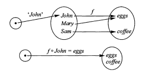

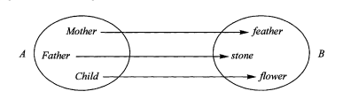

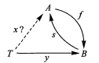

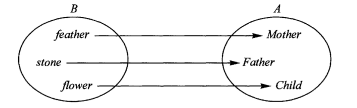

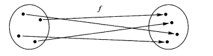

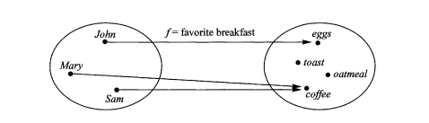

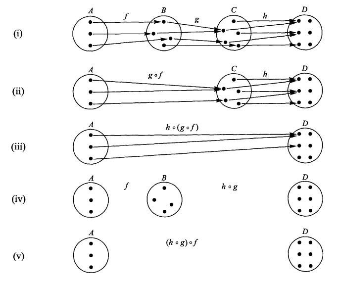

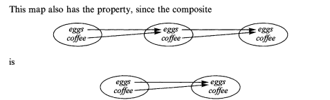

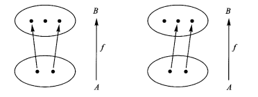

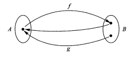

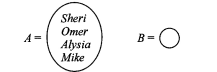

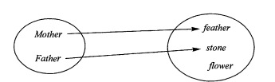

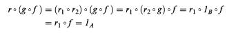

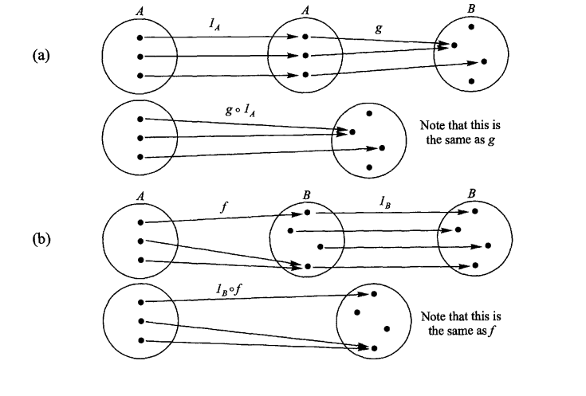

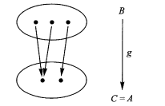

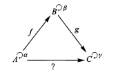

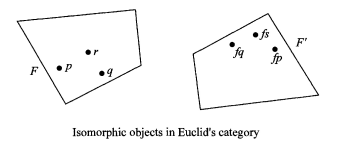

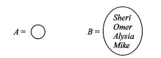

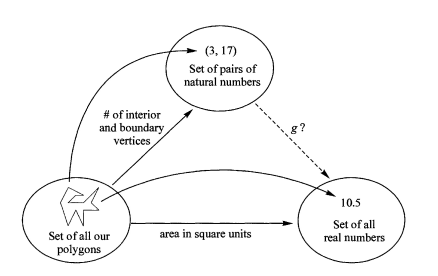

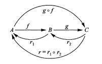

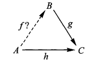

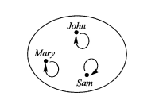

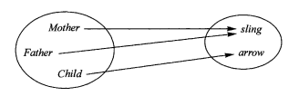

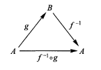

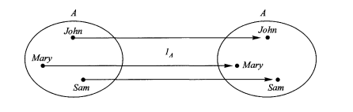

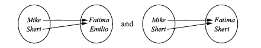

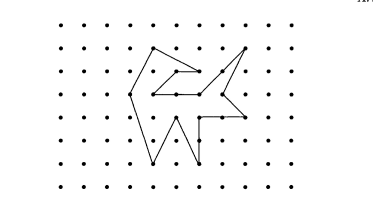

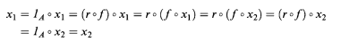

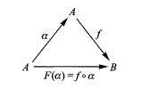

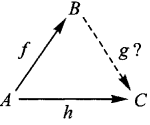

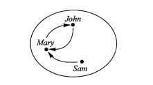
