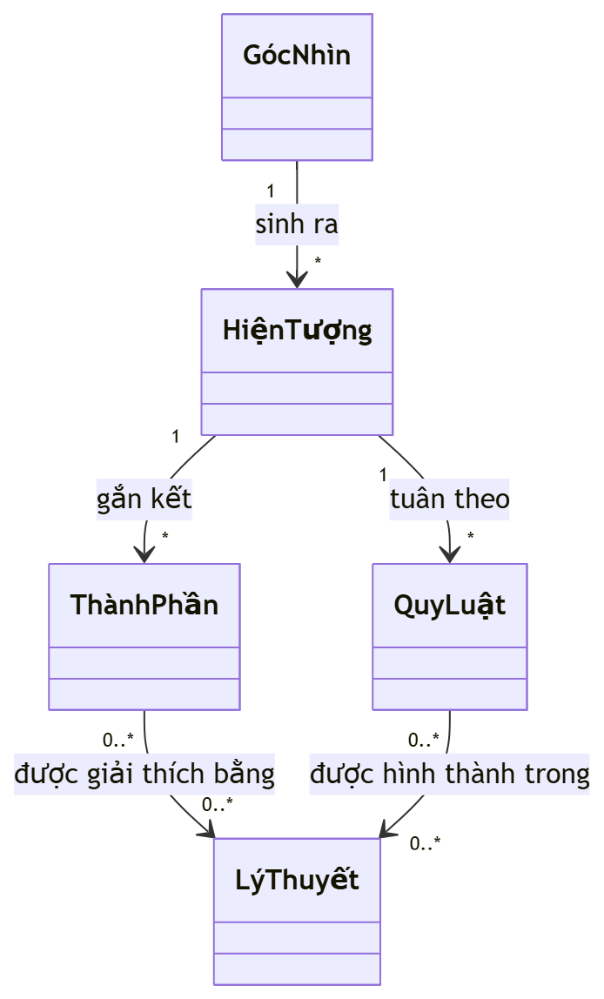
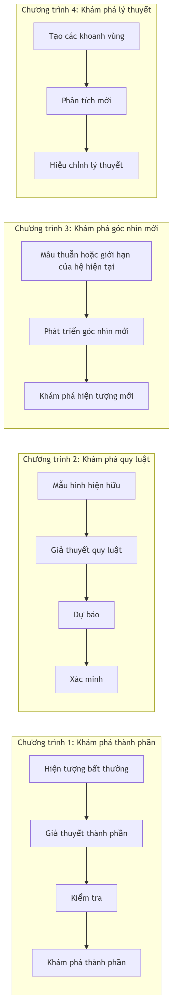
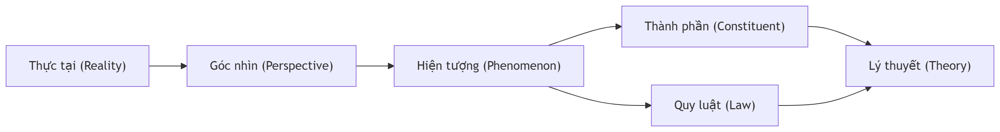
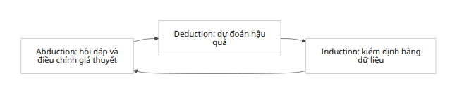

# trực giác 1

Tóm tắt điều hành

Báo cáo này đề xuất một lộ trình học tập và nghiên cứu toàn diện để phát triển lý thuyết tri thức/khám phá mới dựa trên mô hình “Thực tại → Góc nhìn → Hiện tượng → Thành phần & Quy luật → Lý thuyết”. Nội dung bao gồm: (1) các lĩnh vực khoa học/philosophy chính cần học, sách vở và tài nguyên tham khảo ưu tiên; (2) công cụ hình thức – từ lôgic và lý thuyết mô hình đến lý thuyết tập hợp, lý thuyết category, khoa học phức tạp, lý thuyết mạng, và logic động/bổ đề (“modal”) – theo trình tự khuyến nghị; (3) phương pháp luận khám phá (suy diễn giả thuyết abduction, kiểm định, dựng mô hình, mô phỏng, mô hình đa tầng, phát hiện dữ liệu); (4) đề xuất chương trình nghiên cứu cụ thể với câu hỏi nghiên cứu và dự án khả thi; (5) rủi ro và bẫy khái niệm (như đồng nhất ngôn ngữ với thực tại); (6) thời gian biểu 1 năm, 3 năm, 5 năm với cột mốc; (7) bảng so sánh công cụ/lĩnh vực (yêu cầu kỹ năng, thời gian thành thạo, lợi ích); (8) sơ đồ trực quan (biểu đồ Mermaid) cho khung tổng thể, các “tiểu chương trình” song song, vòng lặp khám phá, và biểu đồ quan hệ các đối tượng (Perspective, Phenomenon, Constituent, Law, Theory); (9) danh sách nguồn chính và bài kinh điển cần đọc (Peirce, Kuhn, Popper, Fine, các bài về khoa học phức tạp và lý thuyết mô hình) và khóa học trực tuyến gợi ý; (10) khung biểu diễn chính thức cho các khái niệm (ví dụ: tiên đề cho Góc nhìn, định nghĩa Hiện tượng(P), ánh xạ từ Góc nhìn đến dữ liệu quan sát, định nghĩa sơ bộ về “khoanh vùng tự nhiên”) bằng ký hiệu tập hợp và lý thuyết category; (11) phần mềm/công cụ (thư viện Python, công cụ phân tích mạng, mô phỏng, chứng minh hình thức) với ví dụ mã/mô phỏng minh họa. Mục tiêu là cung cấp lộ trình học rõ ràng và các bước hành động cụ thể cho người nghiên cứu độc lập trình độ cao, hướng tới hệ thống hóa và thử nghiệm lý thuyết tri thức của chính họ.

1. Nền tảng triết học và khoa học cơ bản

Charles S. Peirce – Chủ nghĩa thực dụng và suy luận giả định (abduction): Peirce (1839–1914) được xem là “cha đẻ của chủ nghĩa thực dụng”. Ông phân loại ba hình thức suy luận: suy diễn (deduction), suy quy (induction) và suy luận giả định (abduction). Đặc biệt, abduction – quá trình hình thành giả thuyết giải thích – là “phép toán duy nhất tạo ra ý tưởng mới”. Peirce đặt nó vào ngữ cảnh khám phá (context of discovery) chứ không chỉ biện minh (context of justification). Ví dụ như ông diễn đạt mẫu suy luận giả định: “Quan sát được một sự kiện C gây ngạc nhiên. Nếu A là đúng thì C là đương nhiên. Do đó, có cơ sở nghi ngờ rằng A đúng”. Học Peirce giúp ta hiểu được vai trò trung tâm của abduction trong phát triển lý thuyết khoa học và chiến lược tìm kiếm giải thích ban đầu. Nên đọc: Peirce, “How to Make Our Ideas Clear” (1877) và nguồn thứ cấp như bài SEP “Peirce on Abduction”.

Thomas Kuhn – Paradigm và chuyển đổi góc nhìn: Trong Cấu trúc của cách mạng khoa học (1962), Kuhn giới thiệu khái niệm “paradigm” (hệ hình, mẫu hình) làm khung lý thuyết cơ bản của một cộng đồng khoa học. Khi xuất hiện các phản ví dụ (anomaly) làm lung lay paradigm, khoa học rơi vào khủng hoảng và xảy ra cách mạng khoa học – tức là thay đổi paradigm (paradigm shift). Học Kuhn giúp ta nhận ra rằng tiến bộ tri thức không chỉ là thêm dữ liệu, mà là phát minh góc nhìn mới để nhìn nhận lại hiện tượng. Nên đọc: Kuhn, The Structure of Scientific Revolutions. Wiki tiếng Việt đã có đánh giá sơ lược: Kuhn “giới thiệu thuật ngữ ‘thay đổi hệ hình’” và phân tích quá trình khủng hoảng–cách mạng.

Karl Popper – Giả thuyết và phản bác: Popper nhấn mạnh rằng khoa học tiến triển qua quá trình đưa ra giả thuyết (conjectures) và tìm cách phản bác (refutations), học được từ sai lầm. Mặc dù nội dung chủ yếu của Popper không trực tiếp được trích dẫn ở đây, phương pháp luận của ông – luôn kiếm tìm falsifiability – sẽ hỗ trợ giai đoạn kiểm tra giả thuyết trong mô hình của ta (nằm ở hai chương trình song song “kiểm chứng quy luật” và “đánh giá lý thuyết”). Nên tham khảo: Popper, Conjectures and Refutations.

Kit Fine – Hiện tượng và thực tại: Fine khuyên rằng trong siêu hình và triết học, ta nên tập trung trước tiên vào hiện tượng như chúng xuất hiện, thay vì khởi đầu chỉ với ngôn ngữ hay bản thể luận rộng. Ông viết: “cung cấp mô tả nghiêm ngặt về hiện tượng như chúng xuất hiện và không chỉ làm rõ cách ta biểu diễn chúng trong ngôn ngữ trước khi cố gắng tìm thực tại ẩn sau”. Đó là lời khuyên lớn: hãy mô tả dữ liệu và cấu trúc hiển thị (appearance) một cách minh xác rồi mới rút ra chân lý cơ bản hơn. Điều này phù hợp với cách tiếp cận bình dân của mô hình: không giả định một thực thể tối hậu ngay lập tức, mà bắt đầu từ hiện tượng qua góc nhìn. Nên đọc: Fine, “The Pure Logic of Ground” và bài IEPvề phương pháp của Fine.

Các nguồn bổ sung: Triết học khoa học hiện đại, đặc biệt chủ nghĩa thực dụng của William James, C. I. Lewis, Edmond Gettier về tri thức và ngữ cảnh, Lê Hải (Triết học Cách mạng cho Khoa học – đã trích dẫn Kuhn ở Wikipedia) cũng có thể tham khảo để thêm tầm nhìn. Ngoài ra, nghiên cứu về khoa học hệ phức tạp và mạng xã hội học (ví dụ: Mạng lưới trích dẫn khoa học, lý thuyết trò chơi, phức hợp hệ thống) sẽ cung cấp bối cảnh liên ngành quan trọng. Ví dụ, Zeng et al. (2017) mô tả “science of science” là lĩnh vực kết hợp phân tích dữ liệu, mô hình cơ chế, và lý thuyết mạng để hiểu các quy luật của hệ thống khoa học. (Xem phần 5.)

2. Công cụ hình thức 1: Lôgic và Lý thuyết Tập hợp

Lôgic toán và tập hợp là nền tảng bắt buộc. Trước hết, cần nắm propositional logic và first-order logic (FOL) – để biểu diễn giả thuyết, định luật và câu hỏi về đối tượng. Một sách tham khảo thường dùng: Patrick Suppes, Introduction to Logic hay Stanford Lagunita – courses on logic. Cần học cách viết tiên đề, định nghĩa trong ký hiệu FOL và tập hợp.
Ví dụ: ta sẽ định nghĩa vũ trụ khảo sát (Reality) dưới dạng tập R. Mỗi Góc nhìn P có thể được coi là phần tử của một tập PERSPECTIVES. Ta có thể khởi đầu với các tiên đề hình thức rất thô sơ:

∀P ∈ PERSPECTIVES, ∃Phen(P) ⊆ R: mỗi góc nhìn P tạo ra một tập hiện tượng Phen(P) (các sự kiện quan sát được) là tập con của thực tại.

∀P ≠ Q ⇒ (Phen(P) ≠ Phen(Q)): giả sử hai góc nhìn khác nhau có thể tạo ra tập hiện tượng khác nhau (tùy quan hệ).

∀X ∈ Phen(P): X là một phần tử của R, bị quan sát (detectable) dưới góc nhìn P.

Việc học lý thuyết tập hợp (chuẩn ZFC) giúp hiểu các quan hệ, ánh xạ giữa tập (ví dụ ánh xạ từ PERSPECTIVES sang tập các tập con của R). Có thể dùng Herbert Enderton, A Mathematical Introduction to Logic và Titu Andreescu, Elementary Set Theory làm tài liệu.

Trong phần sau, chúng sẽ dùng ký hiệu tập hợp và logic để biểu diễn Phenomenon(P), Laws(P), Constituents(x), Theories… Ví dụ:  v.v.

3. Công cụ hình thức 2: Lý thuyết Mô hình và Lý thuyết Category

Lý thuyết Mô hình (Model Theory): Hữu ích để hình thức hóa khái niệm “phép diễn dịch” và “phép mô tả” của thực tại bằng ngôn ngữ. Mô hình lý thuyết xem xét cách một hệ tiên đề (lý thuyết) được biểu diễn/diễn dịch qua cấu trúc toán học (structure) nào đó. SEP định nghĩa: “Lý thuyết mô hình là nghiên cứu việc diễn dịch bất kỳ ngôn ngữ nào (có thể là tự nhiên hoặc hình thức) thành cấu trúc tập hợp, với định nghĩa chân lý của Tarski làm nguyên mẫu”. Ví dụ, mỗi góc nhìn P có thể xem như một hệ cấu trúc diễn giải một ngôn ngữ lý thuyết khoa học nhất định, sinh ra tập hiện tượng Phen(P). Tư duy này giúp hiểu: mỗi góc nhìn = một “model” với miền quan tâm riêng. Nên đọc: Marker, “Model Theory: An Introduction” hoặc SEP “Model Theory”.

Lý thuyết Category: Là ngôn ngữ cao cấp để mô tả quan hệ giữa các đối tượng và phép biến đổi của chúng. Category theory thường dùng đối tượng là các “hệ” (ví dụ góc nhìn) và đạo hàm (morphisms) là các chuyển đổi giữa góc nhìn. Ví dụ, ta có thể tưởng tượng một category 𝒞 mà Obj(𝒞) là các Perspective; một phép biến đổi từ P sang Q (morphisme P→Q) là việc “chuyển đổi” cách nhìn P thành Q (có thể là tổng hợp hay hẹp bớt khái niệm). Sau đó, một functor F: 𝒞 → Set gán cho mỗi góc nhìn P tập Phen(P). Khoa học category (xem “Category Theory for the Sciences” của David Spivak hay Awodey, “Category Theory”) sẽ được học ở giai đoạn sau, nhằm khả năng mô hình hóa đa tầng và giữ tính tổng quát. Category sẽ cần thiết khi nghiên cứu “mạng lưới quan hệ” giữa góc nhìn, hiện tượng, lý thuyết… (ví dụ functor giữa các category của hiện tượng, lý thuyết).

Logic modal/dynamic/hyperintensional: Ở mức độ chuyên sâu hơn, nên học về logic đa trị và tri thức: modal logic (logic có các operator như ◻,◇), logic tri thức (epistemic logic), logic động (dynamic logic) và logic “hyperintensional” (mịn hơn modal) như trong tác phẩm của Kit Fine. Ví dụ, logic suy diễn có thể biểu diễn giả thiết “theo góc nhìn P thì X là bắt buộc/tất yếu” hoặc “nhóm quan sát viên nghi ngờ X”. IEP định nghĩa: “Logic tri thức (epistemic logic) nghiên cứu các phương pháp logic để tiếp cận các khái niệm tri thức, niềm tin”; nó dùng các toán tử K để nói “agent biết rằng...”, với ngữ nghĩa Kripke-quyền (possible worlds). Logic động (ví dụ Dynamic Epistemic Logic) thì mô hình hóa quá trình cập nhật kiến thức thông tin theo thời gian. Khi nghiên cứu sâu, chúng ta sẽ cần các công cụ như Fagin et al., “Reasoning About Knowledge”, van Ditmarsch et al., “Dynamic Epistemic Logic”, cũng như kiến thức căn bản về modal logic (phương pháp Kripke, tính toàn vẹn, v.v.). Những công cụ này cho phép mô hình hóa không gian các “góc nhìn khả dĩ” (các thế giới khả thể về kiến thức, giả định, cảnh quan ngữ cảnh).

4. Khoa học hệ phức tạp và lý thuyết mạng

Khoa học phức tạp (Complex Systems): Khác với cách tiếp cận truyền thống tuyến tính, hệ phức tạp nghiên cứu cách các đơn vị tương tác (networks of interacting components) tạo ra cấu trúc và hành vi mới (emergence) ở cấp vĩ mô. Mô hình tri thức này đặc biệt phù hợp: chúng ta xem Thực tại như một hệ phức tạp gồm nhiều hiện tượng liên quan. Nguồn giới thiệu: “Complexity science … studies how a large collection of components – locally interacting … – can spontaneously self-organize to exhibit non-trivial global structures and behaviors at larger scales”. Khái niệm cốt lõi: hệ phức tạp có các thành phần liên kết phức tạp, và tính toàn cục không thể suy ra chỉ từ từng phần. Sẽ học về mạng lưới tương tác (interactions), tính phi tuyến (non-linearity), tự tổ chức (self-organization), độ nhạy (chaos), cạnh tranh – cộng sinh, v.v. Tài liệu: Mitchell, “Complexity: A Guided Tour”, Meadows, “Thinking in Systems” (sơ cấp), và bài trên ComplexityExplained.

Lý thuyết mạng (Network Science): Mạng (graph) là công cụ trực quan và toán học để mô tả các quan hệ. Trong bối cảnh tri thức: ta có thể lập mô hình mạng lưới kiến thức giữa góc nhìn, hiện tượng, thành phần, lý thuyết. Ví dụ, mỗi góc nhìn P kết nối với các hiện tượng mà nó quan sát, mỗi hiện tượng kết nối đến các thành phần cấu thành hoặc luật áp dụng. Network science (xem Barabási, “Network Science”) cho phép phân tích các tính chất như độ trung tâm (centrality), đặc tính nhóm (community structure), và các “đường ngách” quan trọng trong mạng tri thức. Một hướng nghiên cứu tiềm năng là nghiên cứu “mạng lưới nền tảng của tri thức” (science of science) bằng các kỹ thuật của network: ví dụ phân tích mạng trích dẫn, coauthor, đề tài (topic networks). Zeng et al. (2017) cho thấy “phân tích mạng, mô hình cơ chế, xếp hạng, và dự báo” là các lĩnh vực quan trọng trong Science of Science.

Công cụ tính toán: dùng Python (NetworkX, igraph) hoặc phần mềm chuyên ngành (Gephi, Cytoscape) để vẽ và phân tích mạng tri thức. Ví dụ:

import networkx as nx
# Ví dụ: Mô hình mạng tri thức đơn giản
G = nx.DiGraph()
G.add_node("GocNhin1", type="Perspective")
G.add_node("HienTuongA", type="Phenomenon")
G.add_node("ThanhPhanX", type="Constituent")
G.add_node("QuyLuatL", type="Law")
G.add_node("LyThuyetT", type="Theory")
G.add_edge("GocNhin1", "HienTuongA", relation="quan_sat")
G.add_edge("HienTuongA", "ThanhPhanX", relation="tao_thanh")
G.add_edge("HienTuongA", "QuyLuatL", relation="ac_dung")
G.add_edge("ThanhPhanX", "LyThuyetT", relation="giai_thich")
G.add_edge("QuyLuatL", "LyThuyetT", relation="hinh_thanh")

Mã trên tạo một đồ thị trực tuyến (network) minh hoạ mô hình tri thức: “Góc nhìn1 quan sát Hiện tượng A, A được tạo thành bởi Thành phần X, A tuân theo Quy luật L; cả X và L đều được giải thích/hình thành trong Lý thuyết T” (tất cả đều là ví dụ minh hoạ). Đồ thị có thể mở rộng: phân loại node theo loại, phân tích đường đi giữa chúng, v.v.

Hệ thống phức tạp (Systems Theory): Nên học cách dùng các mô hình Hệ động lực và mô phỏng để khám phá các kịch bản mới. Ví dụ agent-based modeling (NetLogo, Mesa) hoặc mô hình hóa vi phân/đại số (MATLAB, Python – SciPy). Mục tiêu là tích hợp dữ liệu thực nghiệm (dữ liệu lớn, GIS, trí tuệ nhân tạo) để kiểm tra mô hình lý thuyết.

5. Phương pháp luận khám phá

Suy diễn giả thuyết (Abduction): Tâm điểm của giai đoạn khám phá – hình thành giả thuyết giải thích mới. Theo Peirce, abduction “là quá trình hình thành giả thuyết giải thích, phép toán logic duy nhất giới thiệu ý tưởng mới”. Trong thực hành, hãy liên tục để ý tới “hiện tượng lạ” (strange data) hoặc lỗ hổng trong mô hình hiện có, rồi đưa ra giả thuyết khả dĩ. Bài tập gợi ý: khi gặp một tập dữ liệu hiện tượng, hãy thử đặt câu hỏi “Nếu góc nhìn mới X là đúng thì dữ liệu này trở nên đương nhiên?” (theo mẫu abduction của Peirce) và xem đòn bẩy để tạo ra giả thuyết X.

Dựng mô hình (Model-Building): Sau khi có giả thuyết hoặc cấu trúc tư duy, dựng ngay mô hình toán/từ điển/hệ qui tắc. Có thể là mô hình xác suất (Bayesian networks), mô hình đại số (phương trình), mô hình mạng (graphs), hoặc mô phỏng tính toán (agent-based). Sau đó rút ra tiên đoán: mô hình phải sinh ra được hiện tượng quan sát. Cho ví dụ: nếu giả thuyết là “các hiện tượng P tuân theo quy luật L”, thì viết công thức L và kiểm tra xem nó dự báo các hiện tượng còn lại hay không.

Phân tích sự chắc chắn (Hypothesis Testing & Falsification): Tiếp bước Deduction và Induction của Peirce: từ giả thuyết suy ra hậu quả (thí dụ nghiệm), rồi dùng dữ liệu thực để kiểm chứng. Dùng cả phân tích thống kê, machine learning để kiểm định mô hình. Theo tinh thần Popper, phải sẵn sàng bác bỏ giả thuyết nếu có phản ví dụ.

Mô phỏng và mô hình đa tầng (Multi-level Modeling): Nhiều hệ thống tri thức có cấu trúc đa tầng – ví dụ một giả thuyết lớn có thể phân thành nhiều lý thuyết con. Học các phương pháp mô hình hóa đa tầng (ví dụ Mũi tên của Poincaré, coarse-graining trong vật lý) để gộp/bóc tách mô hình. Multi-level modeling cũng áp dụng trong phân tích dữ liệu (ví dụ hierarchical Bayesian).

Phát hiện dữ liệu (Data-driven Discovery): Kết hợp kỹ thuật khoa học dữ liệu – khai thác dữ liệu lớn để phát hiện mẫu ẩn. Ví dụ dùng học máy để tìm các cụm (clustering) hiện tượng, hoặc xây dựng ontology tự động từ văn bản (information extraction). Công cụ: Scikit-learn, TensorFlow cho Machine Learning, Pandas, SQL cho xử lý dữ liệu, NLTK cho xử lý ngôn ngữ tự nhiên. Ví dụ dự án: xây dựng mô hình mạng tri thức từ cơ sở dữ liệu tri thức (knowledge graph).

Chu trình khám phá (Discovery Loop): Tóm tắt quy trình theo Peirce: Abduction → Deduction → Induction → (vào Abduction mới). Biểu đồ sau minh hoạ vòng lặp này:

|   |
| --- |

Mỗi vòng lặp liên tục làm giàu lý thuyết và sửa sai. Quá trình này không ngừng (fallibilism): không có định nghĩa cuối cùng, chỉ tiến dần tới mô hình tốt hơn.

6. Kế hoạch nghiên cứu và chương trình làm việc

Câu hỏi nghiên cứu cụ thể: Từ mô hình “Thực tại → Góc nhìn → Hiện tượng → Thành phần & Quy luật → Lý thuyết”, có thể đặt ra nhiều câu hỏi:

Góc nhìn là gì?: Xác định rõ khái niệm Góc nhìn (Perspective) ở cấp hình thức. Là hệ khái niệm? Công cụ đo lường? Vị trí quan sát? Chúng ta sẽ thử chọn một nghĩa làm primitive ban đầu (ví dụ: Góc nhìn là một điểm trong không gian thế giới quan) và phát triển tiên đề.

Hiện tượng(P) là gì?: Cho mỗi Góc nhìn P, hiện tượng là một tập con của R thỏa mãn điều kiện nào (VD: ổn định trong P, hoặc được P cảm nhận)?

Cấu thành (Constituent): Khi chúng ta nói “Thành phần của thực tại”, điều đó ám chỉ ít nhất tập hợp các hạt cơ bản hoặc khối cấu tạo; một hướng là xác định “mạng lưới phụ thuộc” giữa các hiện tượng và thành phần (một mô hình đồ thị).

Quy luật (Law): Có thể định nghĩa quy luật là quan hệ lôgic hoặc hàm số liên kết các Thành phần (Constituents) hoặc Các mẫu hiện tượng. Cần bàn liệu quy luật phải là xác định/hữu hạn, hay có thể chập chờn, chặt/chởn (có biên hoặc không).

Lý thuyết (Theory): Là tập các giả thuyết đã phát triển liên kết các quy luật và thành phần; có thể coi là “hệ tiên đề” cho một tập mô hình.

“Khu vực tự nhiên” (Natural Cut): Khái niệm cấu trúc sâu của thực tại, một cách phân chia R thành các phần có ý nghĩa (ví dụ giống ontology). Cần thảo luận: Thế nào gọi là tự nhiên? Có thể định nghĩa sơ bộ: một lát cắt (A,B) là tự nhiên nếu ít có/quy luật hoặc mối quan hệ xuyên qua hai phần đó (ví dụ như trong cây phân tích hệ thống, không có cạnh quan trọng cắt ngang).

Dự án khả thi:

Formalization Prototype: Bắt đầu bằng viết một bản “thiết kế lý thuyết” (theoretical design document) với các tiên đề sơ khai. Ví dụ: định nghĩa ban đầu cho Perspective, Phenomenon(P), Constituent, Law, Theory. Sau đó thử code mô hình hóa sơ bộ bằng Python (như ví dụ sử dụng networkx trên) để kiểm thử tính nhất quán.

Tìm thuật toán cắt tự nhiên: Xây dựng mô hình đồ thị của thực tại (nodes = đối tượng, edges = quan hệ) và chạy các thuật toán tối ưu cắt (graph partition) để định nghĩa “khoanh vùng tự nhiên”. So sánh kết quả với trực giác.

Mô phỏng abduction: Triển khai ví dụ nhỏ: giả lập một kịch bản trong đó một agent (máy) nhận dữ liệu và phải sinh giả thuyết mới (ví dụ dùng heuristic của Peirce – Pattern Abduction). Sử dụng các công cụ AI (ví dụ generative models) để sinh mẫu “góc nhìn mới” cho một hiện tượng chưa giải thích.

Nghiên cứu mạng tri thức: Sử dụng dữ liệu thực (ví dụ dữ liệu quan hệ hướng đối tượng) để xây dựng mạng tri thức. Phân tích các “lát cắt tự nhiên” trong mạng đó – ví dụ trên mạng trích dẫn khoa học hoặc từ điển tri thức. Xuất bản ở hội nghị “Science of Science” hoặc tạp chí EPJ Data Science.

Thử nghiệm lý thuyết: Nếu định nghĩa sơ khai cho góc nhìn như một cấu trúc toán học (như một không gian tham số), thử kiểm chứng bằng cách áp dụng vào một lĩnh vực cụ thể (ví dụ vật lý hay sinh học): quan sát liệu khi ta thay đổi tham số, “hiện tượng” thu được thay đổi như thế nào.

Hợp tác liên ngành: Lý thuyết này nằm giữa triết học, toán học, khoa học máy tính, hệ thống phức tạp và các ngành khoa học cụ thể. Có thể liên hệ với: triết gia khoa học (đặc biệt formal epistemology), nhà toán lý thuyết, khoa học phức tạp, sinh thái hệ thống, khoa học dữ liệu. Các hội nghị tiềm năng: International Conference on Complex Systems (ICCS), Foundations of Information Science, Philosophy of Science Association (PSA), Conference on Formal Epistemology.

7. Rủi ro và bẫy khái niệm

Đồng nhất ngôn ngữ với thực tại: Một bẫy lớn là tin rằng khái niệm hay ngôn ngữ (văn tự) mô tả đúng bản chất (ontology) của thế giới. Chúng ta cần cảnh giác tránh định nghĩa Góc nhìn hay Hiện tượng quá sớm chỉ dựa trên ngôn ngữ, vì có thể giới hạn mô hình. Ví dụ, nếu định nghĩa ngay “góc nhìn = một tập hợp khái niệm”, ta sẽ loại trừ ngữ nghĩa “công cụ quan sát” hoặc “vị trí không gian” vốn có thể cần thiết. Thay vào đó, nên bắt đầu với biến hình thức (formal placeholder) và tiên đề về tính chất, như đã làm ở trên.

Hợp thức hóa quá nhiều (Overfitting triết học): Khi đưa ra khái niệm “mạng lưới” hay “thành phần” cần cẩn thận không gán quá nhiều tính chất chưa chứng minh. Nên giải thích rõ giả định (ví dụ assume phép phân tầng tự nhiên, assume tính phi tuyến) và thử nghiệm với các giả thuyết đối ngược.

Bỏ qua thực nghiệm: Mô hình tri thức không phải chỉ trừu tượng – cần tích hợp phản hồi từ dữ liệu khoa học. Phương pháp mô phỏng, thu thập dữ liệu là cần thiết (Phương pháp abduction của Peirce cũng nhấn mạnh tầm quan trọng của kiểm chứng sau đó).

Thiếu tính liên ngành: Mô hình này kết hợp nhiều lĩnh vực. Rủi ro là mắc kẹt trong thuật ngữ hay giả định riêng của một lĩnh vực (ví dụ chủ nghĩa duy vật truyền thống hay tư duy biện chứng cứng nhắc). Cần sẵn sàng học hỏi từ khoa học tự nhiên (vật lý, sinh học), khoa học hệ phức tạp, khoa học máy tính.

Nhầm lẫn bảng mô hình (map-territory error): Cảnh giác với cảm giác “đã hiểu” chỉ vì biểu diễn tri thức mượt mà. Luôn kiểm định nếu mô hình mới có thực diễn đạt thực tại hay chỉ khái quát hóa không chính xác. (Peirce gọi đây là “cảm giác hiểu” nhưng thực ra chưa.)

Các chiến lược giảm thiểu: thường xuyên tổng hợp với đồng nghiệp, so sánh với dữ liệu thực, đặt thử các câu hỏi phê phán (“nếu giả thuyết này sai, kết quả nào khác xảy ra?”), và giữ tư duy trực giác khám phá trong khi dần dần kiểm chứng nghiêm ngặt.

8. Lộ trình 1 năm, 3 năm, 5 năm và cột mốc

Năm 1 (Nền tảng và Thử nghiệm):

Học xong căn bản logic (propositional, predicate) và lý thuyết tập hợp. Hiểu sơ bộ model theory (xem SEP Model Theory). Đọc Peirce (fokus abduction), Kuhn (paradigm), Fine (phương pháp). Bắt đầu nghiên cứu complexity science cơ bản (khái niệm emergence, mạng).

Đọc sách/phụ nguồn (xem Tài liệu trọng điểm ở cuối báo cáo).

Làm bài tập nhỏ: xây mô hình logic đơn giản cho một ví dụ giả thuyết; sử dụng Python để vẽ mạng tri thức đơn giản.

Mốc đầu năm: phải có một bản “đề cương lý thuyết” sơ khai, gồm định nghĩa và tiên đề ban đầu (đối tượng, mối quan hệ).

Năm 3 (Xây dựng và Mở rộng):

Học nâng cao: Model Theory (ví dụ Marker), Category Theory (Spivak). Học chi tiết về epistemic/dynamic logics. Đọc thêm triết học khoa học liên ngành (Lakatos, Quine, Kuhn sâu hơn).

Áp dụng formal: đưa Perspective thành đối tượng hình thức (ví dụ tiên đề dạng: P ∈ PERSPECTIVE → có biến Phen(P)), xây dự án network analysis lớn (lấy dataset ví dụ: cơ sở tri thức hay học thuật).

Mở rộng các lộ trình sub: (1) Khám phá thực thể mới: tập trung vào modeling phân tích thành phần (constituents), ứng dụng vật lý lý thuyết hoặc sinh học; (2) Khám phá quy luật mới: thử nghiệm data mining (ví dụ Apriori rule mining) để phát hiện pattern; (3) Khám phá góc nhìn mới: dùng học máy/generative models (như ChatGPT) thử tạo “góc nhìn” giả định mới từ tập dữ liệu tri thức ban đầu; (4) Khám phá khoanh vùng: nghiên cứu các “khoanh vùng tự nhiên” trong mạng (sử dụng graph partition).

Xuất bản paper/báo cáo tiền đề: ví dụ diễn đàn Triết học Khoa học Việt Nam, hội thảo khoa học hệ phức tạp.

Mốc cột: hoàn thành ít nhất 2 dự án thử nghiệm (lập mô hình data hoặc cắt mạng) và có poster báo cáo ở hội nghị hoặc đăng arXiv.

Năm 5 (Hợp thức hóa và Ứng dụng):

Chi tiết hoá: Xây dựng công bố học thuật (tạp chí triết học khoa học, hệ phức tạp). Phát triển thành chứng minh hình thức (ví dụ code Coq/Lean nếu nghiên cứu logic nâng cao).

Mở rộng hợp tác: thử liên kết với nhóm experiment (trong khoa học thực nghiệm) để áp dụng mô hình vào dữ liệu thực (ví dụ đặt câu hỏi triết học trên nền dữ liệu khoa học).

Phát hành sách trắng hoặc whitepaper: tổng hợp mô hình, bao gồm các định nghĩa form (tiên đề) rõ ràng, ví dụ và kết quả mô phỏng.

Mốc cột: có ít nhất 2 bài đăng journal chung quốc tế, 1 báo cáo định nghĩa lý thuyết, mạng lưới cộng tác ổn định.

9. So sánh công cụ/lĩnh vực và bảng đọc – milestones

| Công cụ/Lĩnh vực | Kỹ năng cần có | Thời gian để thành thạo | Lợi ích/chú thích |
| --- | --- | --- | --- |
| Logic & Set Theory | Toán đại cương, lôgic cơ bản | 2–4 tháng | Mô tả tiên đề, tính nhất quán lý thuyết |
| Model Theory | Lôgic, nhẫn nại đọc lý thuyết | 4–6 tháng | Biểu diễn ngữ nghĩa và mô hình hóa góc nhìn ({\it structure}) |
| Category Theory | Đại số trừu tượng, tư duy trừu tượng | 6–12 tháng | Mô hình hóa mạng quan hệ, chuyển đổi giữa góc nhìn |
| Complexity Science | Xác suất, thống kê, lập trình | 3–6 tháng | Hiểu hệ phức tạp, mô phỏng hệ thống, emergence |
| Network Science | Toán rời rạc, lập trình (Python) | 2–4 tháng | Phân tích mạng tri thức, tìm khớp mẫu liên kết |
| Logic modal/DEL | Lôgic, kiến thức về Kripke | 4–6 tháng | Mô hình cập nhật tri thức, siêu nhận thức, multi-agent |
| Abduction/Philosophy | Triết học khoa học, kỹ năng tư duy | 2 tháng | Tìm đường mới (khám phá ban đầu) |
| Programming/Simulation | Python, MATLAB, NetLogo ... | 3–6 tháng | Xây dựng mô phỏng, xử lý dữ liệu, thử nghiệm mô hình |
| Statistics/ML | Xác suất, ML cơ bản | 3–4 tháng | Kiểm định mô hình, phát hiện mẫu bằng ML |

Các tài liệu chính (sách, bài báo) liên quan có thể được phân bổ theo mốc như sau:

| Mốc | Tài liệu căn bản | Nội dung / Milestone |
| --- | --- | --- |
| Năm 1 (sơ bộ) | Peirce “How to Make Our Ideas Clear” (1877), SEP Abduction【23†L59-L66】; Kuhn SSR (chương 1–2), SEP Model Theory【12†L46-L54】; Fine IEP【35†L51-L59】; sách Enderton (Logic căn bản); Complexity explained【39†L17-L24】 | Hiểu abduction, paradigm shift, nền logic. Định nghĩa ban đầu Perspective, Phenomenon. Xây bản đồ kiến thức sơ cấp (diagram trên). |
| Năm 2–3 (xây dựng) | Marker Model Theory; Spivak Category Theory for the Sciences; Fagin et al. Reasoning About Knowledge; Mitchell Complexity; Networks: A Very Short Introduction (Newman); Gray literature về DEL (ví dụ van Benthem). | Formal hóa sơ bộ Perspective, Phenomenon(P), dùng logic modal hoặc category đưa vào mô hình. Thí nghiệm Python/NetLogo. Đọc code mẫu, thử nghiệm logic Coq (nếu khả năng). |
| Năm 3–5 (nâng cao) | Fine The Pure Logic of Ground; Lakatos Proofs & Refutations; van Ditmarsch Dynamic Epistemic Logic; các papers về phát hiện pattern (Freese, Gábor, Sowa) và ontologies; sách Ph.D. chuyên ngành (Complex Systems, Epistemology). | Ứng dụng vào dataset thực (ví dụ data citation, social network). Đăng báo khoa học. Formalization đầy đủ (tiên đề) cho khái niệm. |

(Chú ý: Các văn bản tiếng Anh chủ yếu; tìm sách và tài liệu tiếng Việt chủ yếu cho nền tảng triết học chung hoặc các bài báo/giáo trình chuyên ngành nếu có, ví dụ giới thiệu Triết học khoa học. Tuy nhiên, vì tính chuyên sâu, tài liệu gốc tiếng Anh là cần thiết.)

10. Sơ đồ trực quan (Mermaid)

Biểu đồ tổng thể khung mô hình:

|   |
| --- |

Mô hình các chương trình khám phá song song:

|   |
| --- |

|  |
| --- |

Sơ đồ này cho thấy: mỗi Góc nhìn (Perspective) sinh ra một hoặc nhiều Hiện tượng; mỗi hiện tượng bao gồm nhiều Thành phần và tuân theo nhiều Quy luật; các thành phần và quy luật có thể được giải thích/hình thành bởi các Lý thuyết.

11. Mẫu công thức hình thức (Formalization Templates)

Dưới đây là ví dụ về cách biểu diễn sơ khai một số khái niệm bằng ký hiệu tập hợp và logic:

Tiên đề cho Góc nhìn (Perspective): Đặt  là biến đại diện cho góc nhìn. Ta có thể bắt đầu với:

Hiện tượng (Phenomenon): Định nghĩa Phenomenon(P) là tập con của thực tại R. Ví dụ, có thể chia R thành tập dữ liệu (đồng vị) mà góc nhìn P cho là quan sát được. Một định nghĩa ban đầu:
Ta cũng có thể yêu cầu Phenomenon(P) ổn định theo quan hệ nào đó (ví dụ có mối liên hệ hợp lý giữa các phần tử).

Thành phần (Constituent): Đối tượng cơ bản cấu thành hiện tượng. Có thể định nghĩa dưới dạng hàm , trong đó mỗi phần tử hiện tượng x ánh xạ đến tập các thành phần cơ bản cấu thành nó (giả sử x gồm một số thành phần). Hoặc xem thành phần là yếu tố không thể phân nhỏ hơn. Có thể đặt Constituent(x) là tập con của R với .

Quy luật (Law): Có thể mô tả một quy luật L như một quan hệ (hoặc hàm) giữa các thành phần và/hoặc hiện tượng. Ví dụ,  cho n-ary relation giữa các đối tượng, hoặc  (mệnh đề đánh giá tính đúng theo góc nhìn). Ví dụ:  có thể liên hệ giữa gia tốc và lực trên các hạt. Sơ bộ:
hoặc biểu thức logic như  nếu các thể hiện x,y,z thỏa mãn mô hình logic của luật đó.

Lý thuyết (Theory): Được xem như tập hợp các tiên đề/truy vấn/công thức vận hành liên quan đến thành phần và quy luật. Ví dụ: một lý thuyết  là một tập hợp các mệnh đề trong FOL liên kết các Constituent, Law. Ta có  nghĩa là lý thuyết suy ra hiện tượng y (nếu đủ lý thuyết có thể giải thích hiện tượng).

“Khoanh vùng tự nhiên” (Natural Cut): Xét một phủ . Một định nghĩa sơ khai: lát cắt (A,B) là “tự nhiên” nếu hầu hết các quy luật L (hoặc cạnh trong mạng) không kết nối chéo giữa A và B. Ví dụ, . Tức là không có quan hệ trực tiếp (hoặc ít nhất có thể coi như không quan trọng) liên kết đối tượng ở hai bên cắt.

Biểu diễn logic bộ: Tất cả khái niệm trên có thể chuyển thành tiên đề logic đệ quy. Ví dụ:

# Dưỡng bộ cho góc nhìn và hiện tượng (pseudocode logic)
Types: Perspective, Object
Relation Phenomenon(Perspective, Object)
Axiom: ∀P:Perspective ∃x:Object Phenomenon(P,x)
Axiom: ∀P,Q,x (Phenomenon(P,x) & Phenomenon(Q,x) → Something) 

(Phần Something có thể quy định ràng buộc khi cùng một đối tượng được hai góc nhìn quan sát.)

Category-theoretic: Ví dụ, định nghĩa category Persp với đối tượng là các góc nhìn, và category Phen với đối tượng là hiện tượng. Sau đó một functor  gán F(P)=Phenomenon(P) (tập Phenomenon) và  (trên morphism ) là phép ánh xạ từ Phenomenon(P) sang Phenomenon(Q) (có thể là biến đổi nội dung nhận thức khi chuyển góc nhìn). Tương tự, có thể xây category của lý thuyết, category của quy luật.

Sơ đồ trên thể hiện ý tưởng: góc nhìn – hiện tượng – thành phần/laws – lý thuyết đều có thể formal hóa như những đối tượng và quan hệ trong lý thuyết category hoặc mô hình logic. Công việc tiếp theo sẽ là bổ sung tính chất cụ thể (VD: tính bất khả tri, khả năng mở rộng) từng khái niệm này.

12. Công cụ phần mềm và ví dụ mã

Python: Thư viện NetworkX cho phân tích đồ thị (như ví dụ ở trên). pandas và NumPy/SciPy cho xử lý dữ liệu và mô phỏng toán học. Scikit-learn cho machine learning (phân cụm, phân loại) phát hiện mẫu từ dữ liệu tri thức. Statsmodels hoặc PyMC3 cho thống kê Bayes. Ví dụ trên dùng NetworkX để biểu diễn mạng kiến thức.

Mô phỏng agent: NetLogo (có giao diện đồ họa) hoặc Mesa (Python) để xây agent-based models, thử nghiệm abduction (agent tự tạo giả thuyết) hoặc mô hình hệ phức tạp.

Hệ thống lý thuyết ràng buộc (Constraint/Symbolic): Dùng Z3 (Microsoft) hoặc PyEDA để kiểm tra tính nhất quán tập tiên đề.

Proof assistants: Nếu đi sâu vào logic hình thức, có thể dùng Coq hoặc Lean để định nghĩa luận lý và tự động chứng minh một số mệnh đề cơ bản (vd: tính nhất quán nhỏ).

Cơ sở tri thức đồ thị: Ví dụ Neo4j hoặc RDF/SPARQL để lưu trữ mạng tri thức lớn. Chúng hỗ trợ biểu diễn ontology và thực hiện truy vấn logic về mối quan hệ (GraphQL).

Ví dụ mã: Bên trên (phần 4) là ví dụ Python với NetworkX. Có thể thêm ví dụ nhỏ với SciPy: giả sử ta có dữ liệu hiện tượng, dùng hồi quy hoặc clustering để xác định luật từ dữ liệu, mã như:

import numpy as np
from sklearn.linear_model import LinearRegression

# Dữ liệu ảo: Phenomenon(P) gồm cặp (đặc tính, kết quả)
X = np.array([[1],[2],[3],[4]])
y = np.array([2.0, 4.1, 6.1, 8.0])  # gần theo quy luật y=2x (Phép quy luật 1)
model = LinearRegression().fit(X, y)
print(model.coef_, model.intercept_)  # Dự đoán quy luật

Đây là ví dụ đơn giản dùng hồi quy để tìm “quy luật” liên hệ giữa đặc tính và kết quả. Trong dự án thật, có thể áp dụng với dữ liệu phức tạp hơn và dùng phương pháp phức tạp (hồi quy đa biến, mạng nơ-ron).

